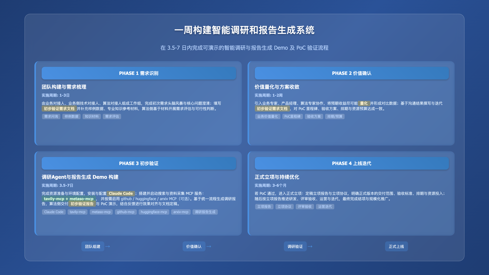

**实践详情**

|  |
|:---|
| 这是擂台[一周构建智能调研和报告生成系统Demo]（编号Case251120Y01）的实践详情。 |

1\. **方案概览**

<table style="width:89%;">
<colgroup>
<col style="width: 15%" />
<col style="width: 73%" />
</colgroup>
<tbody>
<tr>
<td style="text-align: left;"><strong>PHASE 1 需求识别与团队构建</strong></td>
<td style="text-align: left;"></td>
</tr>
<tr>
<td style="text-align: center;"><strong>团队构成</strong></td>
<td style="text-align: left;">
<strong>业务对接人（×1）</strong>：熟悉该案例对应业务工作的组织、流程、决策链路，擅长沟通，熟悉项目管理基本操作

<strong>业务侧技术对接人（×1）</strong>：熟悉该案例对应业务工作实际在用/预期涉及的技术功能与流程、建设与规划，辅助业务对接人在技术层面的沟通，建议首选架构师或技术型项目经理，其次为具体技术执行人员（如后端工程师等）

<strong>算法对接人（×1）</strong>：熟悉该案例对应业务工作的业界通行技术架构与流程、建设与规划，擅长沟通，熟悉项目管理基本操作
</td>
</tr>
<tr>
<td style="text-align: center;"><strong>实施内容</strong></td>
<td style="text-align: left;">
业务对接人与算法对接人进行初次需求接触与头脑风暴交流，梳理该案例的核心需求

业务对接人与算法对接人组建工作组及联络群，明确明确对接人与联络方式

业务对接人（代表需求方团队）填写算法对接人（代表承做方团队）提供的项目合作需求问询书；如果已有较明确的构想、能拆解出多个子任务，可进一步填写子任务算法需求模板

双方沟通补充需求确认所需的其他材料，如样例数据、专业知识参考资料等

算法对接人协调自己团队，根据双方会议内容及反馈的文档和材料，展开需求评估
</td>
</tr>
<tr>
<td style="text-align: center;"><strong>相关资源</strong></td>
<td style="text-align: left;">模板：<a href="https://gvxnc4ekbvn.feishu.cn/wiki/PC8FwObgwiMwVPkM0i4cYkr2nYf?from=from_copylink">初步验证需求文档模板</a></td>
</tr>
<tr>
<td style="text-align: center;"><strong>结果产出</strong></td>
<td style="text-align: left;">
成立工作组，明确对接人与联络方式

开始填写初步验证需求文档，对相关信息进行调研与梳理
</td>
</tr>
<tr>
<td style="text-align: center;"><strong>实施周期</strong></td>
<td style="text-align: left;">1-3日</td>
</tr>
</tbody>
</table>

<table style="width:89%;">
<colgroup>
<col style="width: 15%" />
<col style="width: 73%" />
</colgroup>
<tbody>
<tr>
<td style="text-align: left;"><strong>PHASE 2 价值确认与需求细化</strong></td>
<td style="text-align: left;"></td>
</tr>
<tr>
<td style="text-align: center;"><strong>团队构成</strong></td>
<td style="text-align: left;">
<strong>业务对接人（×1）</strong>：同PHASE 1

<strong>业务侧技术对接人（×1）</strong>：同PHASE 1

<strong>业务专家（×1）</strong>：该案例对应业务工作中涉及核心业务模块的领导者、执行者或专家，协助业务对接人明确业务痛点与价值

<strong>产品经理（×1）</strong>：熟悉该案例对应业务工作的组织、流程、决策链路，擅长沟通，协助业务对接人细化需求，并设计原型，该职位可由承做方提供，可由业务对接人担任

<strong>算法对接人（×1）</strong>：同PHASE 1

<strong>算法专家（×1）</strong>：熟悉各场景与应用中业界目前的前沿与通用技术方案及选型，协助算法对接人评估需求，协调团队进行调研、设计方案与架构，协助评估排期，可由算法对接人担任
</td>
</tr>
<tr>
<td style="text-align: center;"><strong>实施内容</strong></td>
<td style="text-align: left;">
业务对接人与己方业务专家及相关团队沟通，确认该方案实施的预期目标及业务价值，业务价值需要尽可能量化，并有对比数据（如现状数字、预期达成目标、预期相比现状改善的程度等）

算法对接人与己方算法专家及相关团队沟通，罗列待确认事项，同时对方案进行初步调研、评估、设计

产品经理与业务对接人和算法对接人沟通、梳理并明确需求，之后组织双方相关人员撰写初步验证需求文档

双方根据初步验证需求文档进行需求确认，根据确认的需求规划排期、预算和资源。排期建议：首先以承接方完成初步验证、选型、产出Demo，并通过PoC为首个里程碑；之后双方进一步协商正式立项实施

重复以上步骤直至初步验证需求文档定稿
</td>
</tr>
<tr>
<td style="text-align: center;"><strong>相关资源</strong></td>
<td style="text-align: left;">模板：<a href="https://gvxnc4ekbvn.feishu.cn/wiki/PC8FwObgwiMwVPkM0i4cYkr2nYf?from=from_copylink">初步验证需求文档模板</a></td>
</tr>
<tr>
<td style="text-align: center;"><strong>结果产出</strong></td>
<td style="text-align: left;">
初步验证需求文档：<a href="https://gvxnc4ekbvn.feishu.cn/wiki/UK3nwnHFuiZtxzkhAhvczfDDn5g?from=from_copylink">初步验证需求文档</a>

PoC相关事项确认，如启动时间、验收时间、验收方案等
</td>
</tr>
<tr>
<td style="text-align: center;"><strong>实施周期</strong></td>
<td style="text-align: left;">1-2周</td>
</tr>
</tbody>
</table>

<table style="width:89%;">
<colgroup>
<col style="width: 15%" />
<col style="width: 73%" />
</colgroup>
<tbody>
<tr>
<td style="text-align: left;"><strong>PHASE 3 初步验证与立项</strong></td>
<td style="text-align: left;"></td>
</tr>
<tr>
<td style="text-align: center;"><strong>团队构成</strong></td>
<td style="text-align: left;">
<strong>业务对接人（×1）</strong>：同PHASE 1

<strong>算法对接人（×1）</strong>：同PHASE 1

<strong>产品经理（×1）</strong>：同PHASE 2，另需能熟练使用常见的无/低代码（“拖拉拽”方式）构建智能体工作流平台（如毕昇、Dify等）

<strong>算法工程师（×1）</strong>：掌握至少一门后端编程语言（如Python等）；熟悉 Docker；掌握常见智能体平台（如Dify 等）的私有化部署、大模型配置，可由算法对接人担任
</td>
</tr>
<tr>
<td style="text-align: center;"><strong>实施内容</strong></td>
<td style="text-align: left;">
资源准备与环境配置

Claude Code 安装和配置

tavily-mcp 服务构建、启动

metaso-mcp 服务构建、启动

github、huggingface、arxiv-mcp 服务构建、启动（可选）

使⽤ Claude Code ⽣成调研报告

算法团队撰写初步验证报告

完成PoC

双方密切沟通，确认是否正式立项

若确定正式立项，双方就Demo效果调整方案，定稿立项报告，准备立项协议及启动事宜
</td>
</tr>
<tr>
<td style="text-align: center;"><strong>相关资源</strong></td>
<td style="text-align: left;">
Claude Code GitHub：https://github.com/anthropics/claude-code

Tavily安装文档：https://docs.tavily.com/documentation/mcp

Metaso安装文档：https://www.modelscope.cn/mcp/servers/metasota/metaso-search

mcp-python-sdk GitHub：https://github.com/modelcontextprotocol/python-sdk

模板：<a href="https://gvxnc4ekbvn.feishu.cn/wiki/HKZGwXetBije9HklRQmcAe94nZE?from=from_copylink">初步验证报告模板</a>

模板：<a href="https://gvxnc4ekbvn.feishu.cn/wiki/R0jrwxeDfiBpsEkqZdYcZtgJncd?from=from_copylink">立项报告模板</a>
</td>
</tr>
<tr>
<td style="text-align: center;"><strong>结果产出</strong></td>
<td style="text-align: left;">
定稿并交付初步验证报告：<a href="https://gvxnc4ekbvn.feishu.cn/wiki/EpdnwqYsri1TZDkRYNVcgE1TnYe?from=from_copylink">初步验证报告</a>

完成Demo构建，准备并最终通过PoC

撰写并交付立项报告：<a href="https://gvxnc4ekbvn.feishu.cn/wiki/EioZwicWhiWcfek81q9cCl7bnGb?from=from_copylink">立项报告</a>

立项协议（附件应包含正式上线版本的交付、验收、排期、资源等内容）
</td>
</tr>
<tr>
<td style="text-align: center;"><strong>实施周期</strong></td>
<td style="text-align: left;">3.5-7日</td>
</tr>
</tbody>
</table>

<table style="width:89%;">
<colgroup>
<col style="width: 15%" />
<col style="width: 73%" />
</colgroup>
<tbody>
<tr>
<td style="text-align: left;"><strong>PHASE 4 正式上线与优化迭代</strong></td>
<td style="text-align: left;"></td>
</tr>
<tr>
<td style="text-align: center;"><strong>团队构成</strong></td>
<td style="text-align: left;">按立项报告确定</td>
</tr>
<tr>
<td style="text-align: center;"><strong>实施内容</strong></td>
<td style="text-align: left;">
完成正式立项，确定启动时间

按立项报告内容与排期计划来实施与交付

按立项报告目标与流程来评审与验收

按立项报告规划来进行运营与迭代

按立项报告规划及协议约定，完成结项
</td>
</tr>
<tr>
<td style="text-align: center;"><strong>相关资源</strong></td>
<td style="text-align: left;">/</td>
</tr>
<tr>
<td style="text-align: center;"><strong>结果产出</strong></td>
<td style="text-align: left;">
项目全周期所有双方协商达成一致的材料

正式上线的产品
</td>
</tr>
<tr>
<td style="text-align: center;"><strong>实施周期</strong></td>
<td style="text-align: left;">3-6月（因具体情况而异）</td>
</tr>
</tbody>
</table>

2\. **方案验证**

|                |
|:---------------|
| [初步验证报告] |

3\. **技术步骤**

<table style="width:89%;">
<colgroup>
<col style="width: 10%" />
<col style="width: 10%" />
<col style="width: 10%" />
<col style="width: 55%" />
</colgroup>
<tbody>
<tr>
<td style="text-align: center;"><strong>步骤序号</strong></td>
<td style="text-align: left;">1</td>
<td style="text-align: center;"><strong>步骤名称</strong></td>
<td style="text-align: left;">资源准备与环境配置</td>
</tr>
<tr>
<td style="text-align: center;"><strong>步骤定义</strong></td>
<td style="text-align: left;">检查 Node、npm、python是否完成安装，为下一步安装 Claude Code 做准备</td>
<td style="text-align: left;"></td>
<td style="text-align: left;"></td>
</tr>
<tr>
<td style="text-align: center;"><strong>参与人员</strong></td>
<td style="text-align: left;">
角色名称：算法工程师

技能要求：

熟练使用多种思维链策略，对前沿与流行的开/闭源大模型资源较熟悉，有自己的使用经验、使用总结与心得

熟练掌握NLP经典深度学习模型（如Transformer系、LLaMA系、GLM系等）及相关资源（网站、库、博客等）；掌握至少一种常用深度学习开发框架，如PyTorch等；对GPT-3.5之后的大规模生成式语言模型（大模型）的工作原理和最新消息保持持续关注与兴趣

熟练掌握Python语言，会使用基本的正则表达式和命令行脚本；熟知NLP基础概念及经典任务（分类、匹配、序列标注、生成等）；能熟练运用常见NLP开源库（HanLP、LTP、Jieba等）

态度积极主动，沟通有条理，有好奇心与自驱力

角色数量：1 人
</td>
<td style="text-align: left;"></td>
<td style="text-align: left;"></td>
</tr>
<tr>
<td style="text-align: center;"><strong>本步输入</strong></td>
<td style="text-align: left;">
输入名称：安装 Node

输入介绍：通过命令行安装 Node、npm、python。

输入示例：

<blockquote>

相关命令如下：

</blockquote>
<table style="width:70%;">
<colgroup>
<col style="width: 70%" />
</colgroup>
<tbody>
<tr>
<td style="text-align: left;">Plain Text 
node -v 
注：输出可能类似"v22.21.1" 
 
npm -v 
注：输出可能类似"10.9.4" 
 
python -V 
注：输出可能类似"Python 3.11.13"</td>
</tr>
</tbody>
</table></td>
<td style="text-align: left;"></td>
<td style="text-align: left;"></td>
</tr>
<tr>
<td style="text-align: center;"><strong>本步产出</strong></td>
<td style="text-align: left;">
输出名称：环境配置所需资源就绪

输出介绍：服务器已配置Python 环境、Node 环境，满足模型部署的要求
</td>
<td style="text-align: left;"></td>
<td style="text-align: left;"></td>
</tr>
<tr>
<td style="text-align: center;"><strong>预估时间</strong></td>
<td style="text-align: left;">1-2 日</td>
<td style="text-align: left;"></td>
<td style="text-align: left;"></td>
</tr>
</tbody>
</table>

<table style="width:89%;">
<colgroup>
<col style="width: 10%" />
<col style="width: 10%" />
<col style="width: 10%" />
<col style="width: 55%" />
</colgroup>
<tbody>
<tr>
<td style="text-align: center;"><strong>步骤序号</strong></td>
<td style="text-align: left;">2</td>
<td style="text-align: center;"><strong>步骤名称</strong></td>
<td style="text-align: left;">Claude Code 安装和配置</td>
</tr>
<tr>
<td style="text-align: center;"><strong>步骤定义</strong></td>
<td style="text-align: left;">通过 Node 安装和配置 Claude Code</td>
<td style="text-align: left;"></td>
<td style="text-align: left;"></td>
</tr>
<tr>
<td style="text-align: center;"><strong>参与人员</strong></td>
<td style="text-align: left;">
角色名称：算法工程师（前端工程师/后端工程师）

技能要求：熟悉 node 即可

角色数量：1
</td>
<td style="text-align: left;"></td>
<td style="text-align: left;"></td>
</tr>
<tr>
<td style="text-align: center;"><strong>本步输入</strong></td>
<td style="text-align: left;">
输入名称：安装和配置 Claude Code

输入介绍：基于 Node 环境来安装和配置 Claude Code

输入示例：

相关命令如下：

<table style="width:75%;">
<colgroup>
<col style="width: 75%" />
</colgroup>
<tbody>
<tr>
<td style="text-align: left;">Bash 
# 安装 Claude Code 
npm install -g @anthropic-ai/claude-code 
 
# 配置环境变量（以 ~/.bashrc 为例，其他如 ~/.zshrc 等同理） 
echo 'export ANTHROPIC_BASE_URL="YOUR_BASE_URL"' &gt;&gt; ~/.bashrc 
echo 'export ANTHROPIC_AUTH_TOKEN="YOUR_AUTH_TOKEN"' &gt;&gt; ~/.bashrc 
 
# 配置模型 
vim ~/.claude/settings.json 
{ 
"env": { 
"ANTHROPIC_DEFAULT_HAIKU_MODEL": "YOUR_HAIKU_MODEL", 
"ANTHROPIC_DEFAULT_SONNET_MODEL": "YOUR_SONNET_MODEL", 
"ANTHROPIC_DEFAULT_OPUS_MODEL": "YOUR_OPUS_MODEL" 
} 
} 
 
# 启动成功确认命令，claude 进入命令行，输入任意文字后有收到对应回复且无报错则配置完成 
claude 
&gt; your_input</td>
</tr>
</tbody>
</table>

资源链接：

Claude Code GitHub：https://github.com/anthropics/claude-code
</td>
<td style="text-align: left;"></td>
<td style="text-align: left;"></td>
</tr>
<tr>
<td style="text-align: center;"><strong>本步产出</strong></td>
<td style="text-align: left;">
输出名称：可用的 Claude Code 服务

输出介绍：通过 Claude Code 来生成目标网站的 PRD 文件
</td>
<td style="text-align: left;"></td>
<td style="text-align: left;"></td>
</tr>
<tr>
<td style="text-align: center;"><strong>预估时间</strong></td>
<td style="text-align: left;">0.5-1 日</td>
<td style="text-align: left;"></td>
<td style="text-align: left;"></td>
</tr>
</tbody>
</table>

<table style="width:89%;">
<colgroup>
<col style="width: 10%" />
<col style="width: 10%" />
<col style="width: 10%" />
<col style="width: 55%" />
</colgroup>
<tbody>
<tr>
<td style="text-align: center;"><strong>步骤序号</strong></td>
<td style="text-align: left;">3</td>
<td style="text-align: center;"><strong>步骤名称</strong></td>
<td style="text-align: left;">tavily-mcp 服务构建、启动（可选）</td>
</tr>
<tr>
<td style="text-align: center;"><strong>步骤定义</strong></td>
<td style="text-align: left;">构建 tavily-mcp 服务，支持网络搜索、内容读取和智能问答能力</td>
<td style="text-align: left;"></td>
<td style="text-align: left;"></td>
</tr>
<tr>
<td style="text-align: center;"><strong>参与人员</strong></td>
<td style="text-align: left;">
角色名称：算法/后端工程师

技能要求：熟悉 linux 常用命令和python

角色数量：1
</td>
<td style="text-align: left;"></td>
<td style="text-align: left;"></td>
</tr>
<tr>
<td style="text-align: center;"><strong>本步输入</strong></td>
<td style="text-align: left;">
输入名称：tavily-mcp 服务构建、启动

输入介绍：使用远程MCP服务器URL来安装和启动相关 mcp 服务

输入示例：

<blockquote>

使用远程MCP服务器URL与Tavily API密钥：

</blockquote>
<table style="width:70%;">
<colgroup>
<col style="width: 70%" />
</colgroup>
<tbody>
<tr>
<td style="text-align: left;">Plain Text 
https://mcp.tavily.com/mcp/?tavilyApiKey=&lt;your-api-key&gt;</td>
</tr>
</tbody>
</table>
<blockquote>

将以下内容添加到.claude.json文件

</blockquote>
<table style="width:70%;">
<colgroup>
<col style="width: 70%" />
</colgroup>
<tbody>
<tr>
<td style="text-align: left;">Plain Text 
{ 
"mcpServers": { 
"tavily-remote-mcp": { 
"command": "npx -y mcp-remote https://mcp.tavily.com/mcp/?tavilyApiKey=&lt;your-api-key&gt;", 
"env": {} 
} 
} 
}</td>
</tr>
</tbody>
</table>
<blockquote>

运行以下代码查看是否连接成功：

</blockquote>
<table style="width:70%;">
<colgroup>
<col style="width: 70%" />
</colgroup>
<tbody>
<tr>
<td style="text-align: left;">Plain Text 
claude mcp list 
 
# 注：看到类似"tavily-remote-mcp：https://mcp.tavily.com/mcp（HTTP） - ✓ Connected"则成功</td>
</tr>
</tbody>
</table>

资源链接：

Claude Code GitHub：https://github.com/anthropics/claude-code
</td>
<td style="text-align: left;"></td>
<td style="text-align: left;"></td>
</tr>
<tr>
<td style="text-align: center;"><strong>本步产出</strong></td>
<td style="text-align: left;">
输出名称：可用的 tavily 网络搜索 mcp 服务

输出介绍：构建和启动 tavily-mcp 服务
</td>
<td style="text-align: left;"></td>
<td style="text-align: left;"></td>
</tr>
<tr>
<td style="text-align: center;"><strong>预估时间</strong></td>
<td style="text-align: left;">0.5-1 日</td>
<td style="text-align: left;"></td>
<td style="text-align: left;"></td>
</tr>
</tbody>
</table>

<table style="width:89%;">
<colgroup>
<col style="width: 10%" />
<col style="width: 10%" />
<col style="width: 10%" />
<col style="width: 55%" />
</colgroup>
<tbody>
<tr>
<td style="text-align: center;"><strong>步骤序号</strong></td>
<td style="text-align: left;">4</td>
<td style="text-align: center;"><strong>步骤名称</strong></td>
<td style="text-align: left;">metaso-mcp 服务构建、启动</td>
</tr>
<tr>
<td style="text-align: center;"><strong>步骤定义</strong></td>
<td style="text-align: left;">构建 metaso-mcp 服务，支持网络搜索、内容读取和智能问答能力</td>
<td style="text-align: left;"></td>
<td style="text-align: left;"></td>
</tr>
<tr>
<td style="text-align: center;"><strong>参与人员</strong></td>
<td style="text-align: left;">
角色名称：算法/后端工程师

技能要求：熟悉 linux 常用命令

角色数量：1
</td>
<td style="text-align: left;"></td>
<td style="text-align: left;"></td>
</tr>
<tr>
<td style="text-align: center;"><strong>本步输入</strong></td>
<td style="text-align: left;">
输入名称：metaso-mcp 服务构建、启动

输入介绍：使用远程MCP服务器URL来安装和启动相关 mcp 服务

输入示例：

<blockquote>

通过命令行安装metaso-mcp：

</blockquote>
<table style="width:70%;">
<colgroup>
<col style="width: 70%" />
</colgroup>
<tbody>
<tr>
<td style="text-align: left;">Plain Text 
claude mcp add -s user -t http search-metaso <a href="https://metaso.cn/api/mcp">https://metaso.cn/api/mcp</a>--header "Authorization: Bearer xxx" #将xxx换为API密钥</td>
</tr>
</tbody>
</table>
<blockquote>

运行以下代码查看是否连接成功：

</blockquote>
<table style="width:70%;">
<colgroup>
<col style="width: 70%" />
</colgroup>
<tbody>
<tr>
<td style="text-align: left;">Plain Text 
claude mcp list 
 
# 注：看到类似"search-metaso: https://metaso.cn/api/mcp (HTTP) - ✓ Connected"则成功</td>
</tr>
</tbody>
</table>

资源链接：

Claude Code GitHub：https://github.com/anthropics/claude-code
</td>
<td style="text-align: left;"></td>
<td style="text-align: left;"></td>
</tr>
<tr>
<td style="text-align: center;"><strong>本步产出</strong></td>
<td style="text-align: left;">
输出名称：可用的 metaso 网络搜索 mcp 服务

输出介绍：构建和启动 metaso-mcp 服务
</td>
<td style="text-align: left;"></td>
<td style="text-align: left;"></td>
</tr>
<tr>
<td style="text-align: center;"><strong>预估时间</strong></td>
<td style="text-align: left;">0.5-1 日</td>
<td style="text-align: left;"></td>
<td style="text-align: left;"></td>
</tr>
</tbody>
</table>

<table style="width:89%;">
<colgroup>
<col style="width: 10%" />
<col style="width: 10%" />
<col style="width: 10%" />
<col style="width: 55%" />
</colgroup>
<tbody>
<tr>
<td style="text-align: center;"><strong>步骤序号</strong></td>
<td style="text-align: left;">5</td>
<td style="text-align: center;"><strong>步骤名称</strong></td>
<td style="text-align: left;">github、huggingface、arxiv-mcp 服务构建、启动（可选）</td>
</tr>
<tr>
<td style="text-align: center;"><strong>步骤定义</strong></td>
<td style="text-align: left;">
构建 github-mcp 服务，支持搜索github网站、内容读取能力

构建 huggingface-mcp 服务，支持搜索huggingface网站、内容读取能力

构建 arxiv-mcp 服务，支持搜索arxiv网站、内容读取能力
</td>
<td style="text-align: left;"></td>
<td style="text-align: left;"></td>
</tr>
<tr>
<td style="text-align: center;"><strong>参与人员</strong></td>
<td style="text-align: left;">
角色名称：算法/后端工程师

技能要求：熟悉 linux 常用命令、python

角色数量：1
</td>
<td style="text-align: left;"></td>
<td style="text-align: left;"></td>
</tr>
<tr>
<td style="text-align: center;"><strong>本步输入</strong></td>
<td style="text-align: left;">
输入名称：github、huggingface、arxiv-mcp 服务构建、启动（可选）

输入介绍：通过安装相关 python 依赖来安装和启动相关 mcp 服务

输入示例：

<blockquote>

创建 requirements.txt 文件：

</blockquote>
<table style="width:70%;">
<colgroup>
<col style="width: 70%" />
</colgroup>
<tbody>
<tr>
<td style="text-align: left;">Plain Text 
# 建议 python 3.10 及以上版本，如 python 3.11 
 
loguru&gt;=0.7.0 
python-dotenv&gt;=1.0.0 
mcp&gt;=1.0.0</td>
</tr>
</tbody>
</table>
<blockquote>

创建相关服务 python 文件：

</blockquote>

<strong>[github_server.py]</strong>

<strong>[hf_server.py]</strong>

<strong>[arxiv_server.py]</strong>

<blockquote>

安装依赖并启动：

</blockquote>
<table style="width:70%;">
<colgroup>
<col style="width: 70%" />
</colgroup>
<tbody>
<tr>
<td style="text-align: left;">Plain Text 
pip install -r requirements.txt 
python github_server.py 
python hf_server.py 
python arxiv_server.py 
 
# 注：看到类似"Uvicorn running on http://0.0.0.0:PORT (Press CTRL+C to quit)"则启动成功</td>
</tr>
</tbody>
</table>
<blockquote>

注册 MCP 服务：

</blockquote>
<table style="width:70%;">
<colgroup>
<col style="width: 70%" />
</colgroup>
<tbody>
<tr>
<td style="text-align: left;">Plain Text 
# arxiv 
claude mcp add -s user -t sse paper-arxiv <a href="http://127.0.0.1:4002/sse">http://127.0.0.1:4002/sse</a> 
# github 
claude mcp add -s user -t sse code-github <a href="http://127.0.0.1:4001/sse">http://127.0.0.1:4001/sse</a> 
# huggingface 
claude mcp add -s user -t sse model-huggingface <a href="http://127.0.0.1:4003/sse">http://127.0.0.1:4003/sse</a></td>
</tr>
</tbody>
</table>

资源链接：

mcp-python-sdk GitHub：https://github.com/modelcontextprotocol/python-sdk
</td>
<td style="text-align: left;"></td>
<td style="text-align: left;"></td>
</tr>
<tr>
<td style="text-align: center;"><strong>本步产出</strong></td>
<td style="text-align: left;">
输出名称：可用的针对 github、huggingface、arxiv网站的 mcp 服务

输出介绍：构建和启动 github、huggingface、arxiv-mcp 服务
</td>
<td style="text-align: left;"></td>
<td style="text-align: left;"></td>
</tr>
<tr>
<td style="text-align: center;"><strong>预估时间</strong></td>
<td style="text-align: left;">0.5-1 日</td>
<td style="text-align: left;"></td>
<td style="text-align: left;"></td>
</tr>
</tbody>
</table>

<table style="width:89%;">
<colgroup>
<col style="width: 10%" />
<col style="width: 10%" />
<col style="width: 10%" />
<col style="width: 55%" />
</colgroup>
<tbody>
<tr>
<td style="text-align: center;"><strong>步骤序号</strong></td>
<td style="text-align: left;">6</td>
<td style="text-align: center;"><strong>步骤名称</strong></td>
<td style="text-align: left;">使用 Claude Code 生成调研报告</td>
</tr>
<tr>
<td style="text-align: center;"><strong>步骤定义</strong></td>
<td style="text-align: left;">使用 Claude Code 自动调用前面的几个 MCP 服务来生成调研报告</td>
<td style="text-align: left;"></td>
<td style="text-align: left;"></td>
</tr>
<tr>
<td style="text-align: center;"><strong>参与人员</strong></td>
<td style="text-align: left;">
角色名称：算法工程师

技能要求：

熟练使用多种思维链策略，对前沿与流行的开/闭源大模型资源较熟悉，有自己的使用经验、使用总结与心得

熟练掌握NLP经典深度学习模型（如Transformer系、LLaMA系、GLM系等）及相关资源（网站、库、博客等）；掌握至少一种常用深度学习开发框架，如PyTorch等；对GPT-3.5之后的大规模生成式语言模型（大模型）的工作原理和最新消息保持持续关注与兴趣

熟练掌握Python语言，会使用基本的正则表达式和命令行脚本；熟知NLP基础概念及经典任务（分类、匹配、序列标注、生成等）；能熟练运用常见NLP开源库（HanLP、LTP、Jieba等）

态度积极主动，沟通有条理，有好奇心与自驱力

角色数量：1 人
</td>
<td style="text-align: left;"></td>
<td style="text-align: left;"></td>
</tr>
<tr>
<td style="text-align: center;"><strong>本步输入</strong></td>
<td style="text-align: left;">
输入名称：使用 Claude Code 生成调研报告

输入介绍：和 Claude Code 交互确认输入信息来生成调研视频

输入示例：

<blockquote>

传入已有调研报告模板.md、调研报告生成流程文档 skill.md 和 流程图.md

</blockquote>
<table style="width:70%;">
<colgroup>
<col style="width: 70%" />
</colgroup>
<tbody>
<tr>
<td style="text-align: left;">Python 
# 素材要求如下 
<em>项目根目录/ 
├── files/ # 原始素材文件夹 
│ └── 调研报告模板.md # 调研报告模板 (必须) 
└── skill.md # 调研报告生成流程文档 (必须) 
└── 深度研究报告生成全流程.md # 生成调研文档的流程图 (必须)</em></td>
</tr>
</tbody>
</table>
<blockquote>

深度研究报告生成全流程.md 文件如下

</blockquote>

<strong>[深度研究报告生成全流程.md]</strong>

<blockquote>

skill.md 文件如下

</blockquote>

<strong>[SKILL.md]</strong>

<blockquote>

在项目根目录启动 Claude Code 来生成调研报告

</blockquote>
<table style="width:70%;">
<colgroup>
<col style="width: 70%" />
</colgroup>
<tbody>
<tr>
<td style="text-align: left;">Plain Text 
# 启动 claude，请确保项目根目录下除了 <em>files、skill.md、流程图外无其他文件</em> 
claude 
&gt; 根据 skill.md 生成 Deerflow 的调研报告 
 
# 注：过程中会有研究方向等需要用户确认的选项，后面会自动生成最终调研报告</td>
</tr>
</tbody>
</table></td>
<td style="text-align: left;"></td>
<td style="text-align: left;"></td>
</tr>
<tr>
<td style="text-align: center;"><strong>本步产出</strong></td>
<td style="text-align: left;">
输出名称：调研报告

输出介绍：Claude Code 自动生成最终调研报告
</td>
<td style="text-align: left;"></td>
<td style="text-align: left;"></td>
</tr>
<tr>
<td style="text-align: center;"><strong>预估时间</strong></td>
<td style="text-align: left;">0.5-1 日</td>
<td style="text-align: left;"></td>
<td style="text-align: left;"></td>
</tr>
</tbody>
</table>

  [一周构建智能调研和报告生成系统Demo]: https://gvxnc4ekbvn.feishu.cn/wiki/DbbUwFE8FiYjupki6uzcRqT0nEe?from=from_copylink
  [初步验证报告]: https://gvxnc4ekbvn.feishu.cn/wiki/EpdnwqYsri1TZDkRYNVcgE1TnYe?from=from_copylink
