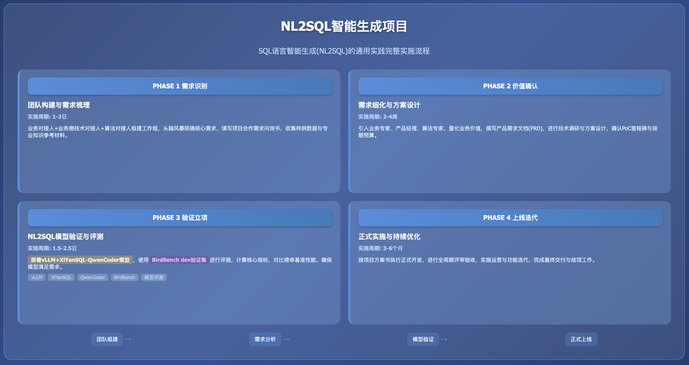

**实践详情**

|  |
|:---|
| 这是擂台[SQL语言智能生成(NL2SQL)的通用实践]（编号Case251031X02）的实践详情。 |

1\. **方案概览**

<table style="width:89%;">
<colgroup>
<col style="width: 15%" />
<col style="width: 73%" />
</colgroup>
<tbody>
<tr>
<td style="text-align: left;"><strong>PHASE 1 需求识别与团队构建</strong></td>
<td style="text-align: left;"></td>
</tr>
<tr>
<td style="text-align: center;"><strong>团队构成</strong></td>
<td style="text-align: left;">
<strong>业务对接人（×1）</strong>：熟悉该案例对应业务工作的组织、流程、决策链路，擅长沟通，熟悉项目管理基本操作

<strong>业务侧技术对接人（×1）</strong>：熟悉该案例对应业务工作实际在用/预期涉及的技术功能与流程、建设与规划，辅助业务对接人在技术层面的沟通，建议首选架构师或技术型项目经理，其次为具体技术执行人员（如后端工程师等）

<strong>算法对接人（×1）</strong>：熟悉该案例对应业务工作的业界通行技术架构与流程、建设与规划，擅长沟通，熟悉项目管理基本操作
</td>
</tr>
<tr>
<td style="text-align: center;"><strong>实施内容</strong></td>
<td style="text-align: left;">
业务对接人与算法对接人进行初次需求接触与头脑风暴交流，梳理该案例的核心需求

业务对接人与算法对接人组建工作组及联络群，明确明确对接人与联络方式

业务对接人（代表需求方团队）填写算法对接人（代表承做方团队）提供的项目合作需求问询书；如果已有较明确的构想、能拆解出多个子任务，可进一步填写子任务算法需求模板

双方沟通补充需求确认所需的其他材料，如样例数据、专业知识参考资料等

算法对接人协调自己团队，根据双方会议内容及反馈的文档和材料，展开需求评估
</td>
</tr>
<tr>
<td style="text-align: center;"><strong>相关资源</strong></td>
<td style="text-align: left;">
模板：<a href="https://gvxnc4ekbvn.feishu.cn/wiki/TXOqw6LDKiN1FrkhRtvcT6JdnVc?from=from_copylink">项目合作需求问询书模板</a>

模板：<a href="https://gvxnc4ekbvn.feishu.cn/wiki/Z4U4wXExviT9UOkeJIGc8EnKnAh?from=from_copylink">子任务算法需求模板</a>
</td>
</tr>
<tr>
<td style="text-align: center;"><strong>结果产出</strong></td>
<td style="text-align: left;">
成立工作组，明确对接人与联络方式

完成项目合作需求问询书（及子任务算法需求模板）填写，对需求有初步梳理
</td>
</tr>
<tr>
<td style="text-align: center;"><strong>实施周期</strong></td>
<td style="text-align: left;">1-3日</td>
</tr>
</tbody>
</table>

<table style="width:89%;">
<colgroup>
<col style="width: 15%" />
<col style="width: 73%" />
</colgroup>
<tbody>
<tr>
<td style="text-align: left;"><strong>PHASE 2 价值确认与需求细化</strong></td>
<td style="text-align: left;"></td>
</tr>
<tr>
<td style="text-align: center;"><strong>团队构成</strong></td>
<td style="text-align: left;">
<strong>业务对接人（×1）</strong>：同PHASE 1

<strong>业务侧技术对接人（×1）</strong>：同PHASE 1

<strong>业务专家（×1）</strong>：该案例对应业务工作中涉及核心业务模块的领导者、执行者或专家，协助业务对接人明确业务痛点与价值

<strong>产品经理（×1）</strong>：熟悉该案例对应业务工作的组织、流程、决策链路，擅长沟通，协助业务对接人细化需求，并设计原型，该职位可由承做方提供

<strong>算法对接人（×1）</strong>：同PHASE 1

<strong>算法专家（×1）</strong>：熟悉各场景与应用中业界目前的前沿与通用技术方案及选型，协助算法对接人评估需求，协调团队进行调研、设计方案与架构，协助评估排期
</td>
</tr>
<tr>
<td style="text-align: center;"><strong>实施内容</strong></td>
<td style="text-align: left;">
业务对接人与己方业务专家及相关团队沟通，确认该方案实施的预期目标及业务价值，业务价值需要尽可能量化，并有对比数据（如现状数字、预期达成目标、预期相比现状改善的程度等）

算法对接人与己方算法专家及相关团队沟通，罗列待确认事项，同时对方案进行初步调研、评估、设计

产品经理与业务对接人和算法对接人沟通、梳理并明确需求，之后组织双方相关人员撰写初步验证需求文档

双方根据初步验证需求文档进行需求确认，根据确认的需求规划排期、预算和资源。排期建议：首先以承接方完成初步验证、选型、产出Demo，并通过PoC为首个里程碑；之后双方进一步协商正式立项实施

重复以上步骤直至初步验证需求文档定稿
</td>
</tr>
<tr>
<td style="text-align: center;"><strong>相关资源</strong></td>
<td style="text-align: left;">模板：<a href="https://gvxnc4ekbvn.feishu.cn/wiki/PC8FwObgwiMwVPkM0i4cYkr2nYf?from=from_copylink">初步验证需求文档模板</a></td>
</tr>
<tr>
<td style="text-align: center;"><strong>结果产出</strong></td>
<td style="text-align: left;">
初步验证需求文档

PoC相关事项确认，如启动时间、验收时间、验收方案等
</td>
</tr>
<tr>
<td style="text-align: center;"><strong>实施周期</strong></td>
<td style="text-align: left;">2-4周</td>
</tr>
</tbody>
</table>

<table style="width:89%;">
<colgroup>
<col style="width: 15%" />
<col style="width: 73%" />
</colgroup>
<tbody>
<tr>
<td style="text-align: left;"><strong>PHASE 3 初步验证与立项</strong></td>
<td style="text-align: left;"></td>
</tr>
<tr>
<td style="text-align: center;"><strong>团队构成</strong></td>
<td style="text-align: left;">
<strong>业务对接人（×1）</strong>：同PHASE 1

<strong>算法对接人（×1）</strong>：同PHASE 1

<strong>产品经理（×1）</strong>：同PHASE 2，另需能熟练使用常见的无/低代码（“拖拉拽”方式）构建智能体工作流平台（如毕昇、Dify等）

<strong>算法工程师（×1）</strong>：掌握至少一门后端编程语言（如Python等）；熟悉 Docker；掌握常见智能体平台（如Dify 等）的私有化部署、大模型配置
</td>
</tr>
<tr>
<td style="text-align: center;"><strong>实施内容</strong></td>
<td style="text-align: left;">
获取并预处理开源模型与评测集资源，完成所提方案运行所需的软硬件环境配置

完成方案所需大模型的模型文件下载与配置，并验证模型能否正常运行、实现NL2SQL功能

使用Bird Bench dev（验证集）对已部署的模型进行评测，计算核心指标，对比榜单基准性能，确保模型在可运行基础上、满足当前方案需求

算法团队撰写初步验证报告

完成PoC

双方密切沟通，确认是否正式立项

若计划立项正式发布，双方就Demo效果调整方案，定稿立项报告，准备立项协议及启动事宜
</td>
</tr>
<tr>
<td style="text-align: center;"><strong>相关资源</strong></td>
<td style="text-align: left;">
vLLM安装文档：https://vllm.hyper.ai/docs/getting-started/installation

XiYanSQL-QwenCoder代码 Github：https://github.com/XGenerationLab/XiYanSQL-QwenCoder

XiYanSQL-QwenCoder文献 Github：https://qwenlm.github.io/blog/qwen3-coder/

XiYanSQL-QwenCoder模型文件 HuggingFace：https://huggingface.co/XGenerationLab/XiYanSQL-QwenCoder-32B-2504

BIRD评测集（含训练集和验证集）Github：https://bird-bench.github.io/

Bird bench评测脚本 GitHub：https://github.com/arcwisedata/bird-sql

BIRD评测集文献 arXiv：https://arxiv.org/abs/2507.04701

模板：<a href="https://gvxnc4ekbvn.feishu.cn/wiki/HKZGwXetBije9HklRQmcAe94nZE?from=from_copylink">初步验证报告模板</a>
</td>
</tr>
<tr>
<td style="text-align: center;"><strong>结果产出</strong></td>
<td style="text-align: left;">
定稿并交付初步验证报告

完成Demo构建，准备并最终通过PoC

立项报告

立项协议（附件应包含正式上线版本的交付、验收、排期、资源等内容）
</td>
</tr>
<tr>
<td style="text-align: center;"><strong>实施周期</strong></td>
<td style="text-align: left;">1.5-2.5日</td>
</tr>
</tbody>
</table>

<table style="width:89%;">
<colgroup>
<col style="width: 15%" />
<col style="width: 73%" />
</colgroup>
<tbody>
<tr>
<td style="text-align: left;"><strong>PHASE 4 正式上线与优化迭代</strong></td>
<td style="text-align: left;"></td>
</tr>
<tr>
<td style="text-align: center;"><strong>团队构成</strong></td>
<td style="text-align: left;">按立项报告确定</td>
</tr>
<tr>
<td style="text-align: center;"><strong>实施内容</strong></td>
<td style="text-align: left;">
完成正式立项，确定启动时间

按立项报告内容与排期计划来实施与交付

按立项报告目标与流程来评审与验收

按立项报告规划来进行运营与迭代

按立项报告规划及协议约定，完成结项
</td>
</tr>
<tr>
<td style="text-align: center;"><strong>相关资源</strong></td>
<td style="text-align: left;">/</td>
</tr>
<tr>
<td style="text-align: center;"><strong>结果产出</strong></td>
<td style="text-align: left;">
项目全周期所有双方协商达成一致的材料

正式上线的产品
</td>
</tr>
<tr>
<td style="text-align: center;"><strong>实施周期</strong></td>
<td style="text-align: left;">3-6月（因具体情况而异）</td>
</tr>
</tbody>
</table>

2\. **方案验证**

|        |
|:-------|
| 待验证 |

3\. **技术步骤**

<table style="width:89%;">
<colgroup>
<col style="width: 10%" />
<col style="width: 10%" />
<col style="width: 10%" />
<col style="width: 55%" />
</colgroup>
<tbody>
<tr>
<td style="text-align: center;"><strong>步骤序号</strong></td>
<td style="text-align: left;">1</td>
<td style="text-align: center;"><strong>步骤名称</strong></td>
<td style="text-align: left;">资源准备与环境配置</td>
</tr>
<tr>
<td style="text-align: center;"><strong>步骤定义</strong></td>
<td style="text-align: left;">获取并预处理开源模型与评测集资源，完成所提方案运行所需的软硬件环境配置</td>
<td style="text-align: left;"></td>
<td style="text-align: left;"></td>
</tr>
<tr>
<td style="text-align: center;"><strong>参与人员</strong></td>
<td style="text-align: left;">
角色名称：算法工程师

技能要求：

熟练使用多种思维链策略，对前沿与流行的开/闭源大模型资源较熟悉，有自己的使用经验、使用总结与心得

熟练掌握NLP经典深度学习模型（如Transformer系、LLaMA系、GLM系等）及相关资源（网站、库、博客等）；掌握至少一种常用深度学习开发框架，如PyTorch等；对GPT-3.5之后的大规模生成式语言模型（大模型）的工作原理和最新消息保持持续关注与兴趣

熟练掌握Python语言，会使用基本的正则表达式和命令行脚本；熟知NLP基础概念及经典任务（分类、匹配、序列标注、生成等）；能熟练运用常见NLP开源库（HanLP、LTP、Jieba等）

态度积极主动，沟通有条理，有好奇心与自驱力

角色数量：1 人
</td>
<td style="text-align: left;"></td>
<td style="text-align: left;"></td>
</tr>
<tr>
<td style="text-align: center;"><strong>本步输入</strong></td>
<td style="text-align: left;">
输入名称：环境配置所需资源

输入介绍：

检查运行环境的硬件是否满足下述要求：GPU 最好为 NVIDIA A10 及以上，显存 ≥ 16GB 的 GPU、CPU ≥8 核、内存 ≥ 32GB，操作系统为 Linux（Ubuntu 20.04+）。

下载并安装相应的软件资源：

配置vLLM模型框架

下载BIRD Bench数据集

下载大模型XiYanSQL-QwenCoder的相关代码、了解其基本用法

（选做）下载并阅读BIRD评测集文献，了解其基本信息与用法

输入示例：

请列出清单自检：

NVIDIA A10 及以上

显存 ≥ 16GB 的GPU

CPU ≥8 核

内存 ≥ 32GB

单条样本格式示例：

资源链接：

vLLM安装文档：https://vllm.hyper.ai/docs/getting-started/installation

XiYanSQL-QwenCoder代码 Github：https://github.com/XGenerationLab/XiYanSQL-QwenCoder

XiYanSQL-QwenCoder文献 Github：https://qwenlm.github.io/blog/qwen3-coder/

BIRD评测集（含训练集和验证集）Github：https://bird-bench.github.io/

BIRD评测集文献 arXiv：https://arxiv.org/abs/2507.04701
</td>
<td style="text-align: left;"></td>
<td style="text-align: left;"></td>
</tr>
<tr>
<td style="text-align: center;"><strong>本步产出</strong></td>
<td style="text-align: left;">
输出名称：环境配置所需资源就绪

输出介绍：服务器已配置GPU 驱动、Docker、vLLM，满足模型部署的硬件与系统要求；Bird Bench数据集已下载并解压完成。相关环境显示“配置成功”，数据集下载至本地以文件形式显示。
</td>
<td style="text-align: left;"></td>
<td style="text-align: left;"></td>
</tr>
<tr>
<td style="text-align: center;"><strong>预估时间</strong></td>
<td style="text-align: left;">1-2 日</td>
<td style="text-align: left;"></td>
<td style="text-align: left;"></td>
</tr>
</tbody>
</table>

<table style="width:89%;">
<colgroup>
<col style="width: 10%" />
<col style="width: 10%" />
<col style="width: 10%" />
<col style="width: 55%" />
</colgroup>
<tbody>
<tr>
<td style="text-align: center;"><strong>步骤序号</strong></td>
<td style="text-align: left;">2</td>
<td style="text-align: center;"><strong>步骤名称</strong></td>
<td style="text-align: left;">XiYanSQL-QwenCoder模型下载与部署</td>
</tr>
<tr>
<td style="text-align: center;"><strong>步骤定义</strong></td>
<td style="text-align: left;">上一步配置环境就绪后，本步用于完成方案所需大模型的模型文件下载与配置，并验证模型能否正常运行、实现NL2SQL功能。</td>
<td style="text-align: left;"></td>
<td style="text-align: left;"></td>
</tr>
<tr>
<td style="text-align: center;"><strong>参与人员</strong></td>
<td style="text-align: left;">
角色名称：算法工程师

技能要求：

熟练使用多种思维链策略，对前沿与流行的开/闭源大模型资源较熟悉，有自己的使用经验、使用总结与心得

熟练掌握NLP经典深度学习模型（如Transformer系、LLaMA系、GLM系等）及相关资源（网站、库、博客等）；掌握至少一种常用深度学习开发框架，如PyTorch等；对GPT-3.5之后的大规模生成式语言模型（大模型）的工作原理和最新消息保持持续关注与兴趣

熟练掌握Python语言，会使用基本的正则表达式和命令行脚本；熟知NLP基础概念及经典任务（分类、匹配、序列标注、生成等）；能熟练运用常见NLP开源库（HanLP、LTP、Jieba等）

态度积极主动，沟通有条理，有好奇心与自驱力

角色数量：1 人
</td>
<td style="text-align: left;"></td>
<td style="text-align: left;"></td>
</tr>
<tr>
<td style="text-align: center;"><strong>本步输入</strong></td>
<td style="text-align: left;">
输入名称：就绪的环境，模型配置所需资源

输入介绍：

下载模型文件

安装配置下载好的模型文件

运行大模型并确认正常工作

输入示例： 模型下载和模型部署

模型部署（基于vLLM）：

<table style="width:70%;">
<colgroup>
<col style="width: 70%" />
</colgroup>
<tbody>
<tr>
<td style="text-align: left;">Plain Text 
Model 
from vllm import LLM, SamplingParams 
from transformers import AutoTokenizer 
 
# 模型路径 
model_path = "XGenerationLab/XiYanSQL-QwenCoder-32B-2504" # 替换为本地模型路径 
 
# 初始化LLM和分词器 
llm = LLM(model=model_path, tensor_parallel_size=8) # 根据GPU数量调整tensor_parallel_size 
tokenizer = AutoTokenizer.from_pretrained(model_path) 
 
# 配置采样参数 
sampling_params = SamplingParams( 
n=1, 
temperature=0.1, 
max_tokens=1024 
) 
 
# 准备提示词（同上） 
prompt = nl2sqlite_template_cn.format( 
dialect="PostgreSQL", # 选择对应的方言 
question="你的问题", 
db_schema="数据库schema信息", 
evidence="参考信息（可选）" 
) 
 
# 构建对话 
message = [{'role': 'user', 'content': prompt}] 
text = tokenizer.apply_chat_template( 
message, 
tokenize=False, 
add_generation_prompt=True 
) 
 
# 推理 
outputs = llm.generate([text], sampling_params=sampling_params) 
response = outputs[0].outputs[0].text 
print(response)</td>
</tr>
</tbody>
</table>

资源链接：

XiYanSQL-QwenCoder模型文件 HuggingFace：https://huggingface.co/XGenerationLab/XiYanSQL-QwenCoder-32B-2504
</td>
<td style="text-align: left;"></td>
<td style="text-align: left;"></td>
</tr>
<tr>
<td style="text-align: center;"><strong>本步产出</strong></td>
<td style="text-align: left;">
输出名称：模型就绪

输出介绍：模型安装并运行成功，能够接收自然语言问题输入并准确输出对应的SQL语句。
</td>
<td style="text-align: left;"></td>
<td style="text-align: left;"></td>
</tr>
<tr>
<td style="text-align: center;"><strong>预估时间</strong></td>
<td style="text-align: left;">0.5-1 日</td>
<td style="text-align: left;"></td>
<td style="text-align: left;"></td>
</tr>
</tbody>
</table>

<table style="width:89%;">
<colgroup>
<col style="width: 10%" />
<col style="width: 10%" />
<col style="width: 10%" />
<col style="width: 55%" />
</colgroup>
<tbody>
<tr>
<td style="text-align: center;"><strong>步骤序号</strong></td>
<td style="text-align: left;">3</td>
<td style="text-align: center;"><strong>步骤名称</strong></td>
<td style="text-align: left;">基于Bird Bench数据集进行评测</td>
</tr>
<tr>
<td style="text-align: center;"><strong>步骤定义</strong></td>
<td style="text-align: left;">使用Bird Bench dev（验证集）对已部署的模型进行评测，计算核心指标，对比榜单基准性能，确保模型在可运行基础上、满足当前方案需求。</td>
<td style="text-align: left;"></td>
<td style="text-align: left;"></td>
</tr>
<tr>
<td style="text-align: center;"><strong>参与人员</strong></td>
<td style="text-align: left;">
角色名称：算法工程师

技能要求：

熟练使用多种思维链策略，对前沿与流行的开/闭源大模型资源较熟悉，有自己的使用经验、使用总结与心得

熟练掌握NLP经典深度学习模型（如Transformer系、LLaMA系、GLM系等）及相关资源（网站、库、博客等）；掌握至少一种常用深度学习开发框架，如PyTorch等；对GPT-3.5之后的大规模生成式语言模型（大模型）的工作原理和最新消息保持持续关注与兴趣

熟练掌握Python语言，会使用基本的正则表达式和命令行脚本；熟知NLP基础概念及经典任务（分类、匹配、序列标注、生成等）；能熟练运用常见NLP开源库（HanLP、LTP、Jieba等）

态度积极主动，沟通有条理，有好奇心与自驱力

角色数量：1 人
</td>
<td style="text-align: left;"></td>
<td style="text-align: left;"></td>
</tr>
<tr>
<td style="text-align: center;"><strong>本步输入</strong></td>
<td style="text-align: left;">
输入名称：就绪的模型，就绪的Bird Bench验证集，评测脚本

输入介绍：

确保模型与验证集就绪

获取Bird Bench评测脚本，确保脚本能正常运行

使用模型跑测验证集，并用评测脚本进行指标评测，记录下评测结果，并与Bird Bench官方发布的基线进行对比

输入示例：

<blockquote>

命令行形式运行评测脚本：

</blockquote>
<table style="width:70%;">
<colgroup>
<col style="width: 70%" />
</colgroup>
<tbody>
<tr>
<td style="text-align: left;">Plain Text 
poetry run python -u ./bird_evaluation/src/evaluation.py \ 
--predicted_sql_path ./mock_dataset/ --ground_truth_path ./mock_dataset/ \ 
--db_root_path ./mock_dataset/databases/ --data_mode mock \ 
--diff_json_path ./mock_dataset/questions.json</td>
</tr>
</tbody>
</table>

资源链接：

Bird bench评测脚本 GitHub：https://github.com/arcwisedata/bird-sql
</td>
<td style="text-align: left;"></td>
<td style="text-align: left;"></td>
</tr>
<tr>
<td style="text-align: center;"><strong>本步产出</strong></td>
<td style="text-align: left;">
输出名称：模型评测结果

输出介绍：输出模型在评测集上跑测的结果，包含逻辑准确率、执行准确率等指标。对比Bird Bench官方发布基线后，结果打标，满足方案需求
</td>
<td style="text-align: left;"></td>
<td style="text-align: left;"></td>
</tr>
<tr>
<td style="text-align: center;"><strong>预估时间</strong></td>
<td style="text-align: left;">0.5-1 日</td>
<td style="text-align: left;"></td>
<td style="text-align: left;"></td>
</tr>
</tbody>
</table>

  [SQL语言智能生成(NL2SQL)的通用实践]: https://gvxnc4ekbvn.feishu.cn/wiki/GGMKw7bP7iXmNpk88OxcsqCznmg?from=from_copylink
