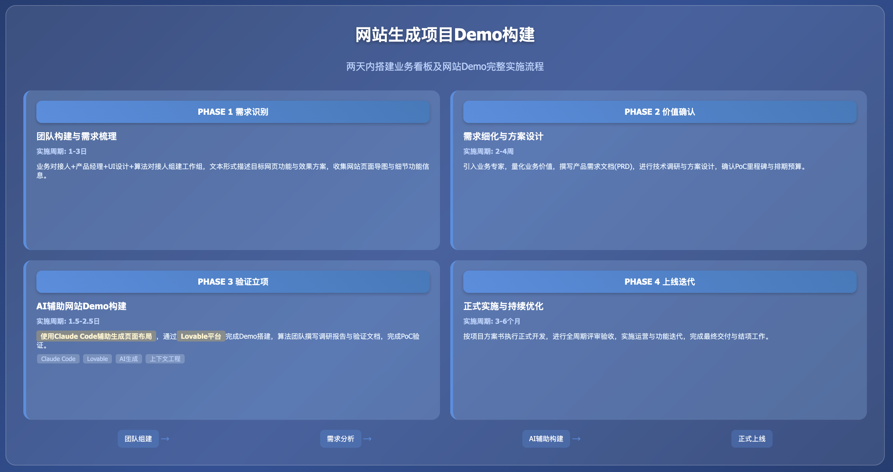

**实践详情**

|                                                                         |
|:------------------------------------------------------------------------|
| 这是擂台[两天内搭建业务看板及网站Demo]（编号Case251107Y01）的实践详情。 |

1\. **方案概览**

<table style="width:89%;">
<colgroup>
<col style="width: 15%" />
<col style="width: 73%" />
</colgroup>
<tbody>
<tr>
<td style="text-align: left;"><strong>PHASE 1 需求识别与团队构建</strong></td>
<td style="text-align: left;"></td>
</tr>
<tr>
<td style="text-align: center;"><strong>团队构成</strong></td>
<td style="text-align: left;">
<strong>业务对接人（×1）</strong>：熟悉该案例对应业务工作的组织、流程、决策链路，擅长沟通，熟悉项目管理基本操作

<strong>产品经理（×1）</strong>：熟悉该案例对应业务工作的组织、流程、决策链路，擅长沟通，协助业务对接人细化需求，并设计原型，该职位可由承做方提供

<strong>UI设计（×1）</strong>：熟悉用户交互界面设计，擅长沟通

<strong>算法对接人（×1）</strong>：熟悉该案例对应业务工作的业界通行技术架构与流程、建设与规划，擅长沟通，熟悉项目管理基本操作；在本案例中，可考虑直接由算法执行人员（即算法工程师、提示工程师等）担当
</td>
</tr>
<tr>
<td style="text-align: center;"><strong>实施内容</strong></td>
<td style="text-align: left;">
业务对接人、产品经理与算法对接人进行初次需求接触与头脑风暴交流，梳理该案例的核心需求

业务对接人与算法对接人组建工作组及联络群，明确明确对接人与联络方式

业务对接人协同产品经理（必要时UI设计参与支持）以文本形式向算法对接人清晰描述目标网页的功能与效果方案

双方沟通补充需求确认所需的其他材料，如网站各页面导图、网站细节功能等信息

算法对接人根据双方会议内容及反馈的文档和材料，展开需求评估
</td>
</tr>
<tr>
<td style="text-align: center;"><strong>相关资源</strong></td>
<td style="text-align: left;">脑图绘制工具：https://xmind.cn/ 或 飞书文档“画板”与“思维导图”功能</td>
</tr>
<tr>
<td style="text-align: center;"><strong>结果产出</strong></td>
<td style="text-align: left;">
成立工作组，明确对接人与联络方式

完成项目合作需求填写（即目标页面规划），对需求有初步梳理
</td>
</tr>
<tr>
<td style="text-align: center;"><strong>实施周期</strong></td>
<td style="text-align: left;">1-3日</td>
</tr>
</tbody>
</table>

<table style="width:89%;">
<colgroup>
<col style="width: 15%" />
<col style="width: 73%" />
</colgroup>
<tbody>
<tr>
<td style="text-align: left;"><strong>PHASE 2 价值确认与需求细化</strong></td>
<td style="text-align: left;"></td>
</tr>
<tr>
<td style="text-align: center;"><strong>团队构成</strong></td>
<td style="text-align: left;">
<strong>业务对接人（×1）</strong>：同PHASE 1

<strong>业务专家（×1）</strong>：该案例对应业务工作中涉及核心业务模块的领导者、执行者或专家，协助业务对接人明确业务痛点与价值

<strong>产品经理（×1）</strong>：同PHASE 1

<strong>UI设计（×1）</strong>：同PHASE 1

<strong>算法对接人（×1）</strong>：同PHASE 1
</td>
</tr>
<tr>
<td style="text-align: center;"><strong>实施内容</strong></td>
<td style="text-align: left;">
业务对接人与己方业务专家及相关团队沟通，确认该方案实施的预期目标及业务价值，业务价值需要尽可能量化，并有对比数据（如现状数字、预期达成目标、预期相比现状改善的程度等）

算法对接人与己方算法专家及相关团队沟通，罗列待确认事项，同时对方案进行初步调研、评估、设计

产品经理与业务对接人和算法对接人沟通、梳理并明确需求，之后组织双方相关人员撰写初步验证需求文档

双方根据初步验证需求文档进行需求确认，根据确认的需求规划排期、预算和资源。排期建议：首先以承接方完成初步验证、选型、产出Demo，并通过PoC为首个里程碑；之后双方进一步协商正式立项实施

重复以上步骤直至初步验证需求文档定稿
</td>
</tr>
<tr>
<td style="text-align: center;"><strong>相关资源</strong></td>
<td style="text-align: left;">模板：<a href="https://gvxnc4ekbvn.feishu.cn/wiki/PC8FwObgwiMwVPkM0i4cYkr2nYf?from=from_copylink">初步验证需求文档模板</a></td>
</tr>
<tr>
<td style="text-align: center;"><strong>结果产出</strong></td>
<td style="text-align: left;">
初步验证需求文档

PoC相关事项确认，如启动时间、验收时间、验收方案等
</td>
</tr>
<tr>
<td style="text-align: center;"><strong>实施周期</strong></td>
<td style="text-align: left;">2-4周</td>
</tr>
</tbody>
</table>

<table style="width:89%;">
<colgroup>
<col style="width: 15%" />
<col style="width: 73%" />
</colgroup>
<tbody>
<tr>
<td style="text-align: left;"><strong>PHASE 3 初步验证与立项</strong></td>
<td style="text-align: left;"></td>
</tr>
<tr>
<td style="text-align: center;"><strong>团队构成</strong></td>
<td style="text-align: left;">
<strong>业务对接人（×1）</strong>：同PHASE 1

<strong>算法对接人（×1）</strong>：同PHASE 1

<strong>产品经理（×1）</strong>：同PHASE 1

<strong>UI设计（×1）</strong>：同PHASE 1
</td>
</tr>
<tr>
<td style="text-align: center;"><strong>实施内容</strong></td>
<td style="text-align: left;">
安装和配置Claude Code（选做，可由产品经理人工撰写）

使用Claude Code辅助生成、完善目标页面布局大纲等资料（选做，可由产品经理人工撰写）

登录Lovable官方网站，输入目标页面布局大纲等资料，通过上下文工程完成Demo搭建

算法团队撰写初步验证报告

完成PoC

双方密切沟通，确认是否正式立项、建设正式网站

若计划立项正式发布，双方就Demo效果调整方案，定稿立项报告，准备立项协议及启动事宜
</td>
</tr>
<tr>
<td style="text-align: center;"><strong>相关资源</strong></td>
<td style="text-align: left;">
Claude Code GitHub：https://github.com/anthropics/claude-code

Lovable：https://lovable.dev/

模板：<a href="https://gvxnc4ekbvn.feishu.cn/wiki/HKZGwXetBije9HklRQmcAe94nZE?from=from_copylink">初步验证报告模板</a>
</td>
</tr>
<tr>
<td style="text-align: center;"><strong>结果产出</strong></td>
<td style="text-align: left;">
定稿并交付初步验证报告

完成Demo构建，准备并最终通过PoC

立项报告

立项协议（附件应包含正式上线版本的交付、验收、排期、资源等内容）
</td>
</tr>
<tr>
<td style="text-align: center;"><strong>实施周期</strong></td>
<td style="text-align: left;">1-2日</td>
</tr>
</tbody>
</table>

<table style="width:89%;">
<colgroup>
<col style="width: 15%" />
<col style="width: 73%" />
</colgroup>
<tbody>
<tr>
<td style="text-align: left;"><strong>PHASE 4 正式上线与优化迭代</strong></td>
<td style="text-align: left;"></td>
</tr>
<tr>
<td style="text-align: center;"><strong>团队构成</strong></td>
<td style="text-align: left;">按立项报告确定</td>
</tr>
<tr>
<td style="text-align: center;"><strong>实施内容</strong></td>
<td style="text-align: left;">
完成正式立项，确定启动时间

按立项报告内容与排期计划来实施与交付

按立项报告目标与流程来评审与验收

按立项报告规划来进行运营与迭代

按立项报告规划及协议约定，完成结项
</td>
</tr>
<tr>
<td style="text-align: center;"><strong>相关资源</strong></td>
<td style="text-align: left;">/</td>
</tr>
<tr>
<td style="text-align: center;"><strong>结果产出</strong></td>
<td style="text-align: left;">
项目全周期所有双方协商达成一致的材料

正式上线的产品
</td>
</tr>
<tr>
<td style="text-align: center;"><strong>实施周期</strong></td>
<td style="text-align: left;">3-6月（因具体情况而异）</td>
</tr>
</tbody>
</table>

2\. **方案验证**

|            |
|:-----------|
| [验证文档] |

3\. **技术步骤**

<table style="width:89%;">
<colgroup>
<col style="width: 10%" />
<col style="width: 10%" />
<col style="width: 10%" />
<col style="width: 55%" />
</colgroup>
<tbody>
<tr>
<td style="text-align: center;"><strong>步骤序号</strong></td>
<td style="text-align: left;">1</td>
<td style="text-align: center;"><strong>步骤名称</strong></td>
<td style="text-align: left;">Claude Code 安装和配置</td>
</tr>
<tr>
<td style="text-align: center;"><strong>步骤定义</strong></td>
<td style="text-align: left;">通过 Node 安装和配置 Claude Code</td>
<td style="text-align: left;"></td>
<td style="text-align: left;"></td>
</tr>
<tr>
<td style="text-align: center;"><strong>参与人员</strong></td>
<td style="text-align: left;">
角色名称：前端工程师/后端/算法工程师

技能要求：熟悉 node 即可

角色数量：1
</td>
<td style="text-align: left;"></td>
<td style="text-align: left;"></td>
</tr>
<tr>
<td style="text-align: center;"><strong>本步输入</strong></td>
<td style="text-align: left;">
输入名称：安装和配置 Claude Code

输入介绍：基于 Node 环境来安装和配置 Claude Code

输入示例：

相关命令如下：

<table style="width:75%;">
<colgroup>
<col style="width: 75%" />
</colgroup>
<tbody>
<tr>
<td style="text-align: left;">Bash 
# 安装 Claude Code 
npm install -g @anthropic-ai/claude-code 
 
# 配置环境变量（以 ~/.bashrc 为例，其他如 ~/.zshrc 等同理） 
echo 'export ANTHROPIC_BASE_URL="YOUR_BASE_URL"' &gt;&gt; ~/.bashrc 
echo 'export ANTHROPIC_AUTH_TOKEN="YOUR_AUTH_TOKEN"' &gt;&gt; ~/.bashrc 
 
# 配置模型 
vim ~/.claude/settings.json 
{ 
"env": { 
"ANTHROPIC_DEFAULT_HAIKU_MODEL": "YOUR_HAIKU_MODEL", 
"ANTHROPIC_DEFAULT_SONNET_MODEL": "YOUR_SONNET_MODEL", 
"ANTHROPIC_DEFAULT_OPUS_MODEL": "YOUR_OPUS_MODEL" 
} 
} 
 
# 启动成功确认命令，claude 进入命令行，输入任意文字后有收到对应回复且无报错则配置完成 
claude 
&gt; your_input</td>
</tr>
</tbody>
</table>

资源链接：

Claude Code GitHub：https://github.com/anthropics/claude-code
</td>
<td style="text-align: left;"></td>
<td style="text-align: left;"></td>
</tr>
<tr>
<td style="text-align: center;"><strong>本步产出</strong></td>
<td style="text-align: left;">
输出名称：可用的 Claude Code 服务

输出介绍：通过 Claude Code 来生成目标网站的 PRD 文件
</td>
<td style="text-align: left;"></td>
<td style="text-align: left;"></td>
</tr>
<tr>
<td style="text-align: center;"><strong>预估时间</strong></td>
<td style="text-align: left;">0.5-1 日</td>
<td style="text-align: left;"></td>
<td style="text-align: left;"></td>
</tr>
</tbody>
</table>

<table style="width:89%;">
<colgroup>
<col style="width: 10%" />
<col style="width: 10%" />
<col style="width: 10%" />
<col style="width: 55%" />
</colgroup>
<tbody>
<tr>
<td style="text-align: center;"><strong>步骤序号</strong></td>
<td style="text-align: left;">2</td>
<td style="text-align: center;"><strong>步骤名称</strong></td>
<td style="text-align: left;">PRD 生成</td>
</tr>
<tr>
<td style="text-align: center;"><strong>步骤定义</strong></td>
<td style="text-align: left;">通过 Claude Code 生成网站 PRD</td>
<td style="text-align: left;"></td>
<td style="text-align: left;"></td>
</tr>
<tr>
<td style="text-align: center;"><strong>参与人员</strong></td>
<td style="text-align: left;">
角色名称：产品经理

技能要求：具备产品、建站相关知识，熟悉 markdown 格式

角色数量：1
</td>
<td style="text-align: left;"></td>
<td style="text-align: left;"></td>
</tr>
<tr>
<td style="text-align: center;"><strong>本步输入</strong></td>
<td style="text-align: left;">
输入名称：通过 Claude Code 生成网站 PRD

输入介绍：和 Claude Code 进行一次或多次交互来生成 markdown 格式的 PRD 文件

输入示例：

相关命令如下：

<table style="width:75%;">
<colgroup>
<col style="width: 75%" />
</colgroup>
<tbody>
<tr>
<td style="text-align: left;">Bash 
# 把已有材料放到项目根目录，然后启动 Claude Code 
claude 
&gt; 根据已有材料生成网站的prd，保存为md文件 
 
# 对生成的prd不满意可以继续对话，对应md文件大模型修改后会实时更新，直到符合要求</td>
</tr>
</tbody>
</table>

资源链接：

Claude Code GitHub：https://github.com/anthropics/claude-code
</td>
<td style="text-align: left;"></td>
<td style="text-align: left;"></td>
</tr>
<tr>
<td style="text-align: center;"><strong>本步产出</strong></td>
<td style="text-align: left;">
输出名称：PRD 文件

输出介绍：符合要求的 markdown 格式的 PRD 文件
</td>
<td style="text-align: left;"></td>
<td style="text-align: left;"></td>
</tr>
<tr>
<td style="text-align: center;"><strong>预估时间</strong></td>
<td style="text-align: left;">0.5-1 日</td>
<td style="text-align: left;"></td>
<td style="text-align: left;"></td>
</tr>
</tbody>
</table>

<table style="width:89%;">
<colgroup>
<col style="width: 10%" />
<col style="width: 10%" />
<col style="width: 10%" />
<col style="width: 55%" />
</colgroup>
<tbody>
<tr>
<td style="text-align: center;"><strong>步骤序号</strong></td>
<td style="text-align: left;">3</td>
<td style="text-align: center;"><strong>步骤名称</strong></td>
<td style="text-align: left;">网站生成</td>
</tr>
<tr>
<td style="text-align: center;"><strong>步骤定义</strong></td>
<td style="text-align: left;">通过 Lovable 生成最终网站</td>
<td style="text-align: left;"></td>
<td style="text-align: left;"></td>
</tr>
<tr>
<td style="text-align: center;"><strong>参与人员</strong></td>
<td style="text-align: left;">
角色名称：产品经理

技能要求：具备产品、建站相关知识

角色数量：1
</td>
<td style="text-align: left;"></td>
<td style="text-align: left;"></td>
</tr>
<tr>
<td style="text-align: center;"><strong>本步输入</strong></td>
<td style="text-align: left;">
输入名称：通过 Lovable 生成最终网站

输入介绍：基于 Claude Code 生成的 PRD，和 Lovable 交互生成最终网站

输入示例：

相关操作如下：访问 https://lovable.dev/，点击左下角的 Attach 上传 PRD 文件，简单描述建站需求，如"根据当前 PRD 来建站实现 XXX 网站的全部功能（含交互）"，对细节等地方不满意，也可以对话继续优化

资源链接：

Lovable：https://lovable.dev/
</td>
<td style="text-align: left;"></td>
<td style="text-align: left;"></td>
</tr>
<tr>
<td style="text-align: center;"><strong>本步产出</strong></td>
<td style="text-align: left;">
输出名称：网站原型链接

输出介绍：可互联网公开访问的网站原型链接
</td>
<td style="text-align: left;"></td>
<td style="text-align: left;"></td>
</tr>
<tr>
<td style="text-align: center;"><strong>预估时间</strong></td>
<td style="text-align: left;">0.5-1 日</td>
<td style="text-align: left;"></td>
<td style="text-align: left;"></td>
</tr>
</tbody>
</table>

  [两天内搭建业务看板及网站Demo]: https://gvxnc4ekbvn.feishu.cn/wiki/CtjuwGhsIiE977kD7TLc4u0KnRe?from=from_copylink
  [验证文档]: https://gvxnc4ekbvn.feishu.cn/wiki/C3zwwGpfciexEGkzsD0cM2fRnRe?from=from_copylink
