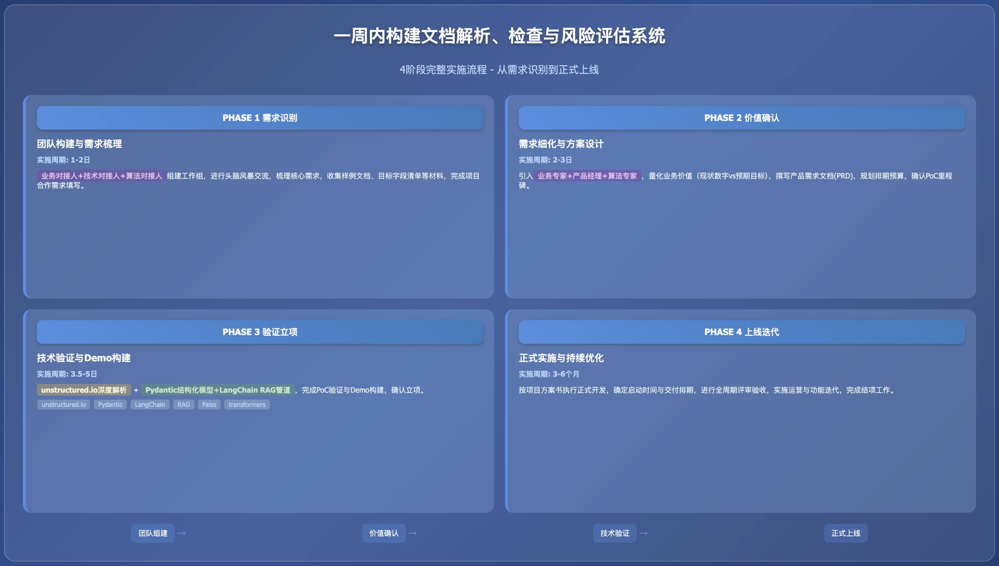

**实践详情**

|                                                                         |
|:------------------------------------------------------------------------|
| 这是擂台[一周内构建文档审核与风控Demo]（编号Case251119X01）的实践详情。 |

1\. **方案概览**

<table style="width:89%;">
<colgroup>
<col style="width: 15%" />
<col style="width: 73%" />
</colgroup>
<tbody>
<tr>
<td style="text-align: left;"><strong>PHASE 1 需求识别与团队构建</strong></td>
<td style="text-align: left;"></td>
</tr>
<tr>
<td style="text-align: center;"><strong>团队构成</strong></td>
<td style="text-align: left;">
<strong>业务对接人（×1）</strong>：熟悉该案例对应业务工作的组织、流程、决策链路，擅长沟通，熟悉基本的项目管理、产品需求梳理方法

<strong>业务侧技术对接人（×1）</strong>：通常为该案例最终工程实施的技术对接与负责人，辅助业务对接人在技术层面的沟通

<strong>算法对接人（×1）</strong>：熟悉该案例对应业务工作的业界通行技术架构与流程、建设与规划，擅长沟通，有执行力
</td>
</tr>
<tr>
<td style="text-align: center;"><strong>实施内容</strong></td>
<td style="text-align: left;">
业务对接人和技术对接人与算法对接人进行初次需求接触与头脑风暴交流，梳理该案例的核心需求

业务对接人与算法对接人组建工作组及联络群，明确明确对接人与联络方式

业务对接人以文本形式向算法对接人清晰描述该文档解析任务的目标与效果等内容

双方沟通补充需求确认所需的其他材料，如样例文档、目标字段清单、范例输出、文档解析业务规则与经验等

算法对接人根据双方会议内容及反馈的文档和材料，展开需求评估
</td>
</tr>
<tr>
<td style="text-align: center;"><strong>相关资源</strong></td>
<td style="text-align: left;">
模板：<a href="https://gvxnc4ekbvn.feishu.cn/wiki/TXOqw6LDKiN1FrkhRtvcT6JdnVc?from=from_copylink">项目合作需求问询书模板</a>

模板：<a href="https://gvxnc4ekbvn.feishu.cn/wiki/Z4U4wXExviT9UOkeJIGc8EnKnAh?from=from_copylink">子任务算法需求模板</a>
</td>
</tr>
<tr>
<td style="text-align: center;"><strong>结果产出</strong></td>
<td style="text-align: left;">
成立工作组，明确对接人与联络方式

完成项目合作需求填写，对需求有初步梳理
</td>
</tr>
<tr>
<td style="text-align: center;"><strong>实施周期</strong></td>
<td style="text-align: left;">1-2日</td>
</tr>
</tbody>
</table>

<table style="width:89%;">
<colgroup>
<col style="width: 15%" />
<col style="width: 73%" />
</colgroup>
<tbody>
<tr>
<td style="text-align: left;"><strong>PHASE 2 价值确认与需求细化</strong></td>
<td style="text-align: left;"></td>
</tr>
<tr>
<td style="text-align: center;"><strong>团队构成</strong></td>
<td style="text-align: left;">
<strong>业务对接人（×1）</strong>：同PHASE 1

<strong>业务专家（×1）</strong>：该案例对应业务工作中涉及核心业务模块的领导者、执行者或专家，协助业务对接人明确业务痛点与价值

<strong>产品经理（×1）</strong>：熟悉该案例对应业务工作的组织、流程、决策链路，擅长沟通，协助业务对接人细化需求，并设计原型，该职位可由承做方提供

<strong>业务侧技术对接人（×1）</strong>：同PHASE 1

<strong>算法对接人（×1）</strong>：同PHASE 1

<strong>算法专家（×1）</strong>：熟悉各场景与应用中业界目前的前沿与通用技术方案及选型，协助算法对接人评估需求，协调团队进行调研、设计方案与架构，协助评估排期
</td>
</tr>
<tr>
<td style="text-align: center;"><strong>实施内容</strong></td>
<td style="text-align: left;">
业务对接人与己方业务专家及相关团队沟通，确认该方案实施的预期目标及业务价值，业务价值需要尽可能量化，并有对比数据（如现状数字、预期达成目标、预期相比现状改善的程度等）

算法对接人与己方算法专家及相关团队沟通，罗列待确认事项，同时对方案进行初步调研、评估、设计

产品经理与业务对接人和算法对接人沟通、梳理并明确需求，之后组织双方相关人员撰写初步验证需求文档

双方根据初步验证需求文档进行需求确认，根据确认的需求规划排期、预算和资源。排期建议：首先以承接方完成初步验证、选型、产出Demo，并通过PoC为首个里程碑；之后双方进一步协商正式立项实施

重复以上步骤直至初步验证需求文档定稿
</td>
</tr>
<tr>
<td style="text-align: center;"><strong>相关资源</strong></td>
<td style="text-align: left;">模板：<a href="https://gvxnc4ekbvn.feishu.cn/wiki/PC8FwObgwiMwVPkM0i4cYkr2nYf?from=from_copylink">初步验证需求文档模板</a></td>
</tr>
<tr>
<td style="text-align: center;"><strong>结果产出</strong></td>
<td style="text-align: left;">
初步验证需求文档

PoC相关事项确认，如启动时间、验收时间、验收方案等
</td>
</tr>
<tr>
<td style="text-align: center;"><strong>实施周期</strong></td>
<td style="text-align: left;">2-3日</td>
</tr>
</tbody>
</table>

<table style="width:89%;">
<colgroup>
<col style="width: 15%" />
<col style="width: 73%" />
</colgroup>
<tbody>
<tr>
<td style="text-align: left;"><strong>PHASE 3 初步验证与立项</strong></td>
<td style="text-align: left;"></td>
</tr>
<tr>
<td style="text-align: center;"><strong>团队构成</strong></td>
<td style="text-align: left;">
<strong>业务对接人（×1）</strong>：同PHASE 1

<strong>算法对接人（×1）</strong>：同PHASE 1

<strong>算法工程师（×1）</strong>：熟悉Python虚拟环境管理、包管理工具等运用；熟悉LangChain、RAG、提示工程、基座模型部署与调用等相关技能
</td>
</tr>
<tr>
<td style="text-align: center;"><strong>实施内容</strong></td>
<td style="text-align: left;">
资源准备与环境配置

使用 unstructured.io 库对输入的PDF文档进行深度布局感知解析，将其转换为结构化的语义元素（Elements）

根据目标接口文档，使用 Pydantic 库定义一个严格对应的、包含嵌套模型的Python BaseModel 类

使用LangChain Expression Language (LCEL) 编排一个完整的检索增强生成（RAG）管道：解析器 -&gt; 分块 -&gt; 检索器 -&gt; 提示词 -&gt; 基座模型 -&gt; 结构化输出解析器，以全自动方式处理PDF并生成目标JSON

算法团队撰写初步验证报告

完成PoC

双方密切沟通，确认是否正式立项

若计划立项正式发布，双方就Demo效果调整方案，定稿立项报告，准备立项协议及启动事宜
</td>
</tr>
<tr>
<td style="text-align: center;"><strong>相关资源</strong></td>
<td style="text-align: left;">
LangChain GitHub：https://github.com/langchain-ai/langchain

transformers Github： https://github.com/huggingface/transformers

Langchain-community Github： https://github.com/langchain-ai/langchain-community

Pydantic Github: https://github.com/pydantic/pydantic

accelerate Github: https://github.com/huggingface/accelerate

sentence-transformers Github: https://github.com/huggingface/sentence-transformers

unstructured Github : https://github.com/Unstructured-IO/unstructured

Faiss Github: https://github.com/facebookresearch/faiss

模板：<a href="https://gvxnc4ekbvn.feishu.cn/wiki/HKZGwXetBije9HklRQmcAe94nZE?from=from_copylink">初步验证报告模板</a>
</td>
</tr>
<tr>
<td style="text-align: center;"><strong>结果产出</strong></td>
<td style="text-align: left;">
定稿并交付初步验证报告

完成Demo构建，准备并最终通过PoC

立项报告

立项协议（附件应包含正式上线版本的交付、验收、排期、资源等内容）
</td>
</tr>
<tr>
<td style="text-align: center;"><strong>实施周期</strong></td>
<td style="text-align: left;">3.5-5日</td>
</tr>
</tbody>
</table>

<table style="width:89%;">
<colgroup>
<col style="width: 15%" />
<col style="width: 73%" />
</colgroup>
<tbody>
<tr>
<td style="text-align: left;"><strong>PHASE 4 正式上线与优化迭代</strong></td>
<td style="text-align: left;"></td>
</tr>
<tr>
<td style="text-align: center;"><strong>团队构成</strong></td>
<td style="text-align: left;">按立项报告确定</td>
</tr>
<tr>
<td style="text-align: center;"><strong>实施内容</strong></td>
<td style="text-align: left;">
完成正式立项，确定启动时间

按立项报告内容与排期计划来实施与交付

按立项报告目标与流程来评审与验收

按立项报告规划来进行运营与迭代

按立项报告规划及协议约定，完成结项
</td>
</tr>
<tr>
<td style="text-align: center;"><strong>相关资源</strong></td>
<td style="text-align: left;">/</td>
</tr>
<tr>
<td style="text-align: center;"><strong>结果产出</strong></td>
<td style="text-align: left;">
项目全周期所有双方协商达成一致的材料

正式上线的产品
</td>
</tr>
<tr>
<td style="text-align: center;"><strong>实施周期</strong></td>
<td style="text-align: left;">3-6月（因具体情况而异）</td>
</tr>
</tbody>
</table>

2\. **方案验证**

|        |
|:-------|
| 待验证 |

3\. **技术步骤**

<table style="width:89%;">
<colgroup>
<col style="width: 10%" />
<col style="width: 10%" />
<col style="width: 10%" />
<col style="width: 55%" />
</colgroup>
<tbody>
<tr>
<td style="text-align: center;"><strong>步骤序号</strong></td>
<td style="text-align: left;">1</td>
<td style="text-align: center;"><strong>步骤名称</strong></td>
<td style="text-align: left;">环境与依赖准备</td>
</tr>
<tr>
<td style="text-align: center;"><strong>步骤定义</strong></td>
<td style="text-align: left;">配置Python 3.10+环境，并安装所有SOTA管道所需的核心库。</td>
<td style="text-align: left;"></td>
<td style="text-align: left;"></td>
</tr>
<tr>
<td style="text-align: center;"><strong>参与人员</strong></td>
<td style="text-align: left;">
角色名称：算法工程师

技能要求：

熟悉Python虚拟环境管理 (venv 或 conda)

熟悉 pip等包管理工具，包括处理复杂的对等依赖

角色数量：1 人
</td>
<td style="text-align: left;"></td>
<td style="text-align: left;"></td>
</tr>
<tr>
<td style="text-align: center;"><strong>本步输入</strong></td>
<td style="text-align: left;">
输入名称：requirements.txt 文件

输入介绍：

包含所有必需的Python包，尤其是 unstructured 及其PDF解析所需的额外依赖

输入示例：

<table style="width:70%;">
<colgroup>
<col style="width: 70%" />
</colgroup>
<tbody>
<tr>
<td style="text-align: left;">XML 
# 编排与核心逻辑 
langchain 
langchain-community 
pydantic 
 
# LLM与嵌入 (以Ollama和开源模型为例) 
langchain-ollama 
transformers 
accelerate 
sentence-transformers 
 
# SOTA 解析层 
unstructured[pdf] # 关键：[pdf] 包含PDF解析依赖 
 
# 检索层 
faiss-cpu</td>
</tr>
</tbody>
</table>

资源链接

LangChain GitHub：https://github.com/langchain-ai/langchain

transformers Github： https://github.com/huggingface/transformers

Langchain-community Github： https://github.com/langchain-ai/langchain-community

Pydantic Github: https://github.com/pydantic/pydantic

accelerate Github: https://github.com/huggingface/accelerate

sentence-transformers Github: https://github.com/huggingface/sentence-transformers

unstructured Github : https://github.com/Unstructured-IO/unstructured

Faiss Github: https://github.com/facebookresearch/faiss
</td>
<td style="text-align: left;"></td>
<td style="text-align: left;"></td>
</tr>
<tr>
<td style="text-align: center;"><strong>本步产出</strong></td>
<td style="text-align: left;">
输出名称：已配置的虚拟环境

输出介绍：一个隔离的、包含所有SOTA依赖的Python环境。<strong>注意</strong>：unstructured[pdf] 可能需要额外的系统级依赖，如 poppler-utils 和 tesseract-ocr。
</td>
<td style="text-align: left;"></td>
<td style="text-align: left;"></td>
</tr>
<tr>
<td style="text-align: center;"><strong>预估时间</strong></td>
<td style="text-align: left;">0.5 日</td>
<td style="text-align: left;"></td>
<td style="text-align: left;"></td>
</tr>
</tbody>
</table>

<table style="width:89%;">
<colgroup>
<col style="width: 10%" />
<col style="width: 10%" />
<col style="width: 10%" />
<col style="width: 56%" />
</colgroup>
<tbody>
<tr>
<td style="text-align: center;"><strong>步骤序号</strong></td>
<td style="text-align: left;">2</td>
<td style="text-align: center;"><strong>步骤名称</strong></td>
<td style="text-align: left;">SOTA文档解析层：布局感知解析</td>
</tr>
<tr>
<td style="text-align: center;"><strong>步骤定义</strong></td>
<td style="text-align: left;">使用 unstructured.io 库对输入的PDF文档进行深度布局感知解析，将其转换为结构化的语义元素（Elements）。</td>
<td style="text-align: left;"></td>
<td style="text-align: left;"></td>
</tr>
<tr>
<td style="text-align: center;"><strong>参与人员</strong></td>
<td style="text-align: left;">
角色名称：AI算法工程师

技能要求：

熟悉 unstructured.io 库

理解不同解析策略（fast vs hi_res）对性能和准确率的影响

熟悉LangChain的DocumentLoader（文档加载器）接口

角色数量：1
</td>
<td style="text-align: left;"></td>
<td style="text-align: left;"></td>
</tr>
<tr>
<td style="text-align: center;"><strong>本步输入</strong></td>
<td style="text-align: left;">
输入名称：PDF文档

输入介绍：复杂的、包含文本、表格、多级标题的半结构化PDF
</td>
<td style="text-align: left;"></td>
<td style="text-align: left;"></td>
</tr>
<tr>
<td style="text-align: center;"><strong>本步产出</strong></td>
<td style="text-align: left;">
输出名称：结构化文档元素列表 (List of unstructured.documents.elements.Element)

输出介绍：一个Python列表，其中每个元素都被分类为 Title, NarrativeText, Table 等，为后续的语义分块和检索奠定基础。
</td>
<td style="text-align: left;"></td>
<td style="text-align: left;"></td>
</tr>
<tr>
<td style="text-align: center;"><strong>预估时间</strong></td>
<td style="text-align: left;">0.5-1 日</td>
<td style="text-align: left;"></td>
<td style="text-align: left;"></td>
</tr>
</tbody>
</table>

<table style="width:89%;">
<colgroup>
<col style="width: 10%" />
<col style="width: 10%" />
<col style="width: 10%" />
<col style="width: 55%" />
</colgroup>
<tbody>
<tr>
<td style="text-align: center;"><strong>步骤序号</strong></td>
<td style="text-align: left;">3</td>
<td style="text-align: center;"><strong>步骤名称</strong></td>
<td style="text-align: left;">结构化输出模式定义</td>
</tr>
<tr>
<td style="text-align: center;"><strong>步骤定义</strong></td>
<td style="text-align: left;">根据目标接口文档，使用 Pydantic 定义一个严格对应的、包含嵌套模型的Python BaseModel 类。</td>
<td style="text-align: left;"></td>
<td style="text-align: left;"></td>
</tr>
<tr>
<td style="text-align: center;"><strong>参与人员</strong></td>
<td style="text-align: left;">
角色名称：AI算法工程师 / 后端工程师

技能要求：

精通 Pydantic BaseModel 定义

能够将JSON schema翻译为 BaseModel，包括 Field 定义、类型提示（typing.List, typing.bool）和嵌套模型

角色数量：1
</td>
<td style="text-align: left;"></td>
<td style="text-align: left;"></td>
</tr>
<tr>
<td style="text-align: center;"><strong>本步输入</strong></td>
<td style="text-align: left;">
输入名称：API接口文档

输入介绍：目标JSON输出的详细schema，包括所有键、值类型和嵌套结构

输入示例：

<blockquote>

completeness_check.sections 的Pydantic定义

</blockquote>
<table style="width:70%;">
<colgroup>
<col style="width: 70%" />
</colgroup>
<tbody>
<tr>
<td style="text-align: left;">Python 
from pydantic import BaseModel, Field 
from typing import bool 
 
class CompletenessSections(BaseModel): 
info_introduction: bool = Field(..., description="文档是否包含'摘要'章节") 
info_method: bool = Field(..., description="文档是否包含'实施方案'章节") 
info_dataset: bool = Field(..., description="文档是否包含'数据介绍'章节") 
info_settings: bool = Field(..., description="文档是否包含'实施配置'章节") 
......</td>
</tr>
</tbody>
</table></td>
<td style="text-align: left;"></td>
<td style="text-align: left;"></td>
</tr>
<tr>
<td style="text-align: center;"><strong>本步产出</strong></td>
<td style="text-align: left;">
输出名称：DocumentCheckResult Pydantic 模型 (Python Class)

输出介绍：一个可直接被LangChain的with_structured_output 调用的Python类，用于强制LLM输出合规的JSON
</td>
<td style="text-align: left;"></td>
<td style="text-align: left;"></td>
</tr>
<tr>
<td style="text-align: center;"><strong>预估时间</strong></td>
<td style="text-align: left;">1-1.5 日</td>
<td style="text-align: left;"></td>
<td style="text-align: left;"></td>
</tr>
</tbody>
</table>

<table style="width:89%;">
<colgroup>
<col style="width: 10%" />
<col style="width: 10%" />
<col style="width: 10%" />
<col style="width: 56%" />
</colgroup>
<tbody>
<tr>
<td style="text-align: center;"><strong>步骤序号</strong></td>
<td style="text-align: left;">4</td>
<td style="text-align: center;"><strong>步骤名称</strong></td>
<td style="text-align: left;">构建并执行E2E智能处理链</td>
</tr>
<tr>
<td style="text-align: center;"><strong>步骤定义</strong></td>
<td style="text-align: left;">使用LangChain Expression Language (LCEL)编排一个完整的RAG管道：解析器 -&gt; 分块 -&gt; 检索器 -&gt; 提示词 -&gt; 基座模型 -&gt; 结构化输出解析器，以全自动方式处理PDF并生成目标JSON。</td>
<td style="text-align: left;"></td>
<td style="text-align: left;"></td>
</tr>
<tr>
<td style="text-align: center;"><strong>参与人员</strong></td>
<td style="text-align: left;">
角色名称：算法工程师

技能要求：

精通 LangChain (LCEL)，理解 RunnableParallel 和 RunnablePassthrough

熟悉 with_structured_output的使用，并能将其与Pydantic模型绑定。

具备高级提示词工程（Prompt Engineering）能力，能编写复杂的指令来指导LLM同时完成多项任务（分类、摘要、提取。

角色数量：1 人
</td>
<td style="text-align: left;"></td>
<td style="text-align: left;"></td>
</tr>
<tr>
<td style="text-align: center;"><strong>本步输入</strong></td>
<td style="text-align: left;">
输入名称：PDF文件存储路径, Pydantic模型, LLM实例

输入介绍：步骤1、2、3的所有产出物，以及一个已初始化的 LangChain LLM 实例（如指向本地 Qwen模型的 ChatOllama 实例）。
</td>
<td style="text-align: left;"></td>
<td style="text-align: left;"></td>
</tr>
<tr>
<td style="text-align: center;"><strong>本步产出</strong></td>
<td style="text-align: left;">
输出名称：符合规范的Pydantic对象（可序列化为JSON）

输出介绍：对输入文档进行完整分析后，由SOTA RAG管道生成的、100%符合schema的结构化数据，可直接用于API返回。
</td>
<td style="text-align: left;"></td>
<td style="text-align: left;"></td>
</tr>
<tr>
<td style="text-align: center;"><strong>预估时间</strong></td>
<td style="text-align: left;">1.5-2 日</td>
<td style="text-align: left;"></td>
<td style="text-align: left;"></td>
</tr>
</tbody>
</table>

  [一周内构建文档审核与风控Demo]: https://gvxnc4ekbvn.feishu.cn/wiki/PQ6MwPExLi3v2Vkn3DAckYxGn8b?from=from_copylink
