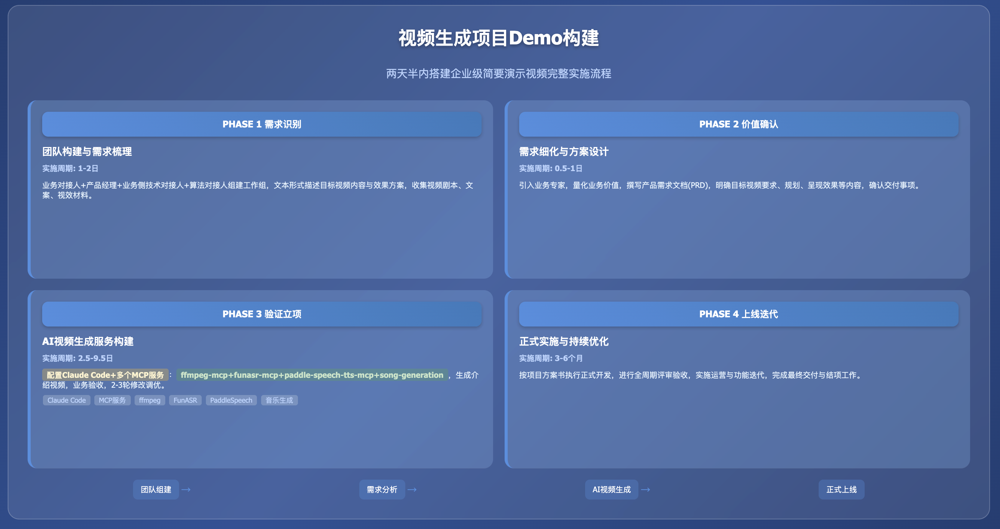

**实践详情**

|                                                                         |
|:------------------------------------------------------------------------|
| 这是擂台[两天半搭建企业级简要演示视频]（编号Case251107Y02）的实践详情。 |

1\. **方案概览**



<table style="width:89%;">
<colgroup>
<col style="width: 15%" />
<col style="width: 73%" />
</colgroup>
<tbody>
<tr>
<td style="text-align: left;"><strong>PHASE 1 需求识别与团队构建</strong></td>
<td style="text-align: left;"></td>
</tr>
<tr>
<td style="text-align: center;"><strong>团队构成</strong></td>
<td style="text-align: left;"><p><strong>业务对接人（×1）</strong>：熟悉该案例对应业务工作的组织、流程、决策链路，擅长沟通，熟悉项目管理基本操作</p>
<p><strong>产品经理（×1）</strong>：通常为该视频录制功能点的产品负责人，擅长沟通，协助业务对接人在技术层面的沟通</p>
<p><strong>业务侧技术对接人（×1）</strong>：通常为该视频录制功能点的技术负责人，辅助业务对接人在技术层面的沟通</p>
<p><strong>算法对接人（×1）</strong>：熟悉该案例对应业务工作的业界通行技术架构与流程、建设与规划，擅长沟通，有执行力</p></td>
</tr>
<tr>
<td style="text-align: center;"><strong>实施内容</strong></td>
<td style="text-align: left;"><p>业务对接人、产品经理与算法对接人进行初次需求接触与头脑风暴交流，梳理该案例的核心需求</p>
<p>业务对接人与算法对接人组建工作组及联络群，明确明确对接人与联络方式</p>
<p>业务对接人协同产品经理（必要时业务侧技术对接人参与支持）以文本形式向算法对接人清晰描述目标视频的内容与效果方案</p>
<p>双方沟通补充需求确认所需的其他材料，如视频剧本、文案、视效材料等</p>
<p>算法对接人根据双方会议内容及反馈的文档和材料，展开需求评估</p></td>
</tr>
<tr>
<td style="text-align: center;"><strong>相关资源</strong></td>
<td style="text-align: left;"><p>脑图绘制工具：https://xmind.cn/ 或 飞书文档“画板”与“思维导图”功能</p>
<p>剧本及文案撰写工具：Word、Excel、WPS等</p></td>
</tr>
<tr>
<td style="text-align: center;"><strong>结果产出</strong></td>
<td style="text-align: left;"><p>成立工作组，明确对接人与联络方式</p>
<p>完成项目合作需求填写（即目标视频规划），对需求有初步梳理</p></td>
</tr>
<tr>
<td style="text-align: center;"><strong>实施周期</strong></td>
<td style="text-align: left;">1-2日</td>
</tr>
</tbody>
</table>

<table style="width:89%;">
<colgroup>
<col style="width: 15%" />
<col style="width: 73%" />
</colgroup>
<tbody>
<tr>
<td style="text-align: left;"><strong>PHASE 2 价值确认与需求细化</strong></td>
<td style="text-align: left;"></td>
</tr>
<tr>
<td style="text-align: center;"><strong>团队构成</strong></td>
<td style="text-align: left;"><p><strong>业务对接人（×1）</strong>：同PHASE 1</p>
<p><strong>业务专家（×1）</strong>：该案例对应业务工作中涉及核心业务模块的领导者、执行者或专家，协助业务对接人明确业务痛点与价值</p>
<p><strong>产品经理（×1）</strong>：同PHASE 1</p>
<p><strong>业务侧技术对接人（×1）</strong>：同PHASE 1</p>
<p><strong>算法对接人（×1）</strong>：同PHASE 1</p></td>
</tr>
<tr>
<td style="text-align: center;"><strong>实施内容</strong></td>
<td style="text-align: left;"><p>业务对接人与己方业务专家及相关团队沟通，确认该方案实施的预期目标及业务价值，业务价值需要尽可能量化，并有对比数据（如现状数字、预期达成目标、预期相比现状改善的程度等）</p>
<p>算法对接人与己方算法专家及相关团队沟通，罗列待确认事项，同时对方案进行初步调研、评估、设计</p>
<p>产品经理与业务对接人和算法对接人沟通、梳理并明确需求，之后组织双方相关人员撰写初步验证需求文档</p>
<p>双方根据初步验证需求文档进行需求确认，根据确认的需求规划排期、预算和资源</p>
<p>重复以上步骤直至初步验证需求文档定稿</p></td>
</tr>
<tr>
<td style="text-align: center;"><strong>相关资源</strong></td>
<td style="text-align: left;">模板：<a href="https://gvxnc4ekbvn.feishu.cn/wiki/PC8FwObgwiMwVPkM0i4cYkr2nYf?from=from_copylink">初步验证需求文档模板</a></td>
</tr>
<tr>
<td style="text-align: center;"><strong>结果产出</strong></td>
<td style="text-align: left;"><p>初步验证需求文档：应包含目标视频的明确要求、规划、呈现效果等内容</p>
<p>交付事项确认，如启动时间、验收时间、验收方案等</p></td>
</tr>
<tr>
<td style="text-align: center;"><strong>实施周期</strong></td>
<td style="text-align: left;">0.5-1日</td>
</tr>
</tbody>
</table>

<table style="width:89%;">
<colgroup>
<col style="width: 15%" />
<col style="width: 73%" />
</colgroup>
<tbody>
<tr>
<td style="text-align: left;"><strong>PHASE 3 初步验证与立项</strong></td>
<td style="text-align: left;"></td>
</tr>
<tr>
<td style="text-align: center;"><strong>团队构成</strong></td>
<td style="text-align: left;"><p><strong>业务对接人（×1）</strong>：同PHASE 1</p>
<p><strong>产品经理（×1）</strong>：同PHASE 1</p>
<p><strong>算法对接人（×1）</strong>：同PHASE 1</p>
<p><strong>算法工程师（×1）</strong>：掌握至少一门后端编程语言（如Python等）；熟悉 Docker；掌握常见智能体平台（如Dify 等）的私有化部署、大模型配置、MCP工具服务配置；了解一定的前端操作</p></td>
</tr>
<tr>
<td style="text-align: center;"><strong>实施内容</strong></td>
<td style="text-align: left;"><p>资源准备与环境配置</p>
<p>Claude Code 安装和配置</p>
<p>构建并启动 ffmpeg-mcp 服务</p>
<p>构建并启动 funasr-mcp 服务</p>
<p>构建并启动 paddle-speech-tts-mcp 服务</p>
<p>构建自定义的视频压缩倍数计算的mcp服务，并启动</p>
<p>配置启动 song-generation 服务，支持文本生成纯音乐</p>
<p>启动 Claude Code 调用上述步骤提及的 MCP 服务，生成介绍视频</p>
<p>算法对接人撰写初步验证报告</p>
<p>算法对接人完成视频制作</p>
<p>业务对接人与产品经理验收视频（首次验收可作为PoC）</p>
<p>业务对接人、产品经理与算法对接人重复2-3轮意见反馈与修改调优</p>
<p>完成验收</p>
<p>若计划立项正式发布，双方密切协商，并就Demo效果调整方案，定稿立项报告，准备立项协议及启动事宜</p></td>
</tr>
<tr>
<td style="text-align: center;"><strong>相关资源</strong></td>
<td style="text-align: left;"><p>Claude Code GitHub：https://github.com/anthropics/claude-code</p>
<p>mcp-python-sdk GitHub：https://github.com/modelcontextprotocol/python-sdk</p>
<p>ffmpeg 官网：https://www.ffmpeg.org/</p>
<p>ffmpeg GitHub：https://github.com/FFmpeg/FFmpeg</p>
<p>ffmpeg-python GitHub：https://github.com/kkroening/ffmpeg-python</p>
<p>loguru GitHub：https://github.com/Delgan/loguru</p>
<p>mcp-python-sdk GitHub：https://github.com/modelcontextprotocol/python-sdk</p>
<p>funasr GitHub：https://github.com/modelscope/FunASR</p>
<p>paddle-speech GitHub：https://github.com/PaddlePaddle/PaddleSpeech</p>
<p>SongGeneration GitHub：https://github.com/tencent-ailab/SongGeneration</p>
<p>模板：<a href="https://gvxnc4ekbvn.feishu.cn/wiki/HKZGwXetBije9HklRQmcAe94nZE?from=from_copylink">初步验证报告模板</a></p></td>
</tr>
<tr>
<td style="text-align: center;"><strong>结果产出</strong></td>
<td style="text-align: left;"><p>定稿并交付初步验证报告</p>
<p>完成视频</p>
<p>立项报告</p>
<p>立项协议（附件应包含正式上线版本的交付、验收、排期、资源等内容）</p></td>
</tr>
<tr>
<td style="text-align: center;"><strong>实施周期</strong></td>
<td style="text-align: left;">2.5-9.5日</td>
</tr>
</tbody>
</table>

<table style="width:89%;">
<colgroup>
<col style="width: 15%" />
<col style="width: 73%" />
</colgroup>
<tbody>
<tr>
<td style="text-align: left;"><strong>PHASE 4 正式上线与优化迭代</strong></td>
<td style="text-align: left;"></td>
</tr>
<tr>
<td style="text-align: center;"><strong>团队构成</strong></td>
<td style="text-align: left;">按立项报告确定</td>
</tr>
<tr>
<td style="text-align: center;"><strong>实施内容</strong></td>
<td style="text-align: left;"><p>完成正式立项，确定启动时间</p>
<p>按立项报告内容与排期计划来实施与交付</p>
<p>按立项报告目标与流程来评审与验收</p>
<p>按立项报告规划来进行运营与迭代</p>
<p>按立项报告规划及协议约定，完成结项</p></td>
</tr>
<tr>
<td style="text-align: center;"><strong>相关资源</strong></td>
<td style="text-align: left;">/</td>
</tr>
<tr>
<td style="text-align: center;"><strong>结果产出</strong></td>
<td style="text-align: left;"><p>项目全周期所有双方协商达成一致的材料</p>
<p>正式上线的产品</p></td>
</tr>
<tr>
<td style="text-align: center;"><strong>实施周期</strong></td>
<td style="text-align: left;">3-6月（因具体情况而异）</td>
</tr>
</tbody>
</table>

2\. **方案验证**

|            |
|:-----------|
| [验证文档] |

3\. **技术步骤**

<table style="width:89%;">
<colgroup>
<col style="width: 10%" />
<col style="width: 10%" />
<col style="width: 10%" />
<col style="width: 55%" />
</colgroup>
<tbody>
<tr>
<td style="text-align: center;"><strong>步骤序号</strong></td>
<td style="text-align: left;">1</td>
<td style="text-align: center;"><strong>步骤名称</strong></td>
<td style="text-align: left;">资源准备与环境配置</td>
</tr>
<tr>
<td style="text-align: center;"><strong>步骤定义</strong></td>
<td style="text-align: left;">获取并预处理开源模型与评测集资源，完成所提方案运行所需的软硬件环境配置</td>
<td style="text-align: left;"></td>
<td style="text-align: left;"></td>
</tr>
<tr>
<td style="text-align: center;"><strong>参与人员</strong></td>
<td style="text-align: left;"><p>角色名称：算法工程师</p>
<p>技能要求：</p>
<p>熟练使用多种思维链策略，对前沿与流行的开/闭源大模型资源较熟悉，有自己的使用经验、使用总结与心得</p>
<p>熟练掌握NLP经典深度学习模型（如Transformer系、LLaMA系、GLM系等）及相关资源（网站、库、博客等）；掌握至少一种常用深度学习开发框架，如PyTorch等；对GPT-3.5之后的大规模生成式语言模型（大模型）的工作原理和最新消息保持持续关注与兴趣</p>
<p>熟练掌握Python语言，会使用基本的正则表达式和命令行脚本；熟知NLP基础概念及经典任务（分类、匹配、序列标注、生成等）；能熟练运用常见NLP开源库（HanLP、LTP、Jieba等）</p>
<p>态度积极主动，沟通有条理，有好奇心与自驱力</p>
<p>角色数量：1 人</p></td>
<td style="text-align: left;"></td>
<td style="text-align: left;"></td>
</tr>
<tr>
<td style="text-align: center;"><strong>本步输入</strong></td>
<td style="text-align: left;"><p>输入名称：环境配置所需资源</p>
<p>输入介绍：</p>
<p>检查运行环境的硬件是否满足下述要求：GPU 最好为 NVIDIA A10 及以上（可选），显存 ≥ 16GB 的 GPU（可选）、CPU ≥8 核、内存 ≥ 16GB，操作系统为 Linux（Ubuntu 20.04+）。</p>
<p>输入示例：</p>
<p>请列出清单自检：</p>
<p>NVIDIA A10 及以上（可选）</p>
<p>显存 ≥ 16GB 的GP（可选）U</p>
<p>CPU ≥8 核</p>
<p>内存 ≥ 16GB</p></td>
<td style="text-align: left;"></td>
<td style="text-align: left;"></td>
</tr>
<tr>
<td style="text-align: center;"><strong>本步产出</strong></td>
<td style="text-align: left;"><p>输出名称：环境配置所需资源就绪</p>
<p>输出介绍：服务器已配置GPU 驱动（可选）、Python 环境、Node 环境，满足模型部署的硬件与系统要求</p></td>
<td style="text-align: left;"></td>
<td style="text-align: left;"></td>
</tr>
<tr>
<td style="text-align: center;"><strong>预估时间</strong></td>
<td style="text-align: left;">1-2 日</td>
<td style="text-align: left;"></td>
<td style="text-align: left;"></td>
</tr>
</tbody>
</table>

<table style="width:89%;">
<colgroup>
<col style="width: 10%" />
<col style="width: 10%" />
<col style="width: 10%" />
<col style="width: 55%" />
</colgroup>
<tbody>
<tr>
<td style="text-align: center;"><strong>步骤序号</strong></td>
<td style="text-align: left;">2</td>
<td style="text-align: center;"><strong>步骤名称</strong></td>
<td style="text-align: left;">Claude Code 安装和配置</td>
</tr>
<tr>
<td style="text-align: center;"><strong>步骤定义</strong></td>
<td style="text-align: left;">通过 Node 安装和配置 Claude Code</td>
<td style="text-align: left;"></td>
<td style="text-align: left;"></td>
</tr>
<tr>
<td style="text-align: center;"><strong>参与人员</strong></td>
<td style="text-align: left;"><p>角色名称：前端工程师/后端/算法工程师</p>
<p>技能要求：熟悉 node 即可</p>
<p>角色数量：1</p></td>
<td style="text-align: left;"></td>
<td style="text-align: left;"></td>
</tr>
<tr>
<td style="text-align: center;"><strong>本步输入</strong></td>
<td style="text-align: left;"><p>输入名称：安装和配置 Claude Code</p>
<p>输入介绍：基于 Node 环境来安装和配置 Claude Code</p>
<p>输入示例：</p>
<p>相关命令如下：</p>
<table style="width:75%;">
<colgroup>
<col style="width: 75%" />
</colgroup>
<tbody>
<tr>
<td style="text-align: left;">Bash<br />
# 安装 Claude Code<br />
npm install -g @anthropic-ai/claude-code<br />
<br />
# 配置环境变量（以 ~/.bashrc 为例，其他如 ~/.zshrc 等同理）<br />
echo 'export ANTHROPIC_BASE_URL="YOUR_BASE_URL"' &gt;&gt; ~/.bashrc<br />
echo 'export ANTHROPIC_AUTH_TOKEN="YOUR_AUTH_TOKEN"' &gt;&gt; ~/.bashrc<br />
<br />
# 配置模型<br />
vim ~/.claude/settings.json<br />
{<br />
"env": {<br />
"ANTHROPIC_DEFAULT_HAIKU_MODEL": "YOUR_HAIKU_MODEL",<br />
"ANTHROPIC_DEFAULT_SONNET_MODEL": "YOUR_SONNET_MODEL",<br />
"ANTHROPIC_DEFAULT_OPUS_MODEL": "YOUR_OPUS_MODEL"<br />
}<br />
}<br />
<br />
# 启动成功确认命令，claude 进入命令行，输入任意文字后有收到对应回复且无报错则配置完成<br />
claude<br />
&gt; your_input</td>
</tr>
</tbody>
</table>
<p>资源链接：</p>
<p>Claude Code GitHub：https://github.com/anthropics/claude-code</p></td>
<td style="text-align: left;"></td>
<td style="text-align: left;"></td>
</tr>
<tr>
<td style="text-align: center;"><strong>本步产出</strong></td>
<td style="text-align: left;"><p>输出名称：可用的 Claude Code 服务</p>
<p>输出介绍：通过 Claude Code 自动调用相关 MCP 服务来完成企业级介绍视频制作</p></td>
<td style="text-align: left;"></td>
<td style="text-align: left;"></td>
</tr>
<tr>
<td style="text-align: center;"><strong>预估时间</strong></td>
<td style="text-align: left;">0.5-1 日</td>
<td style="text-align: left;"></td>
<td style="text-align: left;"></td>
</tr>
</tbody>
</table>

<table style="width:89%;">
<colgroup>
<col style="width: 10%" />
<col style="width: 10%" />
<col style="width: 10%" />
<col style="width: 55%" />
</colgroup>
<tbody>
<tr>
<td style="text-align: center;"><strong>步骤序号</strong></td>
<td style="text-align: left;">3</td>
<td style="text-align: center;"><strong>步骤名称</strong></td>
<td style="text-align: left;">ffmpeg-mcp 服务构建、启动</td>
</tr>
<tr>
<td style="text-align: center;"><strong>步骤定义</strong></td>
<td style="text-align: left;">构建 ffmpeg-mcp 服务，支持视频压缩、多音轨视频烧录、音视频文件提取等场景视频编辑操作</td>
<td style="text-align: left;"></td>
<td style="text-align: left;"></td>
</tr>
<tr>
<td style="text-align: center;"><strong>参与人员</strong></td>
<td style="text-align: left;"><p>角色名称：后端/算法工程师</p>
<p>技能要求：熟悉 linux 常用命令、shell、ffmpeg 和 python</p>
<p>角色数量：1</p></td>
<td style="text-align: left;"></td>
<td style="text-align: left;"></td>
</tr>
<tr>
<td style="text-align: center;"><strong>本步输入</strong></td>
<td style="text-align: left;"><p>输入名称：ffmpeg-mcp 服务构建、启动</p>
<p>输入介绍：通过安装相关 python 依赖来安装和启动相关 mcp 服务</p>
<p>输入示例：</p>
<blockquote>
<p>系统层面安装 ffmpeg（以 ubuntu 为例）：</p>
</blockquote>
<table style="width:70%;">
<colgroup>
<col style="width: 70%" />
</colgroup>
<tbody>
<tr>
<td style="text-align: left;">Plain Text<br />
# 安装<br />
sudo apt update<br />
sudo apt install ffmpeg<br />
<br />
# 验证<br />
ffmpeg -version<br />
<br />
注：也可以通过 Homebrew 安装</td>
</tr>
</tbody>
</table>
<blockquote>
<p>requirements.txt 如下：</p>
</blockquote>
<table style="width:70%;">
<colgroup>
<col style="width: 70%" />
</colgroup>
<tbody>
<tr>
<td style="text-align: left;">Plain Text<br />
# 建议 python 3.10 及以上版本，如 python 3.11<br />
<br />
# 核心依赖<br />
loguru&gt;=0.7.0<br />
python-dotenv&gt;=1.0.0<br />
mcp&gt;=1.0.0<br />
<br />
# FFmpeg 相关依赖<br />
ffmpeg-python&gt;=0.2.0<br />
<br />
# 注：通过 pip install -r requirements.txt 来安装</td>
</tr>
</tbody>
</table>
<blockquote>
<p>python代码如下：</p>
</blockquote>
<table style="width:70%;">
<colgroup>
<col style="width: 70%" />
</colgroup>
<tbody>
<tr>
<td style="text-align: left;">Python<br />
<em># -*- coding: utf-8 -*-</em><br />
import os<br />
import sys<br />
import subprocess<br />
<br />
import ffmpeg<br />
from loguru import logger<br />
from dotenv import load_dotenv<br />
from mcp.server.fastmcp import FastMCP<br />
<br />
load_dotenv()<br />
<br />
env_name = 'dev'<br />
logger.remove()<br />
log_level = 'INFO'<br />
filename = os.path.basename(__file__)<br />
log_dir = os.path.join('logs', env_name, filename.split('.')[0])<br />
os.makedirs(log_dir, exist_ok=True)<br />
log_file = os.path.join(log_dir, '{time:YYYY-MM-DD}.log')<br />
logger.add(sys.stderr, level=log_level)<br />
logger.add(log_file, level=log_level, rotation="00:00", enqueue=True, serialize=False, encoding="utf-8")<br />
<br />
app = FastMCP("video-ffmpeg-tools", host='0.0.0.0', port=int(os.getenv("PORT")))<br />
<br />
<br />
class VideoError(Exception):<br />
pass<br />
<br />
<br />
def get_video_duration(video_path: str) -&gt; float:<br />
<em>"""</em><br />
<em>获取视频文件的时长</em><br />
<br />
<em>:param video_path: 视频文件路径</em><br />
<em>:return: 视频时长（秒）</em><br />
<em>"""</em><br />
logger.info(f"Getting video duration: {video_path}")<br />
<br />
if not os.path.exists(video_path):<br />
raise VideoError(f"视频文件不存在: {video_path}")<br />
<br />
try:<br />
probe = ffmpeg.probe(video_path)<br />
duration = float(probe['format']['duration'])<br />
logger.info(f"Video duration: {duration} seconds")<br />
return duration<br />
except Exception as e:<br />
logger.error(f"Failed to get video duration: {str(e)}")<br />
raise VideoError(f"获取视频时长失败: {str(e)}")<br />
<br />
<br />
def extract_audio(video_path: str, output_path: str) -&gt; str:<br />
<em>"""</em><br />
<em>从视频文件中提取音频</em><br />
<br />
<em>:param video_path: 输入视频文件路径</em><br />
<em>:param output_path: 输出音频文件路径</em><br />
<em>:return: 输出音频文件路径</em><br />
<em>"""</em><br />
logger.info(f"Extracting audio from {video_path} to {output_path}")<br />
<br />
if not os.path.exists(video_path):<br />
raise VideoError(f"视频文件不存在: {video_path}")<br />
<br />
<em># 确保输出目录存在</em><br />
output_dir = os.path.dirname(output_path)<br />
if output_dir and not os.path.exists(output_dir):<br />
os.makedirs(output_dir, exist_ok=True)<br />
<br />
try:<br />
ffmpeg.input(video_path).output(<br />
output_path,<br />
acodec='pcm_s16le',<br />
ar='44100',<br />
ac=2<br />
).run(overwrite_output=True)<br />
<br />
if not os.path.exists(output_path):<br />
raise VideoError(f"音频文件提取失败: {output_path}")<br />
<br />
logger.info(f"Audio extraction completed: {output_path}")<br />
return output_path<br />
except Exception as e:<br />
logger.error(f"Audio extraction failed: {str(e)}")<br />
raise VideoError(f"音频提取失败: {str(e)}")<br />
<br />
<br />
def extract_video(video_path: str, output_path: str) -&gt; str:<br />
<em>"""</em><br />
<em>从视频文件中提取视频流（无音频）</em><br />
<br />
<em>:param video_path: 输入视频文件路径</em><br />
<em>:param output_path: 输出视频文件路径</em><br />
<em>:return: 输出视频文件路径</em><br />
<em>"""</em><br />
logger.info(f"Extracting video from {video_path} to {output_path}")<br />
<br />
if not os.path.exists(video_path):<br />
raise VideoError(f"视频文件不存在: {video_path}")<br />
<br />
<em># 确保输出目录存在</em><br />
output_dir = os.path.dirname(output_path)<br />
if output_dir and not os.path.exists(output_dir):<br />
os.makedirs(output_dir, exist_ok=True)<br />
<br />
try:<br />
(<br />
ffmpeg<br />
.input(video_path)<br />
.output(output_path, **{'an': None, 'c:v': 'copy'})<br />
.run(overwrite_output=True)<br />
)<br />
<br />
if not os.path.exists(output_path):<br />
raise VideoError(f"视频文件提取失败: {output_path}")<br />
<br />
logger.info(f"Video extraction completed: {output_path}")<br />
return output_path<br />
except Exception as e:<br />
logger.error(f"Video extraction failed: {str(e)}")<br />
raise VideoError(f"视频提取失败: {str(e)}")<br />
<br />
<br />
def speed_up_video(video_path: str, output_path: str, speed_factor: float) -&gt; str:<br />
<em>"""</em><br />
<em>加快视频播放速度</em><br />
<br />
<em>:param video_path: 输入视频文件路径</em><br />
<em>:param output_path: 输出视频文件路径</em><br />
<em>:param speed_factor: 速度倍数</em><br />
<em>:return: 输出视频文件路径</em><br />
<em>"""</em><br />
logger.info(f"Speeding up video {video_path} by factor {speed_factor}")<br />
<br />
if not os.path.exists(video_path):<br />
raise VideoError(f"视频文件不存在: {video_path}")<br />
<br />
if speed_factor &lt;= 0:<br />
raise VideoError("速度倍数必须大于0")<br />
<br />
<em># 确保输出目录存在</em><br />
output_dir = os.path.dirname(output_path)<br />
if output_dir and not os.path.exists(output_dir):<br />
os.makedirs(output_dir, exist_ok=True)<br />
<br />
<em># 删除已存在的输出文件</em><br />
if os.path.exists(output_path):<br />
os.remove(output_path)<br />
<br />
try:<br />
<em># 计算视频时间戳倍数</em><br />
video_pts_factor = 1.0 / speed_factor<br />
<br />
<em># 构建FFmpeg命令</em><br />
cmd = [<br />
'ffmpeg',<br />
'-i', video_path,<br />
'-filter:v', f'setpts={video_pts_factor}*PTS',<br />
'-filter:a', f'atempo={speed_factor}',<br />
output_path<br />
]<br />
<br />
logger.info(f"Executing command: {' '.join(cmd)}")<br />
<br />
<em># 执行命令</em><br />
subprocess.run(cmd, check=True)<br />
<br />
if not os.path.exists(output_path):<br />
raise VideoError(f"视频速度处理失败: {output_path}")<br />
<br />
logger.info(f"Video speed up completed: {output_path}")<br />
return output_path<br />
except subprocess.CalledProcessError as e:<br />
logger.error(f"FFmpeg command failed with return code {e.returncode}")<br />
raise VideoError(f"视频速度处理失败: FFmpeg命令执行错误")<br />
except Exception as e:<br />
logger.error(f"Video speed up failed: {str(e)}")<br />
raise VideoError(f"视频速度处理失败: {str(e)}")<br />
<br />
<br />
def get_audio_duration(audio_path: str) -&gt; float:<br />
<em>"""</em><br />
<em>获取音频文件的时长</em><br />
<br />
<em>:param audio_path: 音频文件路径</em><br />
<em>:return: 音频时长（秒）</em><br />
<em>"""</em><br />
logger.info(f"Getting audio duration: {audio_path}")<br />
<br />
if not os.path.exists(audio_path):<br />
raise VideoError(f"音频文件不存在: {audio_path}")<br />
<br />
try:<br />
probe = ffmpeg.probe(audio_path)<br />
duration = float(probe['format']['duration'])<br />
logger.info(f"Audio duration: {duration} seconds")<br />
return duration<br />
except Exception as e:<br />
logger.error(f"Failed to get audio duration: {str(e)}")<br />
raise VideoError(f"获取音频时长失败: {str(e)}")<br />
<br />
<br />
def generate_silence(input_audio_path: str, duration: float, output_path: str = None) -&gt; str:<br />
<em>"""</em><br />
<em>生成与输入音频同参数的静音音频</em><br />
<br />
<em>:param input_audio_path: 参考音频文件路径</em><br />
<em>:param duration: 静音音频时长（秒）</em><br />
<em>:param output_path: 输出文件路径（可选）</em><br />
<em>:return: 输出静音音频文件路径</em><br />
<em>"""</em><br />
logger.info(f"Generating silence audio based on {input_audio_path}")<br />
<br />
if not os.path.exists(input_audio_path):<br />
raise VideoError(f"参考音频文件不存在: {input_audio_path}")<br />
<br />
if duration &lt;= 0:<br />
raise VideoError("时长必须大于0")<br />
<br />
if not output_path:<br />
output_path = f"silence_{duration}s.wav"<br />
<br />
<em># 确保输出目录存在</em><br />
output_dir = os.path.dirname(output_path)<br />
if output_dir and not os.path.exists(output_dir):<br />
os.makedirs(output_dir, exist_ok=True)<br />
<br />
try:<br />
<em># 获取参考音频的参数</em><br />
probe = ffmpeg.probe(input_audio_path)<br />
audio_stream = next((stream for stream in probe['streams'] if stream['codec_type'] == 'audio'), None)<br />
<br />
if not audio_stream:<br />
raise VideoError("无法找到音频流信息")<br />
<br />
sample_rate = int(audio_stream['sample_rate'])<br />
channels = int(audio_stream['channels'])<br />
<br />
<em># 确定声道布局</em><br />
channel_layout = "mono"<br />
if channels == 2:<br />
channel_layout = "stereo"<br />
elif channels &gt; 2:<br />
channel_layout = "multi"<br />
<br />
logger.info(f"Generating {duration}s silence with {sample_rate}Hz, {channels} channels")<br />
<br />
<em># 生成静音音频</em><br />
(<br />
ffmpeg<br />
.input(f'anullsrc=r={sample_rate}:cl={channel_layout}', f='lavfi')<br />
.output(<br />
output_path,<br />
t=duration,<br />
acodec='pcm_s16le',<br />
ar=sample_rate,<br />
ac=channels<br />
)<br />
.run(overwrite_output=True)<br />
)<br />
<br />
if not os.path.exists(output_path):<br />
raise VideoError(f"静音音频生成失败: {output_path}")<br />
<br />
logger.info(f"Silence audio generated: {output_path}")<br />
return output_path<br />
except Exception as e:<br />
logger.error(f"Silence generation failed: {str(e)}")<br />
raise VideoError(f"静音音频生成失败: {str(e)}")<br />
<br />
<br />
def merge_multi_track_video(<br />
video_path: str,<br />
audio1_path: str,<br />
audio2_path: str,<br />
subtitle_path: str = None,<br />
output_path: str = None,<br />
audio1_weight: float = 1.0,<br />
audio2_weight: float = 0.05<br />
) -&gt; str:<br />
<em>"""</em><br />
<em>创建多音轨视频，混合两个音频并添加字幕</em><br />
<br />
<em>:param video_path: 视频文件路径（无音频）</em><br />
<em>:param audio1_path: 主音频文件路径</em><br />
<em>:param audio2_path: 背景音频文件路径</em><br />
<em>:param subtitle_path: 字幕文件路径（可选）</em><br />
<em>:param output_path: 输出视频文件路径（可选）</em><br />
<em>:param audio1_weight: 主音频权重</em><br />
<em>:param audio2_weight: 背景音频权重</em><br />
<em>:return: 输出视频文件路径</em><br />
<em>"""</em><br />
logger.info(f"Merging multi-track video with {audio1_path} and {audio2_path}")<br />
<br />
<em># 检查输入文件</em><br />
for file_path, file_name in [(video_path, "视频"), (audio1_path, "主音频"), (audio2_path, "背景音频")]:<br />
if not os.path.exists(file_path):<br />
raise VideoError(f"{file_name}文件不存在: {file_path}")<br />
<br />
if subtitle_path and not os.path.exists(subtitle_path):<br />
raise VideoError(f"字幕文件不存在: {subtitle_path}")<br />
<br />
if not output_path:<br />
output_path = "output_multi_track.mov"<br />
<br />
<em># 确保输出目录存在</em><br />
output_dir = os.path.dirname(output_path)<br />
if output_dir and not os.path.exists(output_dir):<br />
os.makedirs(output_dir, exist_ok=True)<br />
<br />
try:<br />
<em># 输入文件</em><br />
video_input = ffmpeg.input(video_path)<br />
audio1_input = ffmpeg.input(audio1_path)<br />
audio2_input = ffmpeg.input(audio2_path)<br />
<br />
<em># 混合音频</em><br />
mixed_audio = ffmpeg.filter(<br />
[audio1_input, audio2_input],<br />
'amix',<br />
inputs=2,<br />
duration='first',<br />
weights=f'{audio1_weight} {audio2_weight}'<br />
)<br />
<br />
<em># 添加字幕（如果有）</em><br />
video_stream = video_input.video<br />
if subtitle_path:<br />
video_stream = video_stream.filter('subtitles', subtitle_path)<br />
<br />
<em># 组合视频和混合音频</em><br />
output = ffmpeg.output(<br />
video_stream,<br />
mixed_audio,<br />
output_path,<br />
vcodec='libx264',<br />
crf=18,<br />
preset='fast',<br />
acodec='aac',<br />
audio_bitrate='192k'<br />
)<br />
<br />
<em># 执行命令</em><br />
ffmpeg.run(output, overwrite_output=True)<br />
<br />
if not os.path.exists(output_path):<br />
raise VideoError(f"多音轨视频生成失败: {output_path}")<br />
<br />
logger.info(f"Multi-track video generated: {output_path}")<br />
return output_path<br />
except Exception as e:<br />
logger.error(f"Multi-track video merging failed: {str(e)}")<br />
raise VideoError(f"多音轨视频生成失败: {str(e)}")<br />
<br />
<br />
<em># MCP Tools</em><br />
@app.tool()<br />
def get_video_file_duration(video_path: str) -&gt; float:<br />
<em>"""</em><br />
<em>获取视频文件的时长</em><br />
<br />
<em>:param video_path: 视频文件的绝对路径</em><br />
<em>:return: 视频时长（秒）</em><br />
<em>"""</em><br />
logger.info(f"Getting video file duration: {video_path}")<br />
<br />
try:<br />
duration = get_video_duration(video_path)<br />
logger.info(f"Video duration retrieved successfully: {duration} seconds")<br />
return duration<br />
except Exception as e:<br />
logger.error(f"Failed to get video duration: {str(e)}")<br />
raise VideoError(f"获取视频文件时长失败: {str(e)}")<br />
<br />
<br />
@app.tool()<br />
def extract_audio_from_video(video_path: str, output_path: str) -&gt; str:<br />
<em>"""</em><br />
<em>从视频文件中提取音频</em><br />
<br />
<em>:param video_path: 输入视频文件的绝对路径</em><br />
<em>:param output_path: 输出音频文件的绝对路径</em><br />
<em>:return: 提取的音频文件路径</em><br />
<em>"""</em><br />
logger.info(f"Extracting audio from video: {video_path}")<br />
<br />
try:<br />
result_path = extract_audio(video_path, output_path)<br />
logger.info(f"Audio extraction completed: {result_path}")<br />
return result_path<br />
except Exception as e:<br />
logger.error(f"Audio extraction failed: {str(e)}")<br />
raise VideoError(f"从视频提取音频失败: {str(e)}")<br />
<br />
<br />
@app.tool()<br />
def extract_video_stream(video_path: str, output_path: str) -&gt; str:<br />
<em>"""</em><br />
<em>从视频文件中提取视频流（无音频）</em><br />
<br />
<em>:param video_path: 输入视频文件的绝对路径</em><br />
<em>:param output_path: 输出视频文件的绝对路径</em><br />
<em>:return: 提取的视频文件路径</em><br />
<em>"""</em><br />
logger.info(f"Extracting video stream from: {video_path}")<br />
<br />
try:<br />
result_path = extract_video(video_path, output_path)<br />
logger.info(f"Video stream extraction completed: {result_path}")<br />
return result_path<br />
except Exception as e:<br />
logger.error(f"Video stream extraction failed: {str(e)}")<br />
raise VideoError(f"从视频提取视频流失败: {str(e)}")<br />
<br />
<br />
@app.tool()<br />
def compress_video_duration(video_path: str, output_path: str, speed_factor: float) -&gt; str:<br />
<em>"""</em><br />
<em>通过加速来压缩视频时长</em><br />
<br />
<em>:param video_path: 输入视频文件的绝对路径</em><br />
<em>:param output_path: 输出视频文件的绝对路径</em><br />
<em>:param speed_factor: 速度倍数（大于1表示加速）</em><br />
<em>:return: 处理后的视频文件路径</em><br />
<em>"""</em><br />
logger.info(f"Compressing video duration with speed factor {speed_factor}")<br />
<br />
try:<br />
result_path = speed_up_video(video_path, output_path, speed_factor)<br />
logger.info(f"Video duration compression completed: {result_path}")<br />
return result_path<br />
except Exception as e:<br />
logger.error(f"Video duration compression failed: {str(e)}")<br />
raise VideoError(f"视频时长压缩失败: {str(e)}")<br />
<br />
<br />
@app.tool()<br />
def get_audio_file_duration(audio_path: str) -&gt; float:<br />
<em>"""</em><br />
<em>获取音频文件的时长</em><br />
<br />
<em>:param audio_path: 音频文件的绝对路径</em><br />
<em>:return: 音频时长（秒）</em><br />
<em>"""</em><br />
logger.info(f"Getting audio file duration: {audio_path}")<br />
<br />
try:<br />
duration = get_audio_duration(audio_path)<br />
logger.info(f"Audio duration retrieved successfully: {duration} seconds")<br />
return duration<br />
except Exception as e:<br />
logger.error(f"Failed to get audio duration: {str(e)}")<br />
raise VideoError(f"获取音频文件时长失败: {str(e)}")<br />
<br />
<br />
@app.tool()<br />
def generate_silence_audio(input_audio_path: str, duration: float, output_path: str = None) -&gt; str:<br />
<em>"""</em><br />
<em>生成与输入音频同参数的静音音频</em><br />
<br />
<em>:param input_audio_path: 参考音频文件的绝对路径</em><br />
<em>:param duration: 静音音频时长（秒）</em><br />
<em>:param output_path: 输出静音音频文件的绝对路径</em><br />
<em>:return: 生成的静音音频文件路径</em><br />
<em>"""</em><br />
logger.info(f"Generating silence audio based on: {input_audio_path}")<br />
<br />
try:<br />
result_path = generate_silence(input_audio_path, duration, output_path)<br />
logger.info(f"Silence audio generation completed: {result_path}")<br />
return result_path<br />
except Exception as e:<br />
logger.error(f"Silence audio generation failed: {str(e)}")<br />
raise VideoError(f"生成静音音频失败: {str(e)}")<br />
<br />
<br />
@app.tool()<br />
def create_multi_track_video(<br />
video_path: str,<br />
audio1_path: str,<br />
audio2_path: str,<br />
subtitle_path: str = None,<br />
output_path: str = None,<br />
audio1_weight: float = 1.0,<br />
audio2_weight: float = 0.05<br />
) -&gt; str:<br />
<em>"""</em><br />
<em>创建多音轨视频，混合两个音频并添加字幕</em><br />
<br />
<em>:param video_path: 视频文件的绝对路径（无音频）</em><br />
<em>:param audio1_path: 主音频文件的绝对路径</em><br />
<em>:param audio2_path: 背景音频文件的绝对路径</em><br />
<em>:param subtitle_path: 字幕文件的绝对路径</em><br />
<em>:param output_path: 输出视频文件的绝对路径</em><br />
<em>:param audio1_weight: 主音频权重</em><br />
<em>:param audio2_weight: 背景音频权重</em><br />
<em>:return: 生成的多音轨视频文件路径</em><br />
<em>"""</em><br />
logger.info(f"Creating multi-track video with: {audio1_path}, {audio2_path}")<br />
<br />
try:<br />
result_path = merge_multi_track_video(<br />
video_path, audio1_path, audio2_path, subtitle_path,<br />
output_path, audio1_weight, audio2_weight<br />
)<br />
logger.info(f"Multi-track video creation completed: {result_path}")<br />
return result_path<br />
except Exception as e:<br />
logger.error(f"Multi-track video creation failed: {str(e)}")<br />
raise VideoError(f"创建多音轨视频失败: {str(e)}")<br />
<br />
<br />
if __name__ == '__main__':<br />
transport = "sse"<br />
app.run(transport=transport)</td>
</tr>
</tbody>
</table>
<blockquote>
<p>启动命令如下：</p>
</blockquote>
<table style="width:70%;">
<colgroup>
<col style="width: 70%" />
</colgroup>
<tbody>
<tr>
<td style="text-align: left;">Plain Text<br />
# 前面的 python 代码保存为 server.py，安装后相关依赖后可直接启动<br />
python server.py<br />
<br />
注：看到类似"Uvicorn running on http://0.0.0.0:4008 (Press CTRL+C to quit)"则启动成功</td>
</tr>
</tbody>
</table>
<p>资源链接：</p>
<p>mcp-python-sdk GitHub：https://github.com/modelcontextprotocol/python-sdk</p>
<p>ffmpeg 官方：https://www.ffmpeg.org/</p>
<p>ffmpeg GitHub：https://github.com/FFmpeg/FFmpeg</p>
<p>ffmpeg-python GitHub：https://github.com/kkroening/ffmpeg-python</p>
<p>loguru GitHub：https://github.com/Delgan/loguru</p></td>
<td style="text-align: left;"></td>
<td style="text-align: left;"></td>
</tr>
<tr>
<td style="text-align: center;"><strong>本步产出</strong></td>
<td style="text-align: left;"><p>输出名称：可调用的 ffmpeg-mcp 服务</p>
<p>输出介绍：构建和启动 SSE 协议的 ffmpeg-mcp 服务</p></td>
<td style="text-align: left;"></td>
<td style="text-align: left;"></td>
</tr>
<tr>
<td style="text-align: center;"><strong>预估时间</strong></td>
<td style="text-align: left;">0.5-1 日</td>
<td style="text-align: left;"></td>
<td style="text-align: left;"></td>
</tr>
</tbody>
</table>

<table style="width:89%;">
<colgroup>
<col style="width: 10%" />
<col style="width: 10%" />
<col style="width: 10%" />
<col style="width: 55%" />
</colgroup>
<tbody>
<tr>
<td style="text-align: center;"><strong>步骤序号</strong></td>
<td style="text-align: left;">4</td>
<td style="text-align: center;"><strong>步骤名称</strong></td>
<td style="text-align: left;">funasr-mcp 服务构建、启动</td>
</tr>
<tr>
<td style="text-align: center;"><strong>步骤定义</strong></td>
<td style="text-align: left;">构建 funasr-mcp 服务，支持语音识别，将 wav 等格式的音频文件转写为标准的 srt 字幕文件</td>
<td style="text-align: left;"></td>
<td style="text-align: left;"></td>
</tr>
<tr>
<td style="text-align: center;"><strong>参与人员</strong></td>
<td style="text-align: left;"><p>角色名称：算法工程师</p>
<p>技能要求：</p>
<p>熟练使用多种思维链策略，对前沿与流行的开/闭源大模型资源较熟悉，有自己的使用经验、使用总结与心得</p>
<p>熟练掌握NLP经典深度学习模型（如Transformer系、LLaMA系、GLM系等）及相关资源（网站、库、博客等）；掌握至少一种常用深度学习开发框架，如PyTorch等；对GPT-3.5之后的大规模生成式语言模型（大模型）的工作原理和最新消息保持持续关注与兴趣</p>
<p>熟练掌握Python语言，会使用基本的正则表达式和命令行脚本；熟知NLP基础概念及经典任务（分类、匹配、序列标注、生成等）；能熟练运用常见NLP开源库（HanLP、LTP、Jieba等）</p>
<p>态度积极主动，沟通有条理，有好奇心与自驱力</p>
<p>角色数量：1 人</p></td>
<td style="text-align: left;"></td>
<td style="text-align: left;"></td>
</tr>
<tr>
<td style="text-align: center;"><strong>本步输入</strong></td>
<td style="text-align: left;"><p>输入名称：funasr-mcp 服务构建、启动</p>
<p>输入介绍：通过安装相关 python 依赖来安装和启动相关 mcp 服务</p>
<p>输入示例：</p>
<blockquote>
<p>requirements.txt 如下：</p>
</blockquote>
<table style="width:70%;">
<colgroup>
<col style="width: 70%" />
</colgroup>
<tbody>
<tr>
<td style="text-align: left;">Plain Text<br />
# 建议 python 3.10 及以上版本，如 python 3.10<br />
<br />
# 核心依赖<br />
loguru&gt;=0.7.0<br />
python-dotenv&gt;=1.0.0<br />
mcp&gt;=1.0.0<br />
<br />
# FunASR 相关依赖<br />
torch<br />
torchaudio<br />
funasr<br />
modelscope<br />
<br />
# 注：通过 pip install -r requirements.txt 来安装，其中 torch、torchaudio 可以参考 https://pytorch.org/get-started/locally 来安装</td>
</tr>
</tbody>
</table>
<blockquote>
<p>python代码如下：</p>
</blockquote>
<table style="width:70%;">
<colgroup>
<col style="width: 70%" />
</colgroup>
<tbody>
<tr>
<td style="text-align: left;">Python<br />
<em># -*- coding: utf-8 -*-</em><br />
import os<br />
import sys<br />
<br />
from funasr import AutoModel<br />
from loguru import logger<br />
from dotenv import load_dotenv<br />
from mcp.server.fastmcp import FastMCP<br />
<br />
load_dotenv()<br />
<br />
env_name = 'dev'<br />
logger.remove()<br />
log_level = 'INFO'<br />
filename = os.path.basename(__file__)<br />
log_dir = os.path.join('logs', env_name, filename.split('.')[0])<br />
os.makedirs(log_dir, exist_ok=True)<br />
log_file = os.path.join(log_dir, '{time:YYYY-MM-DD}.log')<br />
logger.add(sys.stderr, level=log_level)<br />
logger.add(log_file, level=log_level, rotation="00:00", enqueue=True, serialize=False, encoding="utf-8")<br />
<br />
model = AutoModel(<br />
<em># 语音识别: paraformer-zh, paraformer-en(without timestamp).</em><br />
model="paraformer-zh",<br />
<em># 语音端点检测，实时</em><br />
vad_model="fsmn-vad",<br />
<em># 标点恢复</em><br />
punc_model="ct-punc-c",<br />
<em># 说话人确认/分割. paraformer-zh.</em><br />
spk_model="cam++",<br />
)<br />
<br />
app = FastMCP("asr-funasr-tools", host='0.0.0.0', port=int(os.getenv("PORT")))<br />
<br />
<br />
class ASRError(Exception):<br />
pass<br />
<br />
<br />
def format_seconds(seconds: float) -&gt; str:<br />
<em>"""</em><br />
<em>将秒数转换为小时、分钟、秒和毫秒的格式化字符串。</em><br />
<br />
<em>参数:</em><br />
<em>seconds (float): 秒数。</em><br />
<br />
<em>返回:</em><br />
<em>str: 格式化后的时间字符串。</em><br />
<em>"""</em><br />
hours = int(seconds // 3600)<br />
minutes = int((seconds % 3600) // 60)<br />
secs = int(seconds % 60)<br />
millis = int((seconds - int(seconds)) * 1000)<br />
<br />
return f"{hours:02d}:{minutes:02d}:{secs:02d},{millis:03d}"<br />
<br />
<br />
def audio2result(audio_path: str, hotword: str = "魔搭"):<br />
<em>"""</em><br />
<em>使用 FunASR 进行语音识别</em><br />
<br />
<em>:param audio_path: 音频文件路径</em><br />
<em>:param hotword: 热词，默认为"魔搭"</em><br />
<em>:return: 识别结果</em><br />
<em>"""</em><br />
logger.info(f"Processing audio file: {audio_path}")<br />
logger.info(f"Using hotword: {hotword}")<br />
<br />
if not os.path.exists(audio_path):<br />
raise ASRError(f"音频文件不存在: {audio_path}")<br />
<br />
try:<br />
res = model.generate(<br />
input=audio_path,<br />
batch_size_s=300,<br />
hotword=hotword<br />
)<br />
logger.info(f"Recognition completed, got {len(res)} results")<br />
return res<br />
except Exception as e:<br />
logger.error(f"ASR processing failed: {str(e)}")<br />
raise ASRError(f"语音识别处理失败: {str(e)}")<br />
<br />
<br />
@app.tool()<br />
def audio2srt_text(audio_path: str, hotword: str = "魔搭") -&gt; str:<br />
<em>"""</em><br />
<em>将音频文件转换为 SRT 格式的字幕文本</em><br />
<br />
<em>:param audio_path: 音频文件路径（支持 wav、mp3 等格式）</em><br />
<em>:param hotword: 热词，用于提高特定词汇的识别准确率，默认为"魔搭"</em><br />
<em>:return: SRT 格式的字幕文本</em><br />
<em>"""</em><br />
logger.info(f"Converting audio to SRT: {audio_path}")<br />
<br />
try:<br />
result = audio2result(audio_path, hotword)<br />
if not result or not result[0].get('sentence_info'):<br />
raise ASRError("未能获取有效的识别结果")<br />
<br />
srt_tex_list = []<br />
sentence_info = result[0].get('sentence_info')<br />
<br />
for index, segment in enumerate(sentence_info):<br />
start_time = format_seconds(segment.get('start') / 1000.0)<br />
end_time = format_seconds(segment.get('end') / 1000.0)<br />
text = segment.get('text') or ''<br />
srt_tex = f'{index + 1}\n{start_time} --&gt; {end_time}\n{text}\n'<br />
srt_tex_list.append(srt_tex)<br />
<br />
srt_text = '\n'.join(srt_tex_list)<br />
logger.info(f"SRT conversion completed, generated {len(srt_tex_list)} subtitle segments")<br />
return srt_text<br />
except Exception as e:<br />
logger.error(f"SRT conversion failed: {str(e)}")<br />
raise ASRError(f"SRT 转换失败: {str(e)}")<br />
<br />
<br />
if __name__ == '__main__':<br />
transport = "sse"<br />
app.run(transport=transport)</td>
</tr>
</tbody>
</table>
<blockquote>
<p>启动命令如下：</p>
</blockquote>
<table style="width:70%;">
<colgroup>
<col style="width: 70%" />
</colgroup>
<tbody>
<tr>
<td style="text-align: left;">Plain Text<br />
# 前面的 python 代码保存为 server.py，安装后相关依赖后可直接启动<br />
python server.py<br />
<br />
注：看到类似"Uvicorn running on http://0.0.0.0:4005 (Press CTRL+C to quit)"则启动成功</td>
</tr>
</tbody>
</table>
<p>资源链接：</p>
<p>mcp-python-sdk GitHub：https://github.com/modelcontextprotocol/python-sdk</p>
<p>funasr GitHub：https://github.com/modelscope/FunASR</p>
<p>loguru GitHub：https://github.com/Delgan/loguru</p></td>
<td style="text-align: left;"></td>
<td style="text-align: left;"></td>
</tr>
<tr>
<td style="text-align: center;"><strong>本步产出</strong></td>
<td style="text-align: left;"><p>输出名称：可调用的 funasr-mcp 服务</p>
<p>输出介绍：构建和启动 SSE 协议的 funasr-mcp 服务</p></td>
<td style="text-align: left;"></td>
<td style="text-align: left;"></td>
</tr>
<tr>
<td style="text-align: center;"><strong>预估时间</strong></td>
<td style="text-align: left;">0.5-1 日</td>
<td style="text-align: left;"></td>
<td style="text-align: left;"></td>
</tr>
</tbody>
</table>

<table style="width:89%;">
<colgroup>
<col style="width: 10%" />
<col style="width: 10%" />
<col style="width: 10%" />
<col style="width: 55%" />
</colgroup>
<tbody>
<tr>
<td style="text-align: center;"><strong>步骤序号</strong></td>
<td style="text-align: left;">5</td>
<td style="text-align: center;"><strong>步骤名称</strong></td>
<td style="text-align: left;">paddle-speech-tts-mcp 服务构建、启动</td>
</tr>
<tr>
<td style="text-align: center;"><strong>步骤定义</strong></td>
<td style="text-align: left;">构建 paddle-speech-tts-mcp 服务，支持 TTS，将文字转为音频文件</td>
<td style="text-align: left;"></td>
<td style="text-align: left;"></td>
</tr>
<tr>
<td style="text-align: center;"><strong>参与人员</strong></td>
<td style="text-align: left;"><p>角色名称：算法工程师</p>
<p>技能要求：</p>
<p>熟练使用多种思维链策略，对前沿与流行的开/闭源大模型资源较熟悉，有自己的使用经验、使用总结与心得</p>
<p>熟练掌握NLP经典深度学习模型（如Transformer系、LLaMA系、GLM系等）及相关资源（网站、库、博客等）；掌握至少一种常用深度学习开发框架，如PyTorch等；对GPT-3.5之后的大规模生成式语言模型（大模型）的工作原理和最新消息保持持续关注与兴趣</p>
<p>熟练掌握Python语言，会使用基本的正则表达式和命令行脚本；熟知NLP基础概念及经典任务（分类、匹配、序列标注、生成等）；能熟练运用常见NLP开源库（HanLP、LTP、Jieba等）</p>
<p>态度积极主动，沟通有条理，有好奇心与自驱力</p>
<p>角色数量：1 人</p></td>
<td style="text-align: left;"></td>
<td style="text-align: left;"></td>
</tr>
<tr>
<td style="text-align: center;"><strong>本步输入</strong></td>
<td style="text-align: left;"><p>输入名称：paddle-speech-tts-mcp 服务构建、启动</p>
<p>输入介绍：通过安装相关 python 依赖来安装和启动相关 mcp 服务</p>
<p>输入示例：</p>
<blockquote>
<p>requirements.txt 如下：</p>
</blockquote>
<table style="width:70%;">
<colgroup>
<col style="width: 70%" />
</colgroup>
<tbody>
<tr>
<td style="text-align: left;">Plain Text<br />
# 建议 python 3.10 及以上版本，如 python 3.11<br />
<br />
# 核心依赖<br />
loguru&gt;=0.7.0<br />
python-dotenv&gt;=1.0.0<br />
mcp&gt;=1.0.0<br />
<br />
# PaddleSpeech 相关依赖<br />
paddlepaddle<br />
pytest-runner<br />
paddlespeech<br />
<br />
# 注：通过 pip install -r requirements.txt 来安装，其中 paddlepaddle 可以参考 https://www.paddlepaddle.org.cn/install/quick 来安装</td>
</tr>
</tbody>
</table>
<blockquote>
<p>python代码如下：</p>
</blockquote>
<table style="width:70%;">
<colgroup>
<col style="width: 70%" />
</colgroup>
<tbody>
<tr>
<td style="text-align: left;">Python<br />
<em># -*- coding: utf-8 -*-</em><br />
import os<br />
import sys<br />
<br />
from paddlespeech.cli.tts.infer import TTSExecutor<br />
from loguru import logger<br />
from dotenv import load_dotenv<br />
from mcp.server.fastmcp import FastMCP<br />
<br />
load_dotenv()<br />
<br />
env_name = 'dev'<br />
logger.remove()<br />
log_level = 'INFO'<br />
filename = os.path.basename(__file__)<br />
log_dir = os.path.join('logs', env_name, filename.split('.')[0])<br />
os.makedirs(log_dir, exist_ok=True)<br />
log_file = os.path.join(log_dir, '{time:YYYY-MM-DD}.log')<br />
logger.add(sys.stderr, level=log_level)<br />
logger.add(log_file, level=log_level, rotation="00:00", enqueue=True, serialize=False, encoding="utf-8")<br />
<br />
tts = TTSExecutor()<br />
<br />
app = FastMCP("tts-paddle-speech-tools", host='0.0.0.0', port=int(os.getenv("PORT")))<br />
<br />
<br />
class TTSError(Exception):<br />
pass<br />
<br />
<br />
def text2speech(text: str, output_path: str) -&gt; str:<br />
<em>"""</em><br />
<em>使用 PaddleSpeech 进行文本转语音</em><br />
<br />
<em>:param text: 要转换的文本</em><br />
<em>:param output_path: 输出音频文件路径（必填，必须是包含文件名的绝对路径）</em><br />
<em>:return: 生成的音频文件绝对路径</em><br />
<em>"""</em><br />
logger.info(f"Converting text to speech: {text}")<br />
<br />
if not text or not text.strip():<br />
raise TTSError("输入文本不能为空")<br />
<br />
if not output_path or not output_path.strip():<br />
raise TTSError("输出路径不能为空，请提供有效的输出文件路径")<br />
<br />
if not os.path.isabs(output_path):<br />
raise TTSError("输出路径必须是绝对路径，请提供完整的文件路径（如：/path/to/output.wav）")<br />
<br />
<em># 检查是否包含文件名</em><br />
filename = os.path.basename(output_path)<br />
if not filename:<br />
raise TTSError("输出路径必须包含文件名，请提供完整的文件路径（如：/path/to/output.wav）")<br />
<br />
<em># 检查文件扩展名</em><br />
valid_extensions = ['.wav', '.mp3', '.flac', '.aac', '.m4a']<br />
file_ext = os.path.splitext(filename)[1].lower()<br />
if not file_ext:<br />
raise TTSError("输出文件必须包含扩展名，支持格式：.wav, .mp3, .flac, .aac, .m4a")<br />
if file_ext not in valid_extensions:<br />
raise TTSError(f"不支持的文件格式：{file_ext}，支持格式：.wav, .mp3, .flac, .aac, .m4a")<br />
<br />
<em># 确保输出目录存在</em><br />
output_dir = os.path.dirname(output_path)<br />
if output_dir and not os.path.exists(output_dir):<br />
os.makedirs(output_dir, exist_ok=True)<br />
<br />
try:<br />
tts(text=text.strip(), output=output_path)<br />
<br />
if not os.path.exists(output_path):<br />
raise TTSError(f"语音文件生成失败: {output_path}")<br />
<br />
logger.info(f"TTS conversion completed: {output_path}")<br />
return output_path<br />
except Exception as e:<br />
logger.error(f"TTS processing failed: {str(e)}")<br />
raise TTSError(f"文本转语音处理失败: {str(e)}")<br />
<br />
<br />
@app.tool()<br />
def text_to_speech(text: str, output_path: str) -&gt; str:<br />
<em>"""</em><br />
<em>将文本转换为语音文件</em><br />
<br />
<em>:param text: 要转换的文本内容</em><br />
<em>:param output_path: 输出音频文件路径（必填，必须是包含文件名的绝对路径）</em><br />
<em>:return: 生成的音频文件的绝对路径</em><br />
<em>"""</em><br />
logger.info(f"Text to speech conversion request: {text[:50]}...")<br />
<br />
try:<br />
result_path = text2speech(text, output_path)<br />
logger.info(f"Text to speech conversion completed: {result_path}")<br />
return result_path<br />
except Exception as e:<br />
logger.error(f"Text to speech conversion failed: {str(e)}")<br />
raise TTSError(f"文本转语音失败: {str(e)}")<br />
<br />
<br />
if __name__ == '__main__':<br />
transport = "sse"<br />
app.run(transport=transport)</td>
</tr>
</tbody>
</table>
<blockquote>
<p>启动命令如下：</p>
</blockquote>
<table style="width:70%;">
<colgroup>
<col style="width: 70%" />
</colgroup>
<tbody>
<tr>
<td style="text-align: left;">Plain Text<br />
# 前面的 python 代码保存为 server.py，安装后相关依赖后可直接启动<br />
python server.py<br />
<br />
注：看到类似"Uvicorn running on http://0.0.0.0:4006 (Press CTRL+C to quit)"则启动成功</td>
</tr>
</tbody>
</table>
<p>资源链接：</p>
<p>mcp-python-sdk GitHub：https://github.com/modelcontextprotocol/python-sdk</p>
<p>paddle-speech GitHub：https://github.com/PaddlePaddle/PaddleSpeech</p>
<p>loguru GitHub：https://github.com/Delgan/loguru</p></td>
<td style="text-align: left;"></td>
<td style="text-align: left;"></td>
</tr>
<tr>
<td style="text-align: center;"><strong>本步产出</strong></td>
<td style="text-align: left;"><p>输出名称：可调用的 paddle-speech-tts-mcp 服务</p>
<p>输出介绍：构建和启动 SSE 协议的 paddle-speech-tts-mcp 服务</p></td>
<td style="text-align: left;"></td>
<td style="text-align: left;"></td>
</tr>
<tr>
<td style="text-align: center;"><strong>预估时间</strong></td>
<td style="text-align: left;">0.5-1 日</td>
<td style="text-align: left;"></td>
<td style="text-align: left;"></td>
</tr>
</tbody>
</table>

<table style="width:89%;">
<colgroup>
<col style="width: 10%" />
<col style="width: 10%" />
<col style="width: 10%" />
<col style="width: 55%" />
</colgroup>
<tbody>
<tr>
<td style="text-align: center;"><strong>步骤序号</strong></td>
<td style="text-align: left;">6</td>
<td style="text-align: center;"><strong>步骤名称</strong></td>
<td style="text-align: left;">视频压缩倍数计算 mcp 服务构建、启动</td>
</tr>
<tr>
<td style="text-align: center;"><strong>步骤定义</strong></td>
<td style="text-align: left;">构建自定义 mcp 服务视频压缩倍数计算（记作 cus-tool-video_compression_calculator），用于计算多个视频的压缩时长分配，确保压缩后的总时长不超过目标时长</td>
<td style="text-align: left;"></td>
<td style="text-align: left;"></td>
</tr>
<tr>
<td style="text-align: center;"><strong>参与人员</strong></td>
<td style="text-align: left;"><p>角色名称：后端/算法工程师</p>
<p>技能要求：熟悉 python 即可</p>
<p>角色数量：1</p></td>
<td style="text-align: left;"></td>
<td style="text-align: left;"></td>
</tr>
<tr>
<td style="text-align: center;"><strong>本步输入</strong></td>
<td style="text-align: left;"><p>输入名称：视频压缩倍数计算 mcp 服务构建、启动</p>
<p>输入介绍：通过安装相关 python 依赖来安装和启动相关 mcp 服务</p>
<p>输入示例：</p>
<blockquote>
<p>requirements.txt 如下：</p>
</blockquote>
<table style="width:70%;">
<colgroup>
<col style="width: 70%" />
</colgroup>
<tbody>
<tr>
<td style="text-align: left;">Plain Text<br />
# 建议 python 3.10 及以上版本，如 python 3.11<br />
<br />
loguru&gt;=0.7.0<br />
python-dotenv&gt;=1.0.0<br />
mcp&gt;=1.0.0<br />
<br />
# 注：通过 pip install -r requirements.txt 来安装</td>
</tr>
</tbody>
</table>
<blockquote>
<p>python版本代码如下：</p>
</blockquote>
<table style="width:70%;">
<colgroup>
<col style="width: 70%" />
</colgroup>
<tbody>
<tr>
<td style="text-align: left;">Python<br />
<em># -*- coding: utf-8 -*-</em><br />
import os<br />
import sys<br />
from typing import List, Tuple, Dict, Any<br />
from loguru import logger<br />
from dotenv import load_dotenv<br />
from mcp.server.fastmcp import FastMCP<br />
<br />
load_dotenv()<br />
<br />
env_name = 'dev'<br />
logger.remove()<br />
log_level = 'INFO'<br />
filename = os.path.basename(__file__)<br />
log_dir = os.path.join('logs', env_name, filename.split('.')[0])<br />
os.makedirs(log_dir, exist_ok=True)<br />
log_file = os.path.join(log_dir, '{time:YYYY-MM-DD}.log')<br />
logger.add(sys.stderr, level=log_level)<br />
logger.add(log_file, level=log_level, rotation="00:00", enqueue=True, serialize=False, encoding="utf-8")<br />
<br />
app = FastMCP("video-compression-calculator-tools", host='0.0.0.0', port=int(os.getenv("PORT")))<br />
<br />
<br />
class VideoCompressionError(Exception):<br />
pass<br />
<br />
<br />
def calculate_video_compression(<br />
key: float,<br />
step_list: List[float],<br />
key_range_target: List[float],<br />
count_target: float = 60.0<br />
) -&gt; Tuple[float, List[float], float, float, List[float]]:<br />
<em>"""</em><br />
<em>计算视频压缩时长分配 - 严格满足总时长约束，同时追求压缩倍率一致性</em><br />
<br />
<em>核心算法：</em><br />
<em>1. 尝试统一压缩倍率</em><br />
<em>2. 如果key视频超出范围，将其固定在边界</em><br />
<em>3. 剩余时间严格分配给其他视频，确保总和=count_target</em><br />
<br />
<em>:param key: Key视频原始时长</em><br />
<em>:param step_list: 其他视频时长的列表</em><br />
<em>:param key_range_target: Key视频压缩后的允许范围 [最小值, 最大值]</em><br />
<em>:param count_target: 目标总时长</em><br />
<em>:return: 压缩后的key时长、其他视频时长列表、总时长、key压缩倍率、其他视频压缩倍率列表</em><br />
<em>"""</em><br />
logger.info(f"Calculating video compression: key={key}, steps={step_list}, range={key_range_target}, target={count_target}")<br />
<br />
<em># 参数验证</em><br />
if key &lt;= 0:<br />
raise VideoCompressionError("Key视频时长必须大于0")<br />
if not step_list or any(s &lt;= 0 for s in step_list):<br />
raise VideoCompressionError("Step视频列表不能为空且所有时长必须大于0")<br />
if len(key_range_target) != 2 or key_range_target[0] &gt;= key_range_target[1]:<br />
raise VideoCompressionError("Key视频约束范围无效，需要[最小值, 最大值]且最小值小于最大值")<br />
if count_target &lt;= 0:<br />
raise VideoCompressionError("目标总时长必须大于0")<br />
<br />
try:<br />
<em># 计算总时长</em><br />
step_total = sum(step_list)<br />
total_original = key + step_total<br />
<br />
if total_original == 0:<br />
return 0, [], 0, 1.0, []<br />
<br />
<em># key视频的约束范围</em><br />
k_min, k_max = key_range_target<br />
<br />
<em># 修正：处理key约束范围</em><br />
<em># 1. 如果原始key小于k_min，压缩后应该使用k_min（相当于延长）</em><br />
<em># 2. 如果原始key大于k_max，压缩后最多只能是原始时长</em><br />
<em># 3. 正常情况下，压缩后不能超过原始时长</em><br />
<br />
<em># 确定实际可用的约束范围</em><br />
actual_k_min = k_min <em># 最小值保持不变，可以延长视频</em><br />
actual_k_max = min(k_max, key) if key &gt; k_min else k_max <em># 最大值不能超过原始时长</em><br />
<br />
<em># 但如果原始key &lt; k_min，我们需要特殊处理</em><br />
if key &lt; k_min:<br />
<em># 原始时长小于最小约束，必须延长到至少k_min</em><br />
actual_k_min = k_min<br />
actual_k_max = max(k_min, min(k_max, count_target - step_total * 0.5)) <em># 确保其他视频至少有0.5秒</em><br />
else:<br />
<em># 原始时长大于等于最小约束，正常压缩</em><br />
actual_k_min = min(k_min, key)<br />
actual_k_max = min(k_max, key)<br />
<br />
<em># 方案1：尝试统一压缩倍率</em><br />
uniform_ratio = count_target / total_original<br />
key_uniform = key * uniform_ratio<br />
<br />
<em># 根据key_uniform的情况选择策略</em><br />
if actual_k_min &lt;= key_uniform &lt;= actual_k_max:<br />
<em># 理想情况：统一压缩倍率</em><br />
key_compress = key_uniform<br />
elif key_uniform &lt; actual_k_min:<br />
<em># key视频压缩后太短，固定在最小值</em><br />
key_compress = actual_k_min<br />
else: <em># key_uniform &gt; actual_k_max</em><br />
<em># key视频压缩后太长，固定在最大值</em><br />
key_compress = actual_k_max<br />
<br />
<em># 计算剩余时间</em><br />
remaining_time = count_target - key_compress<br />
<br />
<em># 严格分配剩余时间给step videos</em><br />
if step_total &gt; 0 and remaining_time &gt; 0:<br />
<em># 按原始比例分配剩余时间</em><br />
step_ratio = remaining_time / step_total<br />
step_list_compress = []<br />
<br />
<em># 首先按比例分配</em><br />
for i, duration in enumerate(step_list):<br />
compressed = duration * step_ratio<br />
<em># 确保每个视频至少0.5秒</em><br />
compressed = max(0.5, compressed)<br />
step_list_compress.append(compressed)<br />
<br />
<em># 检查是否因为最小值限制导致总和不等于remaining_time</em><br />
current_step_sum = sum(step_list_compress)<br />
<br />
if abs(current_step_sum - remaining_time) &gt; 0.001: <em># 允许小误差</em><br />
if current_step_sum &gt; remaining_time:<br />
<em># 需要减少一些时长</em><br />
excess = current_step_sum - remaining_time<br />
<br />
<em># 从最长的视频开始减少，但保持最小0.5秒</em><br />
sorted_indices = sorted(range(len(step_list_compress)),<br />
key=lambda i: step_list_compress[i],<br />
reverse=True)<br />
<br />
for idx in sorted_indices:<br />
if excess &lt;= 0.001:<br />
break<br />
available = step_list_compress[idx] - 0.5<br />
if available &gt; 0:<br />
reduction = min(available, excess)<br />
step_list_compress[idx] -= reduction<br />
excess -= reduction<br />
<br />
<em># 如果还有剩余（极端情况），可能需要调整key</em><br />
if excess &gt; 0.001:<br />
<em># 尝试减少key_compress，但不能低于actual_k_min</em><br />
available_key_reduction = key_compress - actual_k_min<br />
if available_key_reduction &gt; 0:<br />
reduction = min(available_key_reduction, excess)<br />
key_compress -= reduction<br />
remaining_time = count_target - key_compress<br />
<em># 重新计算step_list_compress</em><br />
step_ratio = remaining_time / step_total<br />
step_list_compress = [max(0.5, duration * step_ratio)<br />
for duration in step_list]<br />
<br />
else: <em># current_step_sum &lt; remaining_time</em><br />
<em># 需要增加一些时长，按比例分配到所有视频</em><br />
deficit = remaining_time - current_step_sum<br />
for i in range(len(step_list_compress)):<br />
step_list_compress[i] += deficit * (step_list[i] / step_total)<br />
<br />
<em># 最终微调确保总和精确等于count_target</em><br />
current_total = key_compress + sum(step_list_compress)<br />
if abs(current_total - count_target) &gt; 0.001:<br />
<em># 调整最长的step视频</em><br />
adjustment = count_target - current_total<br />
if step_list_compress:<br />
max_idx = step_list_compress.index(max(step_list_compress))<br />
step_list_compress[max_idx] += adjustment<br />
<br />
elif remaining_time &lt;= 0:<br />
<em># 特殊情况：key_compress已经占满或超过目标时长</em><br />
if key_compress &gt;= count_target:<br />
key_compress = min(key_compress, count_target)<br />
step_list_compress = []<br />
else:<br />
<em># 剩余时间很少，平均分配给每个视频0.5秒</em><br />
step_list_compress = [0.5] * len(step_list)<br />
total_step = sum(step_list_compress)<br />
if key_compress + total_step &gt; count_target:<br />
key_compress = count_target - total_step<br />
else:<br />
step_list_compress = []<br />
<br />
<em># 计算压缩倍率</em><br />
key_compression_ratio = key_compress / key if key &gt; 0 else 1.0<br />
step_compression_ratios = [<br />
compressed / original if original &gt; 0 else 1.0<br />
for compressed, original in zip(step_list_compress, step_list)<br />
]<br />
<br />
<em># 最终总时长（应该正好等于count_target）</em><br />
count_compress = key_compress + sum(step_list_compress)<br />
<br />
<em># 验证总和</em><br />
assert abs(count_compress - count_target) &lt; 0.01, \<br />
f"总时长{count_compress:.2f}不等于目标{count_target}"<br />
<br />
logger.info(f"Video compression calculation completed successfully")<br />
return key_compress, step_list_compress, count_compress, key_compression_ratio, step_compression_ratios<br />
<br />
except AssertionError as e:<br />
logger.error(f"Calculation assertion failed: {str(e)}")<br />
raise VideoCompressionError(f"计算验证失败: {str(e)}")<br />
except Exception as e:<br />
logger.error(f"Video compression calculation failed: {str(e)}")<br />
raise VideoCompressionError(f"视频压缩计算失败: {str(e)}")<br />
<br />
<br />
@app.tool()<br />
def video_compression_calculator(<br />
key: float,<br />
step_list: List[float],<br />
key_range_target: List[float],<br />
count_target: float = 60.0<br />
) -&gt; Dict[str, Any]:<br />
<em>"""</em><br />
<em>视频压缩时长计算器 - MCP工具接口</em><br />
<br />
<em>========== 功能说明 ==========</em><br />
<em>用于计算多个视频的压缩时长分配，确保压缩后的总时长不超过目标时长。</em><br />
<em>主要应用于教学视频或演示视频的场景，其中包含：</em><br />
<em>- 展示效果部分（前10-15秒）：需要重点展示</em><br />
<em>- 步骤讲解部分：安装配置步骤的简要说明</em><br />
<br />
<em>========== 输入参数详细说明 ==========</em><br />
<br />
<em>key: float</em><br />
<em>- 参数含义：展示效果视频的原始时长（秒）</em><br />
<em>- 取值范围：大于0的浮点数</em><br />
<em>- 示例值：15.0 (表示15秒的展示效果视频)</em><br />
<em>- 约束：必须大于0</em><br />
<em>- 说明：这个视频通常放在最前面，用于展示软件或功能的效果</em><br />
<br />
<em>step_list: List[float]</em><br />
<em>- 参数含义：其余各个讲解视频的原始时长列表（秒）</em><br />
<em>- 取值范围：每个元素都是大于0的浮点数</em><br />
<em>- 示例值：[30.0, 45.0, 20.0] (表示3个讲解视频，分别是30秒、45秒、20秒)</em><br />
<em>- 约束：列表不能为空，所有时长必须大于0</em><br />
<em>- 说明：这些视频通常包含安装、配置、操作步骤等讲解内容</em><br />
<br />
<em>key_range_target: List[float]</em><br />
<em>- 参数含义：展示效果视频压缩后的期望时长范围 [最小值, 最大值]</em><br />
<em>- 取值范围：[最小值, 最大值]，且最小值 &lt; 最大值</em><br />
<em>- 示例值：[10.0, 15.0] (表示希望展示效果视频压缩后在10-15秒之间)</em><br />
<em>- 约束：必须包含2个元素的列表，第一个元素小于第二个元素</em><br />
<em>- 说明：用于控制展示效果部分的最终时长，确保足够的展示时间</em><br />
<br />
<em>count_target: float (可选参数，默认值: 60.0)</em><br />
<em>- 参数含义：所有视频压缩后的目标总时长（秒）</em><br />
<em>- 取值范围：大于0的浮点数</em><br />
<em>- 示例值：60.0 (表示希望最终总时长为60秒)</em><br />
<em>- 约束：必须大于0</em><br />
<em>- 说明：这是整个视频组合的目标总时长，算法会确保压缩后的总时长接近这个值</em><br />
<br />
<em>========== 返回值详细说明 ==========</em><br />
<br />
<em>返回一个包含以下字段的字典：</em><br />
<br />
<em>key_original: float</em><br />
<em>- 含义：展示效果视频的原始时长</em><br />
<em>- 单位：秒</em><br />
<br />
<em>step_list_original: List[float]</em><br />
<em>- 含义：讲解视频的原始时长列表</em><br />
<em>- 单位：秒</em><br />
<br />
<em>key_compressed: float</em><br />
<em>- 含义：展示效果视频压缩后的时长</em><br />
<em>- 单位：秒</em><br />
<em>- 特点：保证在 key_range_target 范围内或接近该范围</em><br />
<br />
<em>step_list_compressed: List[float]</em><br />
<em>- 含义：讲解视频压缩后的时长列表</em><br />
<em>- 单位：秒</em><br />
<em>- 特点：按比例分配剩余时间，每个视频至少0.5秒</em><br />
<br />
<em>total_original: float</em><br />
<em>- 含义：所有视频的原始总时长</em><br />
<em>- 单位：秒</em><br />
<br />
<em>total_compressed: float</em><br />
<em>- 含义：所有视频压缩后的实际总时长</em><br />
<em>- 单位：秒</em><br />
<em>- 特点：应该接近或等于 count_target</em><br />
<br />
<em>target_total: float</em><br />
<em>- 含义：目标总时长（即输入的 count_target）</em><br />
<em>- 单位：秒</em><br />
<br />
<em>key_compression_ratio: float</em><br />
<em>- 含义：展示效果视频的压缩倍率</em><br />
<em>- 计算方式：key_compressed / key_original</em><br />
<em>- 说明：大于1表示延长，小于1表示压缩</em><br />
<br />
<em>step_compression_ratios: List[float]</em><br />
<em>- 含义：讲解视频的压缩倍率列表</em><br />
<em>- 计算方式：step_compressed / step_original</em><br />
<em>- 说明：每个元素对应一个视频的压缩倍率</em><br />
<br />
<em>key_range_target: List[float]</em><br />
<em>- 含义：展示效果视频的目标时长范围</em><br />
<em>- 单位：秒</em><br />
<br />
<em>calculation_successful: bool</em><br />
<em>- 含义：计算是否成功</em><br />
<em>- 取值：True 表示成功，False 表示失败</em><br />
<br />
<em>========== 使用示例 ==========</em><br />
<br />
<em>示例1：标准使用</em><br />
<em>video_compression_calculator(</em><br />
<em>key=15.0, # 展示效果视频15秒</em><br />
<em>step_list=[30.0, 45.0], # 两个讲解视频，分别30秒和45秒</em><br />
<em>key_range_target=[10.0, 15.0], # 希望展示效果在10-15秒之间</em><br />
<em>count_target=60.0 # 总时长控制在60秒</em><br />
<em>)</em><br />
<br />
<em>========== 算法特点 ==========</em><br />
<em>1. 优先保持展示效果视频在指定范围内</em><br />
<em>2. 严格保证总时长接近目标值</em><br />
<em>3. 按比例分配剩余时间给讲解视频</em><br />
<em>4. 确保每个视频至少0.5秒的基本时长</em><br />
<em>5. 返回详细的压缩信息便于分析</em><br />
<br />
<em>:param key: Key视频原始时长</em><br />
<em>:param step_list: 其他视频时长的列表</em><br />
<em>:param key_range_target: Key视频压缩后的允许范围 [最小值, 最大值]</em><br />
<em>:param count_target: 目标总时长</em><br />
<em>:return: 包含压缩结果详细信息的字典</em><br />
<em>"""</em><br />
logger.info(f"Video compression calculator request: key={key}, target={count_target}")<br />
<br />
try:<br />
result = calculate_video_compression(key, step_list, key_range_target, count_target)<br />
<br />
key_compress, step_list_compress, count_compress, key_compression_ratio, step_compression_ratios = result<br />
<br />
return {<br />
"key_original": key,<br />
"step_list_original": step_list,<br />
"key_compressed": key_compress,<br />
"step_list_compressed": step_list_compress,<br />
"total_original": key + sum(step_list),<br />
"total_compressed": count_compress,<br />
"target_total": count_target,<br />
"key_compression_ratio": key_compression_ratio,<br />
"step_compression_ratios": step_compression_ratios,<br />
"key_range_target": key_range_target,<br />
"calculation_successful": True<br />
}<br />
except Exception as e:<br />
logger.error(f"Video compression calculator failed: {str(e)}")<br />
raise VideoCompressionError(f"视频压缩计算失败: {str(e)}")<br />
<br />
<br />
if __name__ == '__main__':<br />
transport = "sse"<br />
app.run(transport=transport)</td>
</tr>
</tbody>
</table>
<blockquote>
<p>启动命令如下：</p>
</blockquote>
<table style="width:70%;">
<colgroup>
<col style="width: 70%" />
</colgroup>
<tbody>
<tr>
<td style="text-align: left;">Plain Text<br />
# 前面的 python 代码保存为 server.py，安装后相关依赖后可直接启动<br />
python server.py<br />
<br />
注：看到类似"Uvicorn running on http://0.0.0.0:4007 (Press CTRL+C to quit)"则启动成功</td>
</tr>
</tbody>
</table>
<p>资源链接：</p>
<p>mcp-python-sdk GitHub：https://github.com/modelcontextprotocol/python-sdk</p>
<p>loguru GitHub：https://github.com/Delgan/loguru</p></td>
<td style="text-align: left;"></td>
<td style="text-align: left;"></td>
</tr>
<tr>
<td style="text-align: center;"><strong>本步产出</strong></td>
<td style="text-align: left;"><p>输出名称：可调用的视频压缩倍数计算 mcp 服务</p>
<p>输出介绍：构建和启动 SSE 协议的视频压缩倍数计算 mcp 服务</p></td>
<td style="text-align: left;"></td>
<td style="text-align: left;"></td>
</tr>
<tr>
<td style="text-align: center;"><strong>预估时间</strong></td>
<td style="text-align: left;">0.25-0.5 日</td>
<td style="text-align: left;"></td>
<td style="text-align: left;"></td>
</tr>
</tbody>
</table>

<table style="width:89%;">
<colgroup>
<col style="width: 10%" />
<col style="width: 10%" />
<col style="width: 10%" />
<col style="width: 55%" />
</colgroup>
<tbody>
<tr>
<td style="text-align: center;"><strong>步骤序号</strong></td>
<td style="text-align: left;">7</td>
<td style="text-align: center;"><strong>步骤名称</strong></td>
<td style="text-align: left;">song-generation 服务配置、启动（可选）</td>
</tr>
<tr>
<td style="text-align: center;"><strong>步骤定义</strong></td>
<td style="text-align: left;"><p>配置启动 song-generation 服务，支持文本生成纯音乐（记作 bgm.wav）</p>
<p>注：当前步骤需要 GPU，且配置有一定门槛，也可以通过 https://suno.com/ 等在线产品来使用</p></td>
<td style="text-align: left;"></td>
<td style="text-align: left;"></td>
</tr>
<tr>
<td style="text-align: center;"><strong>参与人员</strong></td>
<td style="text-align: left;"><p>角色名称：算法工程师</p>
<p>技能要求：</p>
<p>熟练使用多种思维链策略，对前沿与流行的开/闭源大模型资源较熟悉，有自己的使用经验、使用总结与心得</p>
<p>熟练掌握NLP经典深度学习模型（如Transformer系、LLaMA系、GLM系等）及相关资源（网站、库、博客等）；掌握至少一种常用深度学习开发框架，如PyTorch等；对GPT-3.5之后的大规模生成式语言模型（大模型）的工作原理和最新消息保持持续关注与兴趣</p>
<p>熟练掌握Python语言，会使用基本的正则表达式和命令行脚本；熟知NLP基础概念及经典任务（分类、匹配、序列标注、生成等）；能熟练运用常见NLP开源库（HanLP、LTP、Jieba等）</p>
<p>态度积极主动，沟通有条理，有好奇心与自驱力</p>
<p>角色数量：1 人</p></td>
<td style="text-align: left;"></td>
<td style="text-align: left;"></td>
</tr>
<tr>
<td style="text-align: center;"><strong>本步输入</strong></td>
<td style="text-align: left;"><p>输入名称：song-generation 服务配置、启动</p>
<p>输入介绍：通过安装相关 python 依赖来安装和启动相关网页服务</p>
<p>输入示例：</p>
<p>相关命令如下：</p>
<table style="width:75%;">
<colgroup>
<col style="width: 75%" />
</colgroup>
<tbody>
<tr>
<td style="text-align: left;">Bash<br />
# 拉取 docker 镜像（确保网络通畅），并启动服务进入容器<br />
docker pull juhayna/song-generation-levo:hf0613<br />
docker run -it --gpus all --network=host juhayna/song-generation-levo:hf0613 /bin/bash<br />
<br />
# 下载必要资源<br />
huggingface-cli download lglg666/SongGeneration-Runtime --local-dir ./runtime<br />
mv runtime/ckpt ckpt<br />
mv runtime/third_party third_party<br />
<br />
# 下载相关模型<br />
# download SongGeneration-base<br />
huggingface-cli download lglg666/SongGeneration-base --local-dir ./songgeneration_base<br />
# download SongGeneration-base-new<br />
huggingface-cli download lglg666/SongGeneration-base-new --local-dir ./songgeneration_base_new<br />
# download SongGeneration-base-full<br />
huggingface-cli download lglg666/SongGeneration-base-full --local-dir ./songgeneration_base_full<br />
# download SongGeneration-large<br />
huggingface-cli download lglg666/SongGeneration-large --local-dir ./songgeneration_large<br />
<br />
# 启动网页服务<br />
bash tools/gradio/run.sh your_ckpt_path<br />
<br />
注：启动后，在浏览器中访问 http://IP:8081，在左侧文本框输入文字，再点击下方按钮生成歌曲/纯音乐（生成后可播放和下载对应音频文件）</td>
</tr>
</tbody>
</table>
<p>资源链接：</p>
<p>SongGeneration GitHub：https://github.com/tencent-ailab/SongGeneration</p></td>
<td style="text-align: left;"></td>
<td style="text-align: left;"></td>
</tr>
<tr>
<td style="text-align: center;"><strong>本步产出</strong></td>
<td style="text-align: left;"><p>输出名称：可使用的 song-generation 网页服务</p>
<p>输出介绍：配置和启动 gradio song-generation 网页服务</p></td>
<td style="text-align: left;"></td>
<td style="text-align: left;"></td>
</tr>
<tr>
<td style="text-align: center;"><strong>预估时间</strong></td>
<td style="text-align: left;">1-2 日</td>
<td style="text-align: left;"></td>
<td style="text-align: left;"></td>
</tr>
</tbody>
</table>

<table style="width:89%;">
<colgroup>
<col style="width: 10%" />
<col style="width: 10%" />
<col style="width: 10%" />
<col style="width: 55%" />
</colgroup>
<tbody>
<tr>
<td style="text-align: center;"><strong>步骤序号</strong></td>
<td style="text-align: left;">8</td>
<td style="text-align: center;"><strong>步骤名称</strong></td>
<td style="text-align: left;">使用 Claude Code 生成介绍视频</td>
</tr>
<tr>
<td style="text-align: center;"><strong>步骤定义</strong></td>
<td style="text-align: left;">使用 Claude Code 自动调用前面的几个 MCP 服务来生成介绍视频</td>
<td style="text-align: left;"></td>
<td style="text-align: left;"></td>
</tr>
<tr>
<td style="text-align: center;"><strong>参与人员</strong></td>
<td style="text-align: left;"><p>角色名称：算法工程师</p>
<p>技能要求：</p>
<p>熟练使用多种思维链策略，对前沿与流行的开/闭源大模型资源较熟悉，有自己的使用经验、使用总结与心得</p>
<p>熟练掌握NLP经典深度学习模型（如Transformer系、LLaMA系、GLM系等）及相关资源（网站、库、博客等）；掌握至少一种常用深度学习开发框架，如PyTorch等；对GPT-3.5之后的大规模生成式语言模型（大模型）的工作原理和最新消息保持持续关注与兴趣</p>
<p>熟练掌握Python语言，会使用基本的正则表达式和命令行脚本；熟知NLP基础概念及经典任务（分类、匹配、序列标注、生成等）；能熟练运用常见NLP开源库（HanLP、LTP、Jieba等）</p>
<p>态度积极主动，沟通有条理，有好奇心与自驱力</p>
<p>角色数量：1 人</p></td>
<td style="text-align: left;"></td>
<td style="text-align: left;"></td>
</tr>
<tr>
<td style="text-align: center;"><strong>本步输入</strong></td>
<td style="text-align: left;"><p>输入名称：使用 Claude Code 生成介绍视频</p>
<p>输入介绍：和 Claude Code 交互确认输入信息来生成介绍视频</p>
<p>输入示例：</p>
<blockquote>
<p>先在 Claude Code 里面注册前面步骤构建和启动的 MCP 服务</p>
</blockquote>
<table style="width:70%;">
<colgroup>
<col style="width: 70%" />
</colgroup>
<tbody>
<tr>
<td style="text-align: left;">Plain Text<br />
# ASR<br />
claude mcp add -s user -t sse asr-funasr http://127.0.0.1:4005/sse<br />
<br />
# TTS<br />
claude mcp add -s user -t sse tts-paddle_speech http://127.0.0.1:4006/sse<br />
<br />
# Custom Tools<br />
claude mcp add -s user -t sse cus-tool-video_compression_calculator http://127.0.0.1:4007/sse<br />
<br />
# Video<br />
claude mcp add -s user -t sse video-ffmpeg http://127.0.0.1:4008/sse</td>
</tr>
</tbody>
</table>
<blockquote>
<p>传入已有视频素材和 video_editing_skill.md</p>
</blockquote>
<table style="width:70%;">
<colgroup>
<col style="width: 70%" />
</colgroup>
<tbody>
<tr>
<td style="text-align: left;">Python<br />
# 视频素材要求如下<br />
<em>项目根目录/<br />
├── files/ # 原始素材文件夹<br />
│ ├── number.title.suffix # 不同功能的录屏视频文件 (必须)<br />
│ ├── text.txt # 文本/文案素材文件 (必须)<br />
│ └── bgm.wav # 背景音乐 (可选)<br />
└── video_editing_skill.md # 视频生成流程文档 (必须)</em><br />
<br />
<br />
# video_editing_skill.md 内容如下<br />
# 企业级介绍视频制作标准流程<br />
<br />
## 概述<br />
<br />
本文档提供了一套完整的企业级介绍视频制作标准化流程，基于MCP工具链实现从原始视频素材到精简成品视频的全自动化处理。<br />
<br />
### 核心设计原则<br />
<br />
- **TTS时长优先**: 先生成TTS音频，视频压缩时长适配TTS<br />
- **严格文本校对**: 确保字幕与原始文本高度一致<br />
- **音画同步保证**: 确保音频、视频、字幕完美同步<br />
- **用户确认机制**: 关键参数需用户确认<br />
- **并行处理优化**: 提升整体处理效率<br />
<br />
## 输入要求<br />
<br />
### 文件结构<br />
<br />
```<br />
项目根目录/<br />
├── files/ # 原始素材文件夹<br />
│ ├── number.title.suffix # 不同功能的录屏视频文件 (必须)<br />
│ ├── text.txt # 文本素材文件 (必须)<br />
│ └── bgm.wav # 背景音乐 (可选)（存在则必须用上）<br />
└── video_editing_skill.md # 本流程文档<br />
```<br />
<br />
### 文件规范<br />
<br />
#### 文本素材文件 (files/text.txt)<br />
<br />
- **格式**: UTF-8编码的.txt文件<br />
- **内容结构**: 按视频序号分段，每段对应一个视频文件<br />
- **格式要求**:<br />
<br />
```txt<br />
# 1<br />
接下来我们来看一下构建流程，新建工作流，导入之前准备好的工作流，点击保存就好了。<br />
<br />
# 2<br />
我们来添加模型，点击左边的模型再点击右上角的添加模型。我们选择这个接口格式，这边我们用的是第三方代理，点击保存就可以了。好，到这里，模型配置就完成了。<br />
```<br />
<br />
**要求**:<br />
<br />
- 文字内容与视频画面内容匹配<br />
- 语言表达简洁流畅，适合口语化表达<br />
- 无特殊字符和复杂格式<br />
<br />
#### 视频文件 (files/number-title.suffix)<br />
<br />
- **格式**: .mov, .mp4, .avi, .mkv<br />
- **命名**: `{序号}.{描述}.mov`<br />
- **要求**: 画面清晰，内容完整，音频清晰可识别<br />
<br />
#### 背景音乐 (files/bgm.wav) - 可选<br />
<br />
- **格式**: .wav, .mp3, .m4a<br />
- **要求**: 时长 ≥ 最终视频时长，音质良好无噪音<br />
<br />
## 技术参数<br />
<br />
```yaml<br />
视频处理:<br />
输出编码: H.264<br />
输出格式: MP4<br />
帧率: 30fps<br />
质量: CRF 23<br />
<br />
音频处理:<br />
采样率: 24000Hz<br />
声道: 单声道<br />
格式: WAV<br />
<br />
字幕格式:<br />
编码: UTF-8<br />
格式: SRT<br />
同步精度: ±0.1秒<br />
<br />
文本处理:<br />
编码: UTF-8<br />
校对精度: 字符级匹配<br />
容错率: &lt; 0.1%<br />
```<br />
<br />
## 完整执行流程<br />
<br />
### 阶段1: 环境准备<br />
<br />
创建输出目录结构：`processed/{audio,video,srt,final}`<br />
<br />
### 阶段2: 输入文件验证<br />
<br />
1. 验证必需文件存在：`files/text.txt` 和视频文件<br />
2. 解析文本素材，提取段落内容<br />
3. 验证文本段落数与视频文件数量匹配<br />
<br />
### 阶段3: 视频内容分析与用户确认<br />
<br />
1. 获取所有视频的时长信息<br />
2. 智能识别关键视频段（文件名包含"效果展示"、"demo"、"演示"等关键词或时长最长）<br />
3. 用户确认关键参数：<br />
- 目标总时长（60秒/90秒/120秒）<br />
- 关键内容视频文件<br />
- 关键内容位置（开头/中间/结尾）<br />
<br />
### 阶段4: TTS音频生成与时长计算<br />
<br />
#### 4.1 TTS音频生成<br />
<br />
生成自然时长的TTS音频：<br />
<br />
1. 按段落分割文本内容<br />
2. 逐段生成TTS音频到 `processed/audio/audio-tts-*.wav`（使用自然语速，不预设时长）<br />
3. 获取每个TTS音频的实际时长<br />
4. 记录文本内容与TTS实际时长的对应关系<br />
<br />
#### 4.2 视频压缩时长计算<br />
<br />
调用"视频压缩时长计算器 - MCP工具接口"确定最终压缩参数：<br />
<br />
1. 输入所有TTS音频的实际时长<br />
2. 输入原始视频的时长信息<br />
3. 根据目标总时长，智能分配各视频段的压缩时长<br />
4. 生成压缩时长配置文件，用于后续视频压缩<br />
<br />
### 阶段5: 视频/音频分离<br />
<br />
并行执行以下任务：<br />
<br />
1. 从原始视频中提取音频到 `processed/audio/audio-original-*.wav`<br />
2. 提取无声视频流到 `processed/video/video-silent-*.mov`<br />
<br />
### 阶段6: 时长匹配压缩<br />
<br />
基于阶段4.2计算的压缩时长配置执行视频压缩：<br />
<br />
1. 读取压缩时长配置文件<br />
2. 获取原始视频时长<br />
3. 计算压缩倍率 = 原始时长 / 目标时长<br />
4. 应用压缩倍率压缩视频到 `processed/video/video-compressed-*.mov`<br />
5. 验证压缩后时长与配置一致（这一步很重要，必须要调用 MCP 工具来验证！），容差在±0.1秒内<br />
<br />
### 阶段7: 字幕生成<br />
<br />
基于TTS音频重新生成字幕：<br />
<br />
1. 为每个TTS音频文件生成ASR字幕<br />
2. 保存字幕到 `processed/srt/srt-tts-*.srt`<br />
3. 提取字幕文本内容<br />
<br />
### 阶段8: 文本校对<br />
<br />
严格校对ASR字幕与原始文本的一致性：<br />
<br />
1. 计算原文与字幕文本的相似度<br />
2. 相似度 &gt;= 95%视为通过<br />
3. 相似度 &lt; 95%则生成校对报告，要求人工校对<br />
4. 人工校对后保存到 `processed/srt/srt-manual-*.srt`<br />
5. 确定最终使用的字幕文件<br />
<br />
### 阶段9: 视频段合成<br />
<br />
为每个视频段合成完整的音画字幕：<br />
<br />
1. 生成静音音频作为第二音轨<br />
2. 将压缩视频、TTS音频、字幕合成为完整视频段<br />
3. 验证音画同步性（时长差异 &lt; 0.1秒）<br />
4. 保存到 `processed/video/video-synthesized-*.mp4`<br />
注：这一步必须调用 ffmpeg 相关 mcp 工具<br />
<br />
### 阶段10: 视频合并<br />
<br />
根据用户确认的关键内容位置重新排序：<br />
<br />
1. 根据用户偏好调整视频段顺序（关键内容可置前）<br />
2. 创建合并列表文件<br />
3. 按顺序合并所有视频段为最终视频<br />
4. 保存到 `processed/final/final_video_no_bgm.mp4`<br />
<br />
### 阶段11: 背景音乐添加<br />
<br />
如存在背景音乐文件，并行生成多个版本：<br />
<br />
1. 无背景音乐版本<br />
2. 5%背景音乐版本<br />
3. 15%背景音乐版本<br />
<br />
## 最终交付物<br />
<br />
### 输出文件结构<br />
<br />
```<br />
processed/<br />
├── final/ # 最终视频文件<br />
│ ├── final_video_no_bgm.mp4 # 无背景音乐版本<br />
│ ├── final_video_with_bgm_5.mp4 # 5%背景音乐版本<br />
│ └── final_video_with_bgm_15.mp4 # 15%背景音乐版本<br />
├── audio/ # 音频文件<br />
│ ├── audio-original-*.wav # 原始音频<br />
│ └── audio-tts-*.wav # TTS音频<br />
├── video/ # 视频文件<br />
│ ├── video-silent-*.mov # 无声视频<br />
│ ├── video-compressed-*.mov # 压缩视频<br />
│ └── video-synthesized-*.mp4 # 合成视频段<br />
├── srt/ # 字幕文件<br />
│ ├── srt-tts-*.srt # 基于TTS生成的字幕<br />
│ ├── srt-final-*.srt # 验证通过的最终字幕<br />
│ └── srt-manual-*.srt # 人工校对的字幕<br />
└── text/ # 文本文件<br />
├── verification_report.txt # 文本校对报告<br />
├── sync_issues.txt # 同步问题报告<br />
└── compression_config.json # 视频压缩时长配置<br />
```<br />
<br />
### 质量标准<br />
<br />
- **总时长**: 符合确认的目标时长<br />
- **音视频同步**: 严格同步，差异 &lt; 0.1秒<br />
- **文本准确性**: 与原文档95%以上相似度<br />
- **字幕同步**: 基于TTS音频生成，时间轴精确匹配<br />
- **关键内容**: 根据用户偏好放置（推荐开头）</td>
</tr>
</tbody>
</table>
<blockquote>
<p>在项目根目录启动 Claude Code 来生成介绍视频</p>
</blockquote>
<table style="width:70%;">
<colgroup>
<col style="width: 70%" />
</colgroup>
<tbody>
<tr>
<td style="text-align: left;">Plain Text<br />
# 较高权限启动 claude，请确保项目根目录下除了 <em>files 和 video_editing_skill.md 无其他文件，并且禁止使用 "rm -rf *" 等危险指令</em><br />
claude --dangerously-skip-permissions<br />
&gt; 根据视频素材和video_editing_skill.md生成介绍视频<br />
<br />
注：前面会有视频时长等需要用户确认的选项，后面会自动生成最终介绍视频（生成效果和使用的大模型及ASR、TTS 模型等效果相关，且大模型具有一定随机性）</td>
</tr>
</tbody>
</table>
<p>资源链接：</p>
<p>Claude Code GitHub：https://github.com/anthropics/claude-code</p></td>
<td style="text-align: left;"></td>
<td style="text-align: left;"></td>
</tr>
<tr>
<td style="text-align: center;"><strong>本步产出</strong></td>
<td style="text-align: left;"><p>输出名称：介绍视频</p>
<p>输出介绍：Claude Code 自动剪辑的最终介绍视频</p></td>
<td style="text-align: left;"></td>
<td style="text-align: left;"></td>
</tr>
<tr>
<td style="text-align: center;"><strong>预估时间</strong></td>
<td style="text-align: left;">0.5-1 日</td>
<td style="text-align: left;"></td>
<td style="text-align: left;"></td>
</tr>
</tbody>
</table>

  [两天半搭建企业级简要演示视频]: https://gvxnc4ekbvn.feishu.cn/wiki/Dkl8wQ6fBiE49Gk4XE2cTRc2nhD?from=from_copylink
  [验证文档]: https://gvxnc4ekbvn.feishu.cn/wiki/X8XRwTHDWiz7AYkcsGFcrcL1nTr?from=from_copylink
