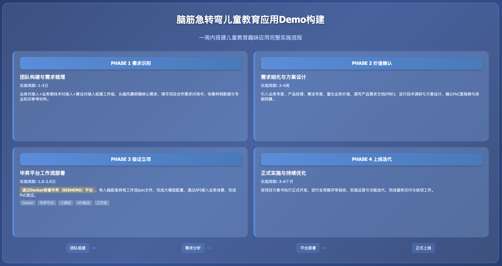

**实践详情**

|  |
|:---|
| 这是擂台[一周内搭建儿童教育趣味应用Demo]（编号Case251031Y01）的实践详情。 |

1\. **方案概览**

<table style="width:89%;">
<colgroup>
<col style="width: 15%" />
<col style="width: 73%" />
</colgroup>
<tbody>
<tr>
<td style="text-align: left;"><strong>PHASE 1 需求识别与团队构建</strong></td>
<td style="text-align: left;"></td>
</tr>
<tr>
<td style="text-align: center;"><strong>团队构成</strong></td>
<td style="text-align: left;">
<strong>业务对接人（×1）</strong>：熟悉该案例对应业务工作的组织、流程、决策链路，擅长沟通，熟悉项目管理基本操作

<strong>业务侧技术对接人（×1）</strong>：熟悉该案例对应业务工作实际在用/预期涉及的技术功能与流程、建设与规划，辅助业务对接人在技术层面的沟通，建议首选架构师或技术型项目经理，其次为具体技术执行人员（如后端工程师等）

<strong>算法对接人（×1）</strong>：熟悉该案例对应业务工作的业界通行技术架构与流程、建设与规划，擅长沟通，熟悉项目管理基本操作
</td>
</tr>
<tr>
<td style="text-align: center;"><strong>实施内容</strong></td>
<td style="text-align: left;">
业务对接人与算法对接人进行初次需求接触与头脑风暴交流，梳理该案例的核心需求

业务对接人与算法对接人组建工作组及联络群，明确明确对接人与联络方式

业务对接人（代表需求方团队）填写算法对接人（代表承做方团队）提供的项目合作需求问询书；如果已有较明确的构想、能拆解出多个子任务，可进一步填写子任务算法需求模板

双方沟通补充需求确认所需的其他材料，如样例数据、专业知识参考资料等

算法对接人协调自己团队，根据双方会议内容及反馈的文档和材料，展开需求评估
</td>
</tr>
<tr>
<td style="text-align: center;"><strong>相关资源</strong></td>
<td style="text-align: left;">
模板：<a href="https://gvxnc4ekbvn.feishu.cn/wiki/TXOqw6LDKiN1FrkhRtvcT6JdnVc?from=from_copylink">项目合作需求问询书模板</a>

模板：<a href="https://gvxnc4ekbvn.feishu.cn/wiki/Z4U4wXExviT9UOkeJIGc8EnKnAh?from=from_copylink">子任务算法需求模板</a>
</td>
</tr>
<tr>
<td style="text-align: center;"><strong>结果产出</strong></td>
<td style="text-align: left;">
成立工作组，明确对接人与联络方式

完成项目合作需求问询书（及子任务算法需求模板）填写，对需求有初步梳理
</td>
</tr>
<tr>
<td style="text-align: center;"><strong>实施周期</strong></td>
<td style="text-align: left;">1-3日</td>
</tr>
</tbody>
</table>

<table style="width:89%;">
<colgroup>
<col style="width: 15%" />
<col style="width: 73%" />
</colgroup>
<tbody>
<tr>
<td style="text-align: left;"><strong>PHASE 2 价值确认与需求细化</strong></td>
<td style="text-align: left;"></td>
</tr>
<tr>
<td style="text-align: center;"><strong>团队构成</strong></td>
<td style="text-align: left;">
<strong>业务对接人（×1）</strong>：同PHASE 1

<strong>业务侧技术对接人（×1）</strong>：同PHASE 1

<strong>业务专家（×1）</strong>：该案例对应业务工作中涉及核心业务模块的领导者、执行者或专家，协助业务对接人明确业务痛点与价值

<strong>产品经理（×1）</strong>：熟悉该案例对应业务工作的组织、流程、决策链路，擅长沟通，协助业务对接人细化需求，并设计原型，该职位可由承做方提供

<strong>算法对接人（×1）</strong>：同PHASE 1

<strong>算法专家（×1）</strong>：熟悉各场景与应用中业界目前的前沿与通用技术方案及选型，协助算法对接人评估需求，协调团队进行调研、设计方案与架构，协助评估排期
</td>
</tr>
<tr>
<td style="text-align: center;"><strong>实施内容</strong></td>
<td style="text-align: left;">
业务对接人与己方业务专家及相关团队沟通，确认该方案实施的预期目标及业务价值，业务价值需要尽可能量化，并有对比数据（如现状数字、预期达成目标、预期相比现状改善的程度等）

算法对接人与己方算法专家及相关团队沟通，罗列待确认事项，同时对方案进行初步调研、评估、设计

产品经理与业务对接人和算法对接人沟通、梳理并明确需求，之后组织双方相关人员撰写初步验证需求文档

双方根据初步验证需求文档进行需求确认，根据确认的需求规划排期、预算和资源。排期建议：首先以承接方完成初步验证、选型、产出Demo，并通过PoC为首个里程碑；之后双方进一步协商正式立项实施

重复以上步骤直至初步验证需求文档定稿
</td>
</tr>
<tr>
<td style="text-align: center;"><strong>相关资源</strong></td>
<td style="text-align: left;">模板：<a href="https://gvxnc4ekbvn.feishu.cn/wiki/PC8FwObgwiMwVPkM0i4cYkr2nYf?from=from_copylink">初步验证需求文档模板</a></td>
</tr>
<tr>
<td style="text-align: center;"><strong>结果产出</strong></td>
<td style="text-align: left;">
初步验证需求文档

PoC相关事项确认，如启动时间、验收时间、验收方案等
</td>
</tr>
<tr>
<td style="text-align: center;"><strong>实施周期</strong></td>
<td style="text-align: left;">2-4周</td>
</tr>
</tbody>
</table>

<table style="width:89%;">
<colgroup>
<col style="width: 15%" />
<col style="width: 73%" />
</colgroup>
<tbody>
<tr>
<td style="text-align: left;"><strong>PHASE 3 初步验证与立项</strong></td>
<td style="text-align: left;"></td>
</tr>
<tr>
<td style="text-align: center;"><strong>团队构成</strong></td>
<td style="text-align: left;">
<strong>业务对接人（×1）</strong>：同PHASE 1

<strong>算法对接人（×1）</strong>：同PHASE 1

<strong>产品经理（×1）</strong>：同PHASE 2，另需能熟练使用常见的无/低代码（“拖拉拽”方式）构建智能体工作流平台（如毕昇、Dify等）

<strong>算法工程师（×1）</strong>：掌握至少一门后端编程语言（如 Python、Java、Go 等）；熟悉 Docker，掌握常见智能体平台（如毕昇、Dify 等）的私有化部署、大模型配置；熟悉基于HTTP的API服务的封装
</td>
</tr>
<tr>
<td style="text-align: center;"><strong>实施内容</strong></td>
<td style="text-align: left;">
在运行环境（云端或本地满足硬件条件的服务器）中安装 Docker

通过Docker部署毕昇（BISHENG）平台，并启动平台

本方案在毕昇平台已构建现成的工作流 json文件，到平台下载该方案，导入到已运行的毕昇平台

完成大模型配置，并在启动的毕昇平台找到上面步骤配置好的应用，点击运行即可试用工作流

结合具体业务场景，将脑筋急转弯工作流通过毕昇的API接入

算法团队撰写初步验证报告

完成PoC

双方密切沟通，确认是否正式立项

若计划立项正式发布，双方就Demo效果调整方案，定稿立项报告，准备立项协议及启动事宜
</td>
</tr>
<tr>
<td style="text-align: center;"><strong>相关资源</strong></td>
<td style="text-align: left;">
Docker Docs：https://docs.docker.com/

毕昇（Bisheng）项目文件 Github：https://github.com/dataelement/bisheng

毕昇社区-工作流精选（最后一行，作者为zh）方案文件：<a href="https://dataelem.feishu.cn/wiki/OJYRwuJzZiUHhhkI4MLcMJvfnzh">手搓100个Workflow【活动】</a>

硅基流动官网大模型页面：https://cloud.siliconflow.cn/me/models

毕昇官方搭建工作流教程：<a href="https://dataelem.feishu.cn/wiki/R7HZwH5ZGiJUDrkHZXicA9pInif">BISHENG workflow</a>

毕昇官方对外发布工作流的API教程：<a href="https://dataelem.feishu.cn/wiki/ZjIywYGZliClIgkg2jFcP4xunjh">工作流对外发布 API</a>

模板：<a href="https://gvxnc4ekbvn.feishu.cn/wiki/HKZGwXetBije9HklRQmcAe94nZE?from=from_copylink">初步验证报告模板</a>
</td>
</tr>
<tr>
<td style="text-align: center;"><strong>结果产出</strong></td>
<td style="text-align: left;">
定稿并交付初步验证报告

完成Demo构建，准备并最终通过PoC

立项报告

立项协议（附件应包含正式上线版本的交付、验收、排期、资源等内容）
</td>
</tr>
<tr>
<td style="text-align: center;"><strong>实施周期</strong></td>
<td style="text-align: left;">2.5-4.5日</td>
</tr>
</tbody>
</table>

<table style="width:89%;">
<colgroup>
<col style="width: 15%" />
<col style="width: 73%" />
</colgroup>
<tbody>
<tr>
<td style="text-align: left;"><strong>PHASE 4 正式上线与优化迭代</strong></td>
<td style="text-align: left;"></td>
</tr>
<tr>
<td style="text-align: center;"><strong>团队构成</strong></td>
<td style="text-align: left;">按立项报告确定</td>
</tr>
<tr>
<td style="text-align: center;"><strong>实施内容</strong></td>
<td style="text-align: left;">
完成正式立项，确定启动时间

按立项报告内容与排期计划来实施与交付

按立项报告目标与流程来评审与验收

按立项报告规划来进行运营与迭代

按立项报告规划及协议约定，完成结项
</td>
</tr>
<tr>
<td style="text-align: center;"><strong>相关资源</strong></td>
<td style="text-align: left;">/</td>
</tr>
<tr>
<td style="text-align: center;"><strong>结果产出</strong></td>
<td style="text-align: left;">
项目全周期所有双方协商达成一致的材料

正式上线的产品
</td>
</tr>
<tr>
<td style="text-align: center;"><strong>实施周期</strong></td>
<td style="text-align: left;">3-6月（因具体情况而异）</td>
</tr>
</tbody>
</table>

2\. **方案验证**

|            |
|:-----------|
| [验证文档] |

3\. **技术步骤**

<table style="width:89%;">
<colgroup>
<col style="width: 10%" />
<col style="width: 10%" />
<col style="width: 10%" />
<col style="width: 55%" />
</colgroup>
<tbody>
<tr>
<td style="text-align: center;"><strong>步骤序号</strong></td>
<td style="text-align: left;">1</td>
<td style="text-align: center;"><strong>步骤名称</strong></td>
<td style="text-align: left;">安装 docker</td>
</tr>
<tr>
<td style="text-align: center;"><strong>步骤定义</strong></td>
<td style="text-align: left;">docker（含docker-compose）的安装</td>
<td style="text-align: left;"></td>
<td style="text-align: left;"></td>
</tr>
<tr>
<td style="text-align: center;"><strong>参与人员</strong></td>
<td style="text-align: left;">
角色名称：后端工程师

技能要求：熟悉 docker 安装、使用

角色数量：1
</td>
<td style="text-align: left;"></td>
<td style="text-align: left;"></td>
</tr>
<tr>
<td style="text-align: center;"><strong>本步输入</strong></td>
<td style="text-align: left;">
输入名称：在 Ubuntu 系列操作系统（Ubuntu-22.04 等）中安装 docker

输入介绍：首先确保开通一台云服务器，确保服务器资源满足“CPU ≥8 核、内存 ≥ 32GB”，操作系统选择Ubuntu。在服务器正常运行的情况下，通过命令行操作完成docker的安装

输入示例：

<blockquote>

命令行安装语句如下：

</blockquote>
<table style="width:75%;">
<colgroup>
<col style="width: 75%" />
</colgroup>
<tbody>
<tr>
<td style="text-align: left;">Bash 
# 安装相关命令 
sudo apt update 
sudo apt install docker.io 
sudo apt install docker-compose -y 
 
# 安装是否成功确认相关命令，两个命令都输出版本号则安装成功 
docker -v 
docker-compose --version</td>
</tr>
</tbody>
</table>

资源链接：

docker Docs：https://docs.docker.com/
</td>
<td style="text-align: left;"></td>
<td style="text-align: left;"></td>
</tr>
<tr>
<td style="text-align: center;"><strong>本步产出</strong></td>
<td style="text-align: left;">
输出名称：可运行的 docker 服务

输出介绍：通过docker能够便捷安装本方案所需的毕昇框架及相关服务，因此首先确保正确安装了docker
</td>
<td style="text-align: left;"></td>
<td style="text-align: left;"></td>
</tr>
<tr>
<td style="text-align: center;"><strong>预估时间</strong></td>
<td style="text-align: left;">0.25-0.5 日</td>
<td style="text-align: left;"></td>
<td style="text-align: left;"></td>
</tr>
</tbody>
</table>

<table style="width:89%;">
<colgroup>
<col style="width: 10%" />
<col style="width: 10%" />
<col style="width: 10%" />
<col style="width: 55%" />
</colgroup>
<tbody>
<tr>
<td style="text-align: center;"><strong>步骤序号</strong></td>
<td style="text-align: left;">2</td>
<td style="text-align: center;"><strong>步骤名称</strong></td>
<td style="text-align: left;">部署毕昇平台</td>
</tr>
<tr>
<td style="text-align: center;"><strong>步骤定义</strong></td>
<td style="text-align: left;">通过docker部署毕昇平台</td>
<td style="text-align: left;"></td>
<td style="text-align: left;"></td>
</tr>
<tr>
<td style="text-align: center;"><strong>参与人员</strong></td>
<td style="text-align: left;">
角色名称：后端/算法工程师

技能要求：熟悉 docker，掌握常见智能体平台（如毕昇、Dify 等）的私有化部署

角色数量：1
</td>
<td style="text-align: left;"></td>
<td style="text-align: left;"></td>
</tr>
<tr>
<td style="text-align: center;"><strong>本步输入</strong></td>
<td style="text-align: left;">
输入名称：通过docker拉取毕昇镜像

输入介绍：先从Github网站下载毕昇的项目文件，里面包含 docker的配置文件，运行该项目文件后，会从毕昇的docker仓库拉取本方案的docker镜像并启动服务

输入示例：

命令行下载项目文件并启动服务的语句如下：

<table style="width:75%;">
<colgroup>
<col style="width: 75%" />
</colgroup>
<tbody>
<tr>
<td style="text-align: left;">Bash 
# 下载代码 
git clone https://github.com/dataelement/bisheng.git 
 
# 启动服务 
cd bisheng/docker 
docker compose -f docker-compose.yml -p bisheng up -d 
 
# 启动成功确认命令，确认是否 10 个相关服务都都是 Up 状态 
docker ps | grep bisheng 
 
# 启动后，在浏览器中访问 http://IP:3001 ，出现登录页，进行用户注册，默认第一个注册的用户会成为系统 admin</td>
</tr>
</tbody>
</table>

资源链接：

毕昇（Bisheng）项目文件 Github：https://github.com/dataelement/bisheng
</td>
<td style="text-align: left;"></td>
<td style="text-align: left;"></td>
</tr>
<tr>
<td style="text-align: center;"><strong>本步产出</strong></td>
<td style="text-align: left;">
输出名称：可用的毕昇平台服务

输出介绍：运行毕昇平台服务后，可通过该平台构建生产级别的智能体工作流
</td>
<td style="text-align: left;"></td>
<td style="text-align: left;"></td>
</tr>
<tr>
<td style="text-align: center;"><strong>预估时间</strong></td>
<td style="text-align: left;">1-2.5 日</td>
<td style="text-align: left;"></td>
<td style="text-align: left;"></td>
</tr>
</tbody>
</table>

<table style="width:89%;">
<colgroup>
<col style="width: 10%" />
<col style="width: 10%" />
<col style="width: 10%" />
<col style="width: 55%" />
</colgroup>
<tbody>
<tr>
<td style="text-align: center;"><strong>步骤序号</strong></td>
<td style="text-align: left;">3</td>
<td style="text-align: center;"><strong>步骤名称</strong></td>
<td style="text-align: left;">导入本方案工作流</td>
</tr>
<tr>
<td style="text-align: center;"><strong>步骤定义</strong></td>
<td style="text-align: left;">下载本方案在毕昇平台构建的现成的工作流 json文件，导入到已运行的毕昇平台</td>
<td style="text-align: left;"></td>
<td style="text-align: left;"></td>
</tr>
<tr>
<td style="text-align: center;"><strong>参与人员</strong></td>
<td style="text-align: left;">
角色名称：产品经理/后端/算法工程师

技能要求：能熟练使用常见的低代码（“拖拉拽”方式）构建智能体工作流平台（如毕昇、Dify等）

角色数量：1
</td>
<td style="text-align: left;"></td>
<td style="text-align: left;"></td>
</tr>
<tr>
<td style="text-align: center;"><strong>本步输入</strong></td>
<td style="text-align: left;">
输入名称：毕昇工作流json文件

输入介绍：在毕昇平台新建一个空白工作流，并在其中导入准备好的 json 文件

输入示例：

以下是该json文件的样例：

<strong>[01-脑筋急转弯互动版.json]</strong>

资源链接：

毕昇社区-工作流精选（最后一行，作者为zh）：<a href="https://dataelem.feishu.cn/wiki/OJYRwuJzZiUHhhkI4MLcMJvfnzh">手搓100个Workflow【活动】</a>
</td>
<td style="text-align: left;"></td>
<td style="text-align: left;"></td>
</tr>
<tr>
<td style="text-align: center;"><strong>本步产出</strong></td>
<td style="text-align: left;">
输出名称：一个待运行的脑筋急转弯应用（智能体工作流）

输出介绍：该应用即满足本方案的目标，并支持版本管理、发布、 API调用等功能
</td>
<td style="text-align: left;"></td>
<td style="text-align: left;"></td>
</tr>
<tr>
<td style="text-align: center;"><strong>预估时间</strong></td>
<td style="text-align: left;">1 小时</td>
<td style="text-align: left;"></td>
<td style="text-align: left;"></td>
</tr>
</tbody>
</table>

<table style="width:89%;">
<colgroup>
<col style="width: 10%" />
<col style="width: 10%" />
<col style="width: 10%" />
<col style="width: 55%" />
</colgroup>
<tbody>
<tr>
<td style="text-align: center;"><strong>步骤序号</strong></td>
<td style="text-align: left;">4</td>
<td style="text-align: center;"><strong>步骤名称</strong></td>
<td style="text-align: left;">配置大模型</td>
</tr>
<tr>
<td style="text-align: center;"><strong>步骤定义</strong></td>
<td style="text-align: left;">在毕昇平台配置常见大模型，来支持平台上各个应用（工作流、智能体等）的调用</td>
<td style="text-align: left;"></td>
<td style="text-align: left;"></td>
</tr>
<tr>
<td style="text-align: center;"><strong>参与人员</strong></td>
<td style="text-align: left;">
角色名称：后端/算法工程师

技能要求：掌握常见智能体平台（如毕昇、Dify 等）的大模型配置

角色数量：1
</td>
<td style="text-align: left;"></td>
<td style="text-align: left;"></td>
</tr>
<tr>
<td style="text-align: center;"><strong>本步输入</strong></td>
<td style="text-align: left;">
输入名称：所用大模型API的key和base url

输入介绍：在“毕昇平台模型→模型管理界面”配置大模型API相关信息，并设置默认的系统模型，该步骤推荐基于硅基流动平台的大模型API

输入示例：

key：通常格式为sk-xxxxxx

base url：格式实例如<a href="https://api.openai.com/v1/chat/completions"><u>https://api.openai.com/v1</u></a>

资源链接：

硅基流动官网大模型页面：https://cloud.siliconflow.cn/me/models
</td>
<td style="text-align: left;"></td>
<td style="text-align: left;"></td>
</tr>
<tr>
<td style="text-align: center;"><strong>本步产出</strong></td>
<td style="text-align: left;">
输出名称：配置好的大模型

输出介绍：整个毕昇平台各应用都可用的配置好的大模型，后续应用使用已有模型无需重复配置
</td>
<td style="text-align: left;"></td>
<td style="text-align: left;"></td>
</tr>
<tr>
<td style="text-align: center;"><strong>预估时间</strong></td>
<td style="text-align: left;">2 小时</td>
<td style="text-align: left;"></td>
<td style="text-align: left;"></td>
</tr>
</tbody>
</table>

<table style="width:89%;">
<colgroup>
<col style="width: 10%" />
<col style="width: 10%" />
<col style="width: 10%" />
<col style="width: 55%" />
</colgroup>
<tbody>
<tr>
<td style="text-align: center;"><strong>步骤序号</strong></td>
<td style="text-align: left;">5</td>
<td style="text-align: center;"><strong>步骤名称</strong></td>
<td style="text-align: left;">通过页面试用工作流</td>
</tr>
<tr>
<td style="text-align: center;"><strong>步骤定义</strong></td>
<td style="text-align: left;">大模型配置完成后，在毕昇平台找到之前配置的应用，点击运行即可试用工作流。作为拓展尝试，也推荐阅读毕昇官方的工作流搭建教程，这样可以自己调整/搭建工作流，方便进行个性化改造</td>
<td style="text-align: left;"></td>
<td style="text-align: left;"></td>
</tr>
<tr>
<td style="text-align: center;"><strong>参与人员</strong></td>
<td style="text-align: left;">
角色名称：产品经理/后端/算法工程师

技能要求：熟悉常见智能体平台（如毕昇、Dify 等）的使用

角色数量：1
</td>
<td style="text-align: left;"></td>
<td style="text-align: left;"></td>
</tr>
<tr>
<td style="text-align: center;"><strong>本步输入</strong></td>
<td style="text-align: left;">
输入名称：工作流使用选项和交互

输入介绍：选择脑筋急转弯类型，开始作答等使用交互

输入示例：如选择“反常规思维类”并开始作答，输入答案后将返回正确性，并支持继续作答/质疑问题/要答案等

资源链接：

毕昇官方搭建工作流教程：<a href="https://dataelem.feishu.cn/wiki/R7HZwH5ZGiJUDrkHZXicA9pInif">BISHENG workflow</a>
</td>
<td style="text-align: left;"></td>
<td style="text-align: left;"></td>
</tr>
<tr>
<td style="text-align: center;"><strong>本步产出</strong></td>
<td style="text-align: left;">
输出名称：一个可运行的脑筋急转弯应用

输出介绍：试用通过后，可以直接发布上线
</td>
<td style="text-align: left;"></td>
<td style="text-align: left;"></td>
</tr>
<tr>
<td style="text-align: center;"><strong>预估时间</strong></td>
<td style="text-align: left;">0.5 - 1.5 日</td>
<td style="text-align: left;"></td>
<td style="text-align: left;"></td>
</tr>
</tbody>
</table>

<table style="width:89%;">
<colgroup>
<col style="width: 10%" />
<col style="width: 10%" />
<col style="width: 10%" />
<col style="width: 55%" />
</colgroup>
<tbody>
<tr>
<td style="text-align: center;"><strong>步骤序号</strong></td>
<td style="text-align: left;">6</td>
<td style="text-align: center;"><strong>步骤名称</strong></td>
<td style="text-align: left;">通过API调用工作流</td>
</tr>
<tr>
<td style="text-align: center;"><strong>步骤定义</strong></td>
<td style="text-align: left;">结合具体业务场景，将脑筋急转弯工作流通过毕昇的API接入原有流程</td>
<td style="text-align: left;"></td>
<td style="text-align: left;"></td>
</tr>
<tr>
<td style="text-align: center;"><strong>参与人员</strong></td>
<td style="text-align: left;">
角色名称：后端/算法工程师

技能要求：掌握至少一门后端语言（如 Python、Java、Go 等），熟悉基于HTTP的API服务的封装

角色数量：1
</td>
<td style="text-align: left;"></td>
<td style="text-align: left;"></td>
</tr>
<tr>
<td style="text-align: center;"><strong>本步输入</strong></td>
<td style="text-align: left;">
输入名称：工作流发布后的url和workflow_id

输入介绍：一般在对外发布-API 访问页面也会直接给出，然后通过python/java等发起 http 请求来调用工作流

输入示例：

<blockquote>

python版本的API 代码调用示例如下：

</blockquote>
<table style="width:70%;">
<colgroup>
<col style="width: 70%" />
</colgroup>
<tbody>
<tr>
<td style="text-align: left;">Python 
<em># -*- coding: utf-8 -*-</em> 
import json 
 
import requests 
 
url = "http://IP:3001/api/v2/workflow/invoke" 
<em># 从应用的地址栏获取</em> 
workflow_id = "xxxxxx" 
 
 
def get_workflow_output_message(query: str) -&gt; str: 
<em>"""</em> 
<em>调用工作流，自动完成两次请求，并返回最终的输出内容（message 字段）</em> 
<em>:param query: 用户输入</em> 
<em>:return: 模型返回的文本内容（message 字段）</em> 
<em>"""</em> 
headers = {'Content-Type': 'application/json'} 
 
<em># 第一次请求，初始化工作流</em> 
init_payload = json.dumps({ 
"workflow_id": workflow_id, 
"stream": False, 
}) 
init_response = requests.post(url, headers=headers, data=init_payload) 
init_data = init_response.json() 
 
if init_response.status_code != 200 or init_data.get("status_code") != 200: 
raise Exception("初始化请求失败:\n" + json.dumps(init_data, indent=2, ensure_ascii=False)) 
 
session_id = init_data["data"]["session_id"] 
 
input_node_id = None 
message_id = None 
for event in init_data["data"]["events"]: 
if event["event"] == "input": 
input_node_id = event["node_id"] 
message_id = event["message_id"] 
break 
 
if not input_node_id or not message_id: 
raise Exception("未能找到 input 节点或 message_id") 
 
<em># 第二次请求，传入 query</em> 
second_payload = json.dumps({ 
"workflow_id": workflow_id, 
"stream": False, 
"input": { 
input_node_id: { 
"user_input": query 
} 
}, 
"message_id": message_id, 
"session_id": session_id 
}) 
second_response = requests.post(url, headers=headers, data=second_payload) 
second_data = second_response.json() 
 
print(f'second_data: \n{second_data}') 
 
if second_response.status_code != 200 or second_data.get("status_code") != 200: 
raise Exception("传入 query 请求失败:\n" + json.dumps(second_data, indent=2, ensure_ascii=False)) 
 
<em># 提取最终输出 message 内容</em> 
for event in second_data["data"]["events"]: 
if event["event"] == "output_msg" and "output_schema" in event: 
return event["output_schema"].get("message", "") 
 
raise Exception("未找到 output_msg 类型的事件") 
 
 
def run(): 
query = "xxxxxx" 
print(f"query: {query}\n") 
result = get_workflow_output_message(query) 
print(f"result: \n{result}") 
 
 
<em># 示例调用</em> 
if __name__ == "__main__": 
run()</td>
</tr>
</tbody>
</table>

资源链接：

毕昇官方对外发布工作流的API教程：<a href="https://dataelem.feishu.cn/wiki/ZjIywYGZliClIgkg2jFcP4xunjh">工作流对外发布 API</a>
</td>
<td style="text-align: left;"></td>
<td style="text-align: left;"></td>
</tr>
<tr>
<td style="text-align: center;"><strong>本步产出</strong></td>
<td style="text-align: left;">
输出名称：基于本方案工作流的独立的API 服务

输出介绍：可以灵活地嵌入相关业务系统
</td>
<td style="text-align: left;"></td>
<td style="text-align: left;"></td>
</tr>
<tr>
<td style="text-align: center;"><strong>预估时间</strong></td>
<td style="text-align: left;">0.25-0.5 日</td>
<td style="text-align: left;"></td>
<td style="text-align: left;"></td>
</tr>
</tbody>
</table>

  [一周内搭建儿童教育趣味应用Demo]: https://gvxnc4ekbvn.feishu.cn/wiki/Csk3wFuMwiZk00kt8WJco88Wn5g?from=from_copylink
  [验证文档]: https://gvxnc4ekbvn.feishu.cn/wiki/O9SDwTgoKitce9kxbIZcMLfFnDh?from=from_copylink
